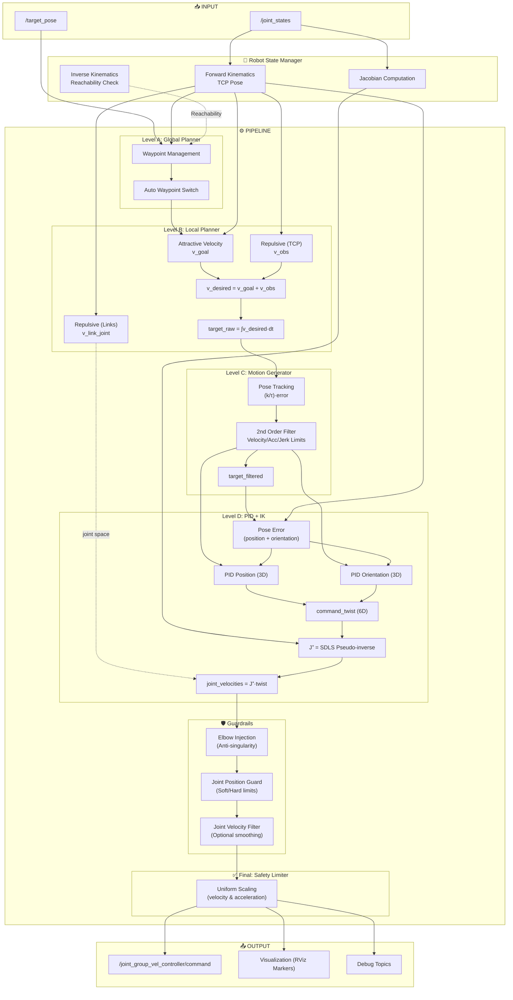
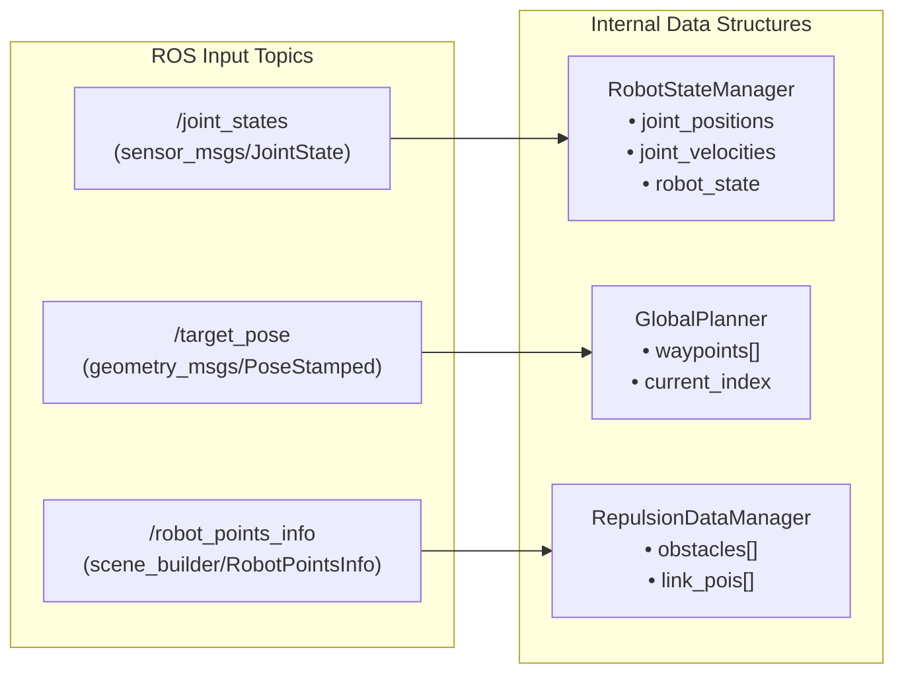
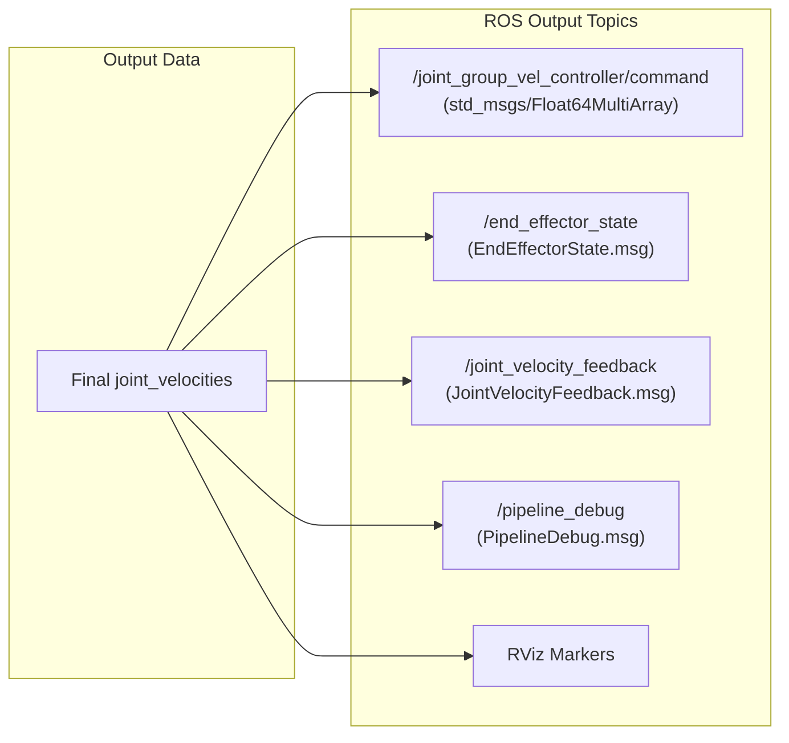

# Cartesian Velocity Controller - Schema di Flusso Completo

Questo documento descrive in dettaglio lo schema a blocchi del flusso del **Cartesian Velocity Controller**, un controller di velocità cartesiana per manipolatori robotici basato su ROS.

---

## 📋 Indice

1. [Panoramica Architetturale](#panoramica-architetturale)
2. [Schema a Blocchi Principale](#schema-a-blocchi-principale)
3. [Flusso della Pipeline](#flusso-della-pipeline)
4. [Dettaglio dei Livelli](#dettaglio-dei-livelli)
5. [Flusso Dati Dettagliato](#flusso-dati-dettagliato)
6. [Schema delle Dipendenze](#schema-delle-dipendenze)

---

## 1. Panoramica Architetturale

Il controller è organizzato in una **pipeline a livelli** (Level A → D → Final) che trasforma:

```
Target Pose → Waypoint → Velocità Cartesiane → Velocità Giunti → Comando Finale
```

### Componenti Principali

| Componente | Livello | Responsabilità |
|------------|---------|----------------|
| **GlobalPlanner** | A | Gestione waypoint |
| **LocalPlanner** | B | Calcolo velocità attrattive/repulsive |
| **CartesianVelocityFilter** | C | Filtro del secondo ordine (τ) |
| **PIDController** | D | Controllo PID posizione/orientamento |
| **JacobianSolver** | D | Pseudo-inversa pesata dello Jacobiano |
| **JointSafetyLimiter** | Final | Limite di sicurezza uniforme |

---

## 2. Schema a Blocchi Principale

```
┌─────────────────────────────────────────────────────────────────────────────────────┐
│                           CARTESIAN VELOCITY CONTROLLER                              │
├─────────────────────────────────────────────────────────────────────────────────────┤
│                                                                                      │
│  ┌─────────────────┐                                                                │
│  │   ROS Topics    │                                                                │
│  │  /target_pose   │                                                                │
│  │  /joint_states  │                                                                │
│  └────────┬────────┘                                                                │
│           │                                                                          │
│           ▼                                                                          │
│  ┌──────────────────────────────────────────────────────────────────────────────┐   │
│  │                        CONTROL LOOP (Timer Callback)                          │   │
│  ├──────────────────────────────────────────────────────────────────────────────┤   │
│  │                                                                               │   │
│  │  ┌─────────────────┐                                                          │   │
│  │  │ RobotStateManager│◄──── /joint_states                                      │   │
│  │  │ • FK (TCP Pose) │                                                          │   │
│  │  │ • IK (Verifica) │                                                          │   │
│  │  │ • Jacobiano     │                                                          │   │
│  │  └────────┬────────┘                                                          │   │
│  │           │ current_tcp_pose                                                  │   │
│  │           ▼                                                                   │   │
│  │  ┌────────────────────────────────────────────────────────────────────────┐   │   │
│  │  │ LEVEL A: GLOBAL PLANNER                                                │   │   │
│  │  │                                                                        │   │   │
│  │  │  waypoints[] ────► getActiveWaypoint() ────► waypoint                  │   │   │
│  │  │                    updateCurrentPosition()                             │   │   │
│  │  │                    (switch automatico waypoint)                        │   │   │
│  │  └────────────────────────────────────────────────────────────────────────┘   │   │
│  │           │ waypoint                                                          │   │
│  │           ▼                                                                   │   │
│  │  ┌────────────────────────────────────────────────────────────────────────┐   │   │
│  │  │ LEVEL B: LOCAL PLANNER                                                 │   │   │
│  │  │                                                                        │   │   │
│  │  │  ┌─────────────┐    ┌─────────────────┐    ┌─────────────────┐         │   │   │
│  │  │  │ ATTRACTIVE  │    │ REPULSIVE (TCP) │    │ REPULSIVE (Links)│         │   │   │
│  │  │  │ v_goal      │    │ v_obs           │    │ v_link_joint    │         │   │   │
│  │  │  └─────┬───────┘    └────────┬────────┘    └────────┬────────┘         │   │   │
│  │  │        │                     │                      │                  │   │   │
│  │  │        └──────────┬──────────┴──────────────────────┘                  │   │   │
│  │  │                   ▼                                                    │   │   │
│  │  │         v_desired = v_goal + v_obs                                     │   │   │
│  │  │                   │                                                    │   │   │
│  │  │                   ▼                                                    │   │   │
│  │  │         target_raw = integrate(v_desired * dt)                         │   │   │
│  │  │                                                                        │   │   │
│  │  └────────────────────────────────────────────────────────────────────────┘   │   │
│  │           │ target_raw, v_desired                                             │   │
│  │           ▼                                                                   │   │
│  │  ┌────────────────────────────────────────────────────────────────────────┐   │   │
│  │  │ LEVEL C: MOTION GENERATOR (CartesianVelocityFilter)                    │   │   │
│  │  │                                                                        │   │   │
│  │  │  ┌─────────────────────────────────────────────────────────────────┐   │   │   │
│  │  │  │         POSE TRACKING (target_raw → target_filtered)            │   │   │   │
│  │  │  │                                                                 │   │   │   │
│  │  │  │  pos_err = target_raw - target_filtered_prev                    │   │   │   │
│  │  │  │  v_des = (k/τ) * pos_err                                        │   │   │   │
│  │  │  │  v_des = clamp(v_des, max_velocity)                             │   │   │   │
│  │  │  └─────────────────────────────────────────────────────────────────┘   │   │   │
│  │  │                   │                                                    │   │   │
│  │  │                   ▼                                                    │   │   │
│  │  │  ┌─────────────────────────────────────────────────────────────────┐   │   │   │
│  │  │  │         SECOND-ORDER FILTER (τ)                                 │   │   │   │
│  │  │  │                                                                 │   │   │   │
│  │  │  │  • Limiti: velocity, acceleration, jerk                         │   │   │   │
│  │  │  │  • Output: v_filtered, target_filtered                          │   │   │   │
│  │  │  └─────────────────────────────────────────────────────────────────┘   │   │   │
│  │  │                                                                        │   │   │
│  │  └────────────────────────────────────────────────────────────────────────┘   │   │
│  │           │ target_filtered, v_filtered                                       │   │
│  │           ▼                                                                   │   │
│  │  ┌────────────────────────────────────────────────────────────────────────┐   │   │
│  │  │ LEVEL D: PID + IK                                                      │   │   │
│  │  │                                                                        │   │   │
│  │  │  ┌─────────────────────────────────────────────────────────────────┐   │   │   │
│  │  │  │ 1. POSE ERROR                                                   │   │   │   │
│  │  │  │                                                                 │   │   │   │
│  │  │  │  position_error = target_filtered - current_tcp_pose            │   │   │   │
│  │  │  │  orientation_error = axis_angle(q_target * q_current⁻¹)         │   │   │   │
│  │  │  │  apply_deadband(errors)                                         │   │   │   │
│  │  │  └─────────────────────────────────────────────────────────────────┘   │   │   │
│  │  │                   │                                                    │   │   │
│  │  │                   ▼                                                    │   │   │
│  │  │  ┌─────────────────────────────────────────────────────────────────┐   │   │   │
│  │  │  │ 2. PID CONTROLLERS                                              │   │   │   │
│  │  │  │                                                                 │   │   │   │
│  │  │  │  ┌────────────────────┐   ┌────────────────────┐                │   │   │   │
│  │  │  │  │ PID Position (3D) │   │ PID Orientation(3D)│                │   │   │   │
│  │  │  │  │ • Kp, Ki, Kd       │   │ • Kp, Ki, Kd       │                │   │   │   │
│  │  │  │  │ • Feedforward      │   │ • Feedforward      │                │   │   │   │
│  │  │  │  │ • Anti-windup      │   │ • Anti-windup      │                │   │   │   │
│  │  │  │  └─────────┬──────────┘   └─────────┬──────────┘                │   │   │   │
│  │  │  │            │                        │                           │   │   │   │
│  │  │  │            └────────┬───────────────┘                           │   │   │   │
│  │  │  │                     ▼                                           │   │   │   │
│  │  │  │            command_twist (6D)                                   │   │   │   │
│  │  │  └─────────────────────────────────────────────────────────────────┘   │   │   │
│  │  │                   │                                                    │   │   │
│  │  │                   ▼                                                    │   │   │
│  │  │  ┌─────────────────────────────────────────────────────────────────┐   │   │   │
│  │  │  │ 3. JACOBIAN SOLVER                                              │   │   │   │
│  │  │  │                                                                 │   │   │   │
│  │  │  │  J = getJacobian(tcp_link)                                      │   │   │   │
│  │  │  │  W = joint_weights_ (from JointWeightManager)                   │   │   │   │
│  │  │  │  J⁺ = dampedWeightedPseudoInverse(J, W)  [SDLS]                 │   │   │   │
│  │  │  │  joint_velocities = J⁺ * command_twist                          │   │   │   │
│  │  │  └─────────────────────────────────────────────────────────────────┘   │   │   │
│  │  │                                                                        │   │   │
│  │  └────────────────────────────────────────────────────────────────────────┘   │   │
│  │           │ joint_velocities                                                  │   │
│  │           ▼                                                                   │   │
│  │  ┌────────────────────────────────────────────────────────────────────────┐   │   │
│  │  │ GUARDRAILS (Controller-side Safety)                                    │   │   │
│  │  │                                                                        │   │   │
│  │  │  ┌─────────────────────────────────────────────────────────────────┐   │   │   │
│  │  │  │ 1. ELBOW INJECTION (Anti-singularity push)                      │   │   │   │
│  │  │  │                                                                 │   │   │   │
│  │  │  │  if (near_singularity && target_allows):                        │   │   │   │
│  │  │  │      qdot[elbow] += push_velocity                               │   │   │   │
│  │  │  └─────────────────────────────────────────────────────────────────┘   │   │   │
│  │  │                   │                                                    │   │   │
│  │  │                   ▼                                                    │   │   │
│  │  │  ┌─────────────────────────────────────────────────────────────────┐   │   │   │
│  │  │  │ 2. JOINT POSITION GUARD (Runtime Guardrail)                     │   │   │   │
│  │  │  │                                                                 │   │   │   │
│  │  │  │  for each controlled joint:                                     │   │   │   │
│  │  │  │    • soft_zone: smooth scaling near limits                      │   │   │   │
│  │  │  │    • hard_margin: force reentry velocity                        │   │   │   │
│  │  │  └─────────────────────────────────────────────────────────────────┘   │   │   │
│  │  │                   │                                                    │   │   │
│  │  │                   ▼                                                    │   │   │
│  │  │  ┌─────────────────────────────────────────────────────────────────┐   │   │   │
│  │  │  │ 3. JOINT VELOCITY FILTER (Optional Smoothing)                   │   │   │   │
│  │  │  │                                                                 │   │   │   │
│  │  │  │  joint_velocities_smoothed = filter(joint_velocities, dt)       │   │   │   │
│  │  │  └─────────────────────────────────────────────────────────────────┘   │   │   │
│  │  │                                                                        │   │   │
│  │  └────────────────────────────────────────────────────────────────────────┘   │   │
│  │           │ joint_velocities_smoothed                                         │   │
│  │           ▼                                                                   │   │
│  │  ┌────────────────────────────────────────────────────────────────────────┐   │   │
│  │  │ FINAL: JOINT SAFETY LIMITER                                            │   │   │
│  │  │                                                                        │   │   │
│  │  │  SafetyLimiterOutput = limit(velocities, prev_velocities, dt)          │   │   │
│  │  │                                                                        │   │   │
│  │  │  ┌───────────────────────────────────────────────────────────────┐     │   │   │
│  │  │  │ UNIFORM SCALING                                               │     │   │   │
│  │  │  │                                                               │     │   │   │
│  │  │  │ 1. Controlla |qdot_i| ≤ max_velocity[i]                       │     │   │   │
│  │  │  │ 2. Controlla |qacc_i| ≤ max_acceleration[i]                   │     │   │   │
│  │  │  │ 3. Calcola scaling_factor = min(tutti i fattori)              │     │   │   │
│  │  │  │ 4. Applica uniformemente a TUTTI i giunti                     │     │   │   │
│  │  │  └───────────────────────────────────────────────────────────────┘     │   │   │
│  │  │                                                                        │   │   │
│  │  └────────────────────────────────────────────────────────────────────────┘   │   │
│  │           │ final_joint_velocities                                            │   │
│  │           ▼                                                                   │   │
│  │  ┌─────────────────┐                                                          │   │
│  │  │ publishVelocity │────► /joint_group_vel_controller/command                 │   │
│  │  │ Command         │                                                          │   │
│  │  └─────────────────┘                                                          │   │
│  │                                                                               │   │
│  └───────────────────────────────────────────────────────────────────────────────┘   │
│                                                                                      │
└─────────────────────────────────────────────────────────────────────────────────────┘
```

---

## 3. Flusso della Pipeline

### Diagramma di Flusso Mermaid



---

## 4. Dettaglio dei Livelli

### Level A: Global Planner

```
┌─────────────────────────────────────────────────────────────────┐
│                        GLOBAL PLANNER                           │
├─────────────────────────────────────────────────────────────────┤
│                                                                 │
│  ┌──────────────┐                                               │
│  │  waypoints[] │  Lista ordinata di pose target                │
│  └──────┬───────┘                                               │
│         │                                                       │
│         ▼                                                       │
│  ┌──────────────────────────────────────────────────────────┐   │
│  │  updateCurrentPosition(current_tcp_pose)                 │   │
│  │                                                          │   │
│  │  • Calcola distanza dal waypoint corrente                │   │
│  │  • Se distanza < threshold → passa al prossimo waypoint  │   │
│  │  • Gestisce completion del percorso                      │   │
│  └──────────────────────────────────────────────────────────┘   │
│         │                                                       │
│         ▼                                                       │
│  ┌──────────────────────────────────────────────────────────┐   │
│  │  OUTPUT: active_waypoint                                 │   │
│  │                                                          │   │
│  │  • Pose del waypoint attivo (Isometry3d)                 │   │
│  │  • Indice del waypoint corrente                          │   │
│  │  • Flag hasReachedTarget()                               │   │
│  └──────────────────────────────────────────────────────────┘   │
│                                                                 │
│  PARAMETRI CONFIGURABILI:                                       │
│  • distance_threshold (m)                                       │
│  • orientation_threshold (rad)                                  │
│  • lookahead_distance (m) - per smooth transitions              │
│                                                                 │
└─────────────────────────────────────────────────────────────────┘
```

### Level B: Local Planner

```
┌─────────────────────────────────────────────────────────────────────────────┐
│                              LOCAL PLANNER                                   │
├─────────────────────────────────────────────────────────────────────────────┤
│                                                                              │
│  INPUT:                                                                      │
│  • current_tcp_pose                                                          │
│  • active_waypoint                                                           │
│  • obstacles[] (ObstacleInfo)                                                │
│  • link_pois[] (LinkPOI)                                                     │
│  • dt                                                                        │
│                                                                              │
│  ┌──────────────────────────────────────────────────────────────────────┐    │
│  │ ATTRACTIVE VELOCITY (verso il target)                                │    │
│  │                                                                      │    │
│  │  error = waypoint - current_pose                                     │    │
│  │  distance = ||error.translation||                                    │    │
│  │                                                                      │    │
│  │  ┌─────────────────────────────────────────────────────────────┐     │    │
│  │  │ Scaling Factor (smooth deceleration)                        │     │    │
│  │  │                                                             │     │    │
│  │  │  if distance > approach_radius:                             │     │    │
│  │  │      scale = 1.0                                            │     │    │
│  │  │  else:                                                      │     │    │
│  │  │      scale = smoothstep(distance / approach_radius)         │     │    │
│  │  └─────────────────────────────────────────────────────────────┘     │    │
│  │                                                                      │    │
│  │  v_goal_linear = k_attractive * (error.translation / distance)       │    │
│  │  v_goal_linear *= scale                                              │    │
│  │  v_goal_linear = clamp(v_goal_linear, max_linear_velocity)           │    │
│  │                                                                      │    │
│  │  v_goal_angular = k_attractive_angular * orientation_error           │    │
│  │  v_goal_angular = clamp(v_goal_angular, max_angular_velocity)        │    │
│  └──────────────────────────────────────────────────────────────────────┘    │
│                                                                              │
│  ┌──────────────────────────────────────────────────────────────────────┐    │
│  │ REPULSIVE VELOCITY - TCP (evitamento ostacoli)                       │    │
│  │                                                                      │    │
│  │  for each obstacle in obstacles:                                     │    │
│  │      d = distance_to_obstacle                                        │    │
│  │                                                                      │    │
│  │      if d < influence_distance:                                      │    │
│  │          ┌────────────────────────────────────────────────────────┐  │    │
│  │          │ Potential Field                                        │  │    │
│  │          │                                                        │  │    │
│  │          │ repulsion_strength = k_rep * (1/d - 1/d_inf)² * (1/d²) │  │    │
│  │          │ v_rep = repulsion_strength * direction_from_obstacle   │  │    │
│  │          └────────────────────────────────────────────────────────┘  │    │
│  │                                                                      │    │
│  │  v_obs = sum(v_rep_i)                                                │    │
│  │  v_obs = clamp(v_obs, max_repulsive_velocity)                        │    │
│  └──────────────────────────────────────────────────────────────────────┘    │
│                                                                              │
│  ┌──────────────────────────────────────────────────────────────────────┐    │
│  │ REPULSIVE VELOCITY - LINKS (POI distribuiti sul braccio)             │    │
│  │                                                                      │    │
│  │  for each link_poi in link_pois:                                     │    │
│  │      for each obstacle:                                              │    │
│  │          • Calcola repulsione nello spazio Cartesiano               │    │
│  │          • Proietta in spazio giunti via Jacobiano POI               │    │
│  │                                                                      │    │
│  │  v_link_joint = sum(J_poi⁺ * v_rep_cartesian)                        │    │
│  │                                                                      │    │
│  │  Questa velocità viene sommata DOPO l'IK (in spazio giunti)          │    │
│  └──────────────────────────────────────────────────────────────────────┘    │
│                                                                              │
│  ┌──────────────────────────────────────────────────────────────────────┐    │
│  │ VIRTUAL TARGET INTEGRATION                                           │    │
│  │                                                                      │    │
│  │  v_desired = v_goal + v_obs                                          │    │
│  │                                                                      │    │
│  │  ┌────────────────────────────────────────────────────────────────┐  │    │
│  │  │ Integration with constraints                                   │  │    │
│  │  │                                                                │  │    │
│  │  │  target_raw.translation += v_desired_linear * dt               │  │    │
│  │  │  target_raw.rotation = slerp(target_raw.rotation,              │  │    │
│  │  │                              waypoint.rotation,                │  │    │
│  │  │                              α * dt)                           │  │    │
│  │  │                                                                │  │    │
│  │  │  // Constraint: non superare il waypoint                       │  │    │
│  │  │  if target_raw oltre waypoint:                                 │  │    │
│  │  │      target_raw = waypoint                                     │  │    │
│  │  └────────────────────────────────────────────────────────────────┘  │    │
│  └──────────────────────────────────────────────────────────────────────┘    │
│                                                                              │
│  OUTPUT:                                                                     │
│  • target_raw (Isometry3d)                                                   │
│  • attractive_linear/angular (Vector3d)                                      │
│  • repulsive_obstacle_linear (Vector3d)                                      │
│  • repulsive_links_joint (VectorXd - nello spazio giunti)                    │
│  • virtual_target_scaling_factor                                             │
│                                                                              │
└─────────────────────────────────────────────────────────────────────────────┘
```

### Level C: Motion Generator (Cartesian Velocity Filter)

```
┌─────────────────────────────────────────────────────────────────────────────┐
│                    CARTESIAN VELOCITY FILTER (Level C)                       │
├─────────────────────────────────────────────────────────────────────────────┤
│                                                                              │
│  INPUT:                                                                      │
│  • target_raw (dal Local Planner)                                            │
│  • target_filtered_prev (stato interno)                                      │
│  • dt                                                                        │
│                                                                              │
│  ┌──────────────────────────────────────────────────────────────────────┐    │
│  │ STEP 1: POSE TRACKING (genera velocità desiderata)                   │    │
│  │                                                                      │    │
│  │  pos_error = target_raw.translation - target_filtered_prev.translation│   │
│  │  ori_error = orientationErrorAxisAngle(q_filtered, q_raw)            │    │
│  │                                                                      │    │
│  │  v_des_linear = (k_linear / τ_linear) * pos_error                    │    │
│  │  v_des_angular = (k_angular / τ_angular) * ori_error                 │    │
│  │                                                                      │    │
│  │  // Clamping alle velocità massime                                   │    │
│  │  v_des_linear = clamp(v_des_linear, max_linear_velocity)             │    │
│  │  v_des_angular = clamp(v_des_angular, max_angular_velocity)          │    │
│  └──────────────────────────────────────────────────────────────────────┘    │
│                                                                              │
│  ┌──────────────────────────────────────────────────────────────────────┐    │
│  │ STEP 2: SECOND-ORDER FILTER                                          │    │
│  │                                                                      │    │
│  │  Il filtro garantisce limiti su:                                     │    │
│  │  • |velocity| ≤ max_velocity                                         │    │
│  │  • |acceleration| ≤ max_acceleration                                 │    │
│  │  • |jerk| ≤ max_jerk                                                 │    │
│  │                                                                      │    │
│  │  ┌────────────────────────────────────────────────────────────────┐  │    │
│  │  │ Algorithm (per asse):                                          │  │    │
│  │  │                                                                │  │    │
│  │  │ 1. Calcola accelerazione desiderata:                           │  │    │
│  │  │    a_des = (v_des - v_current) / τ                             │  │    │
│  │  │                                                                │  │    │
│  │  │ 2. Limita jerk:                                                │  │    │
│  │  │    jerk = (a_des - a_current) / dt                             │  │    │
│  │  │    jerk = clamp(jerk, max_jerk)                                │  │    │
│  │  │    a_new = a_current + jerk * dt                               │  │    │
│  │  │                                                                │  │    │
│  │  │ 3. Limita accelerazione:                                       │  │    │
│  │  │    a_new = clamp(a_new, max_acceleration)                      │  │    │
│  │  │                                                                │  │    │
│  │  │ 4. Integra velocità:                                           │  │    │
│  │  │    v_new = v_current + a_new * dt                              │  │    │
│  │  │                                                                │  │    │
│  │  │ 5. Limita velocità:                                            │  │    │
│  │  │    v_new = clamp(v_new, max_velocity)                          │  │    │
│  │  │                                                                │  │    │
│  │  │ 6. Integra posizione:                                          │  │    │
│  │  │    p_new = p_current + v_new * dt                              │  │    │
│  │  └────────────────────────────────────────────────────────────────┘  │    │
│  │                                                                      │    │
│  │  UNIFORM SCALING (opzionale):                                        │    │
│  │  • Se un asse viola i limiti, scala uniformemente TUTTI gli assi     │    │
│  │  • Preserva la direzione del movimento                               │    │
│  └──────────────────────────────────────────────────────────────────────┘    │
│                                                                              │
│  OUTPUT:                                                                     │
│  • v_filtered (6D twist: linear + angular)                                   │
│  • target_filtered (Isometry3d - posizione filtrata)                         │
│  • acceleration, jerk (per debug)                                            │
│                                                                              │
│  PARAMETRI CONFIGURABILI:                                                    │
│  • τ (time constant)                                                         │
│  • max_linear_velocity, max_linear_acceleration, max_linear_jerk             │
│  • max_angular_velocity, max_angular_acceleration, max_angular_jerk          │
│  • uniform_scaling_enabled                                                   │
│                                                                              │
└─────────────────────────────────────────────────────────────────────────────┘
```

### Level D: PID + Jacobian IK

```
┌─────────────────────────────────────────────────────────────────────────────┐
│                         PID + JACOBIAN IK (Level D)                          │
├─────────────────────────────────────────────────────────────────────────────┤
│                                                                              │
│  INPUT:                                                                      │
│  • target_filtered (dal Motion Generator)                                    │
│  • current_tcp_pose (da RobotStateManager)                                   │
│  • v_filtered (feedforward dal Motion Generator)                             │
│  • Jacobian matrix (da RobotStateManager)                                    │
│                                                                              │
│  ┌──────────────────────────────────────────────────────────────────────┐    │
│  │ STEP 1: COMPUTE POSE ERROR                                           │    │
│  │                                                                      │    │
│  │  position_error = target_filtered.translation - current.translation  │    │
│  │                                                                      │    │
│  │  // Orientation error (axis-angle)                                   │    │
│  │  q_error = q_target * q_current⁻¹                                    │    │
│  │  orientation_error = angle * axis                                    │    │
│  │                                                                      │    │
│  │  // Deadband per evitare oscillazioni                                │    │
│  │  applyDeadband(position_error, position_deadband)                    │    │
│  │  applyDeadband(orientation_error, orientation_deadband)              │    │
│  └──────────────────────────────────────────────────────────────────────┘    │
│                                                                              │
│  ┌──────────────────────────────────────────────────────────────────────┐    │
│  │ STEP 2: PID CONTROLLERS (2 controllori indipendenti)                 │    │
│  │                                                                      │    │
│  │  ┌────────────────────────────────────────────────────────────────┐  │    │
│  │  │ PID POSITION (3D)                                              │  │    │
│  │  │                                                                │  │    │
│  │  │  P = Kp * error                                                │  │    │
│  │  │  I = Ki * ∫error·dt  (con anti-windup dinamico)                │  │    │
│  │  │  D = Kd * d(error)/dt  (filtrato)                              │  │    │
│  │  │  FF = Kff * v_filtered_linear  (feedforward)                   │  │    │
│  │  │                                                                │  │    │
│  │  │  v_pid_linear = P + I + D + FF                                 │  │    │
│  │  │  v_pid_linear = clamp(v_pid_linear, output_limit)              │  │    │
│  │  └────────────────────────────────────────────────────────────────┘  │    │
│  │                                                                      │    │
│  │  ┌────────────────────────────────────────────────────────────────┐  │    │
│  │  │ PID ORIENTATION (3D)                                           │  │    │
│  │  │                                                                │  │    │
│  │  │  (stessa logica del PID position)                              │  │    │
│  │  │  v_pid_angular = P + I + D + FF                                │  │    │
│  │  └────────────────────────────────────────────────────────────────┘  │    │
│  │                                                                      │    │
│  │  command_twist = [v_pid_linear; v_pid_angular]  (6D)                 │    │
│  └──────────────────────────────────────────────────────────────────────┘    │
│                                                                              │
│  ┌──────────────────────────────────────────────────────────────────────┐    │
│  │ STEP 3: JACOBIAN SOLVER (Cartesian → Joint Space)                    │    │
│  │                                                                      │    │
│  │  ┌────────────────────────────────────────────────────────────────┐  │    │
│  │  │ Joint Weight Manager                                           │  │    │
│  │  │                                                                │  │    │
│  │  │  • Aggiorna pesi basati sulla configurazione corrente          │  │    │
│  │  │  • Aumenta peso per giunti vicini a singolarità (elbow)        │  │    │
│  │  │  • Configurable via dynamic_reconfigure                        │  │    │
│  │  └────────────────────────────────────────────────────────────────┘  │    │
│  │                                                                      │    │
│  │  J = getJacobian(tcp_link, tcp_offset)  // 6 x N                     │    │
│  │  W = joint_weights_                      // N x 1                     │    │
│  │                                                                      │    │
│  │  ┌────────────────────────────────────────────────────────────────┐  │    │
│  │  │ SDLS: Selectively Damped Least Squares                        │  │    │
│  │  │                                                                │  │    │
│  │  │  1. Weight Jacobian: J_w = J * W^(-1/2)                        │  │    │
│  │  │  2. SVD: J_w = U * Σ * V^T                                     │  │    │
│  │  │  3. Per ogni valore singolare σᵢ:                              │  │    │
│  │  │       if σᵢ > singularity_threshold:                          │  │    │
│  │  │           λᵢ = 0 (no damping)                                  │  │    │
│  │  │       else:                                                    │  │    │
│  │  │           λᵢ = smooth_interpolation(max_damping)               │  │    │
│  │  │  4. Damped inverse: σᵢ / (σᵢ² + λᵢ²)                           │  │    │
│  │  │  5. J⁺ = W^(-1/2) * V * Σ_damped⁺ * U^T                        │  │    │
│  │  └────────────────────────────────────────────────────────────────┘  │    │
│  │                                                                      │    │
│  │  joint_velocities = J⁺ * command_twist                               │    │
│  │                                                                      │    │
│  │  // Aggiungi repulsione link (già in spazio giunti)                  │    │
│  │  joint_velocities += repulsive_links_joint                           │    │
│  └──────────────────────────────────────────────────────────────────────┘    │
│                                                                              │
│  OUTPUT:                                                                     │
│  • joint_velocities (VectorXd - N giunti)                                    │
│  • damping_factor, min_singular_value (diagnostica)                          │
│                                                                              │
└─────────────────────────────────────────────────────────────────────────────┘
```

---

## 5. Flusso Dati Dettagliato

### Schema Dati in Ingresso



### Schema Dati in Uscita



---

## 6. Schema delle Dipendenze

### Diagramma Componenti

```
┌─────────────────────────────────────────────────────────────────────────────────────┐
│                              COMPONENT DEPENDENCIES                                  │
├─────────────────────────────────────────────────────────────────────────────────────┤
│                                                                                      │
│  ┌──────────────────────────────────────────────────────────────────────────────┐   │
│  │                        CartesianVelocityController                           │   │
│  │                        (Main Orchestrator)                                   │   │
│  └─────────────────────────────────────┬────────────────────────────────────────┘   │
│                                        │                                            │
│               ┌────────────────────────┼────────────────────────┐                   │
│               │                        │                        │                   │
│               ▼                        ▼                        ▼                   │
│  ┌────────────────────┐   ┌────────────────────┐   ┌────────────────────┐           │
│  │ RobotStateManager  │   │ JacobianSolver     │   │ RepulsionDataManager│          │
│  │ (shared_ptr)       │   │ (shared_ptr)       │   │ (unique_ptr)       │           │
│  │                    │   │                    │   │                    │           │
│  │ • FK, IK           │   │ • SDLS             │   │ • POI data         │           │
│  │ • Jacobian         │   │ • Null space       │   │ • Obstacle info    │           │
│  │ • Joint state      │   │ • Damping          │   │                    │           │
│  └────────────────────┘   └────────────────────┘   └────────────────────┘           │
│               │                                                                      │
│               │ used by                                                              │
│               ▼                                                                      │
│  ┌────────────────────────────────────────────────────────────────────────────┐     │
│  │                           PIPELINE COMPONENTS                              │     │
│  │                                                                            │     │
│  │  ┌────────────────┐   ┌────────────────┐   ┌────────────────────────────┐  │     │
│  │  │ GlobalPlanner  │ → │ LocalPlanner   │ → │ CartesianVelocityFilter    │  │     │
│  │  │ (unique_ptr)   │   │ (unique_ptr)   │   │ (unique_ptr)               │  │     │
│  │  └────────────────┘   └────────────────┘   └────────────────────────────┘  │     │
│  │         │                     │                         │                  │     │
│  │         │                     │                         │                  │     │
│  │         ▼                     ▼                         ▼                  │     │
│  │  ┌────────────────┐   ┌────────────────┐   ┌────────────────────────────┐  │     │
│  │  │ waypoint       │   │ target_raw     │   │ target_filtered            │  │     │
│  │  │ management     │   │ v_desired      │   │ v_filtered                 │  │     │
│  │  │                │   │ v_repulsive    │   │                            │  │     │
│  │  └────────────────┘   └────────────────┘   └────────────────────────────┘  │     │
│  │                                                                            │     │
│  └────────────────────────────────────────────────────────────────────────────┘     │
│                                                                                      │
│  ┌────────────────────────────────────────────────────────────────────────────┐     │
│  │                           CONTROL COMPONENTS                               │     │
│  │                                                                            │     │
│  │  ┌──────────────────┐     ┌──────────────────┐                             │     │
│  │  │ PIDController    │     │ PIDController    │                             │     │
│  │  │ (position, 3D)   │     │ (orientation, 3D)│                             │     │
│  │  │ (unique_ptr)     │     │ (unique_ptr)     │                             │     │
│  │  └────────┬─────────┘     └────────┬─────────┘                             │     │
│  │           │                        │                                       │     │
│  │           └───────────┬────────────┘                                       │     │
│  │                       ▼                                                    │     │
│  │              command_twist (6D)                                            │     │
│  │                                                                            │     │
│  └────────────────────────────────────────────────────────────────────────────┘     │
│                                                                                      │
│  ┌────────────────────────────────────────────────────────────────────────────┐     │
│  │                           SAFETY COMPONENTS                                │     │
│  │                                                                            │     │
│  │  ┌──────────────────┐  ┌──────────────────┐  ┌────────────────────────┐    │     │
│  │  │ JointPositionGuard│  │JointVelocityFilter│  │ JointSafetyLimiter   │    │     │
│  │  │ (unique_ptr)     │→ │ (unique_ptr)     │→ │ (unique_ptr)          │    │     │
│  │  │                  │  │                  │  │                       │    │     │
│  │  │ • Soft braking   │  │ • Smoothing      │  │ • Uniform scaling     │    │     │
│  │  │ • Hard margin    │  │ • Jerk limiting  │  │ • Vel/Acc limits      │    │     │
│  │  └──────────────────┘  └──────────────────┘  └────────────────────────┘    │     │
│  │                                                                            │     │
│  └────────────────────────────────────────────────────────────────────────────┘     │
│                                                                                      │
│  ┌────────────────────────────────────────────────────────────────────────────┐     │
│  │                          AUXILIARY COMPONENTS                              │     │
│  │                                                                            │     │
│  │  ┌──────────────────┐  ┌──────────────────┐  ┌────────────────────────┐    │     │
│  │  │ JointWeightManager│  │ MarkerPublisher │  │ FeedbackPublisher     │    │     │
│  │  │ (unique_ptr)     │  │ (unique_ptr)     │  │ (unique_ptr)          │    │     │
│  │  │                  │  │                  │  │                       │    │     │
│  │  │ • Elbow strategy │  │ • RViz markers   │  │ • Debug topics        │    │     │
│  │  │ • Dynamic weights│  │ • Visualization  │  │ • State publishing    │    │     │
│  │  └──────────────────┘  └──────────────────┘  └────────────────────────┘    │     │
│  │                                                                            │     │
│  └────────────────────────────────────────────────────────────────────────────┘     │
│                                                                                      │
└─────────────────────────────────────────────────────────────────────────────────────┘
```

---

## 📌 Riassunto del Flusso

1. **Input**: Target pose + Joint states
2. **Level A**: Gestione waypoint → waypoint attivo
3. **Level B**: Calcolo velocità attrattive/repulsive → target_raw
4. **Level C**: Filtro secondo ordine → target_filtered + v_filtered  
5. **Level D**: PID + Jacobian → joint_velocities
6. **Guardrails**: Elbow injection + Position guard + Smoothing
7. **Final**: Safety limiter (uniform scaling)
8. **Output**: Comando velocità giunti

---

*Documento generato automaticamente dall'analisi del codice sorgente del pacchetto `cartesian_velocity_controller`.*
