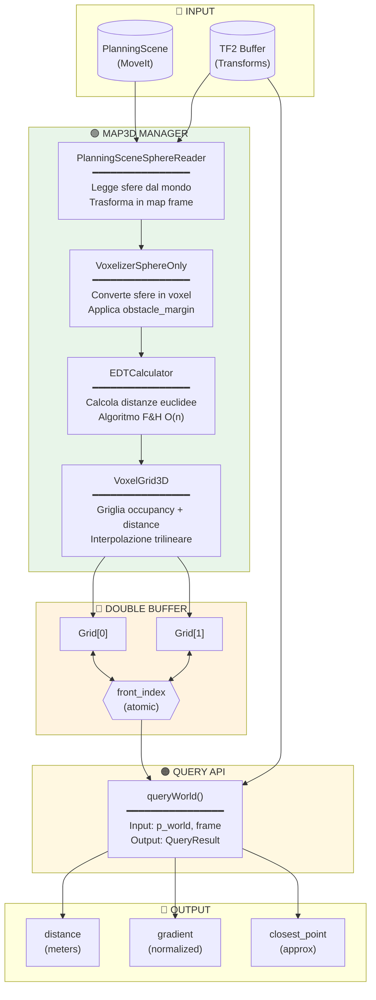
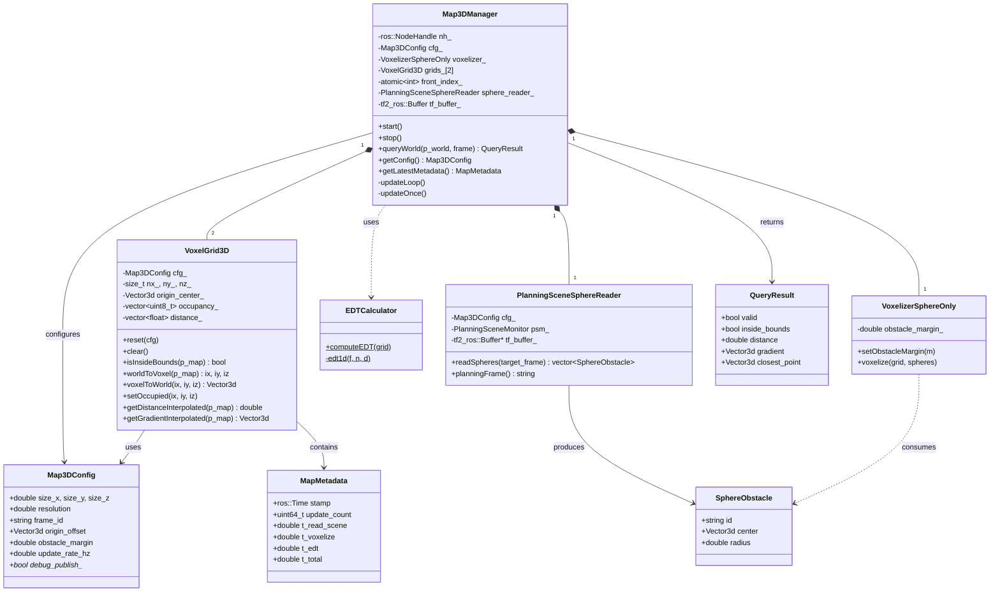
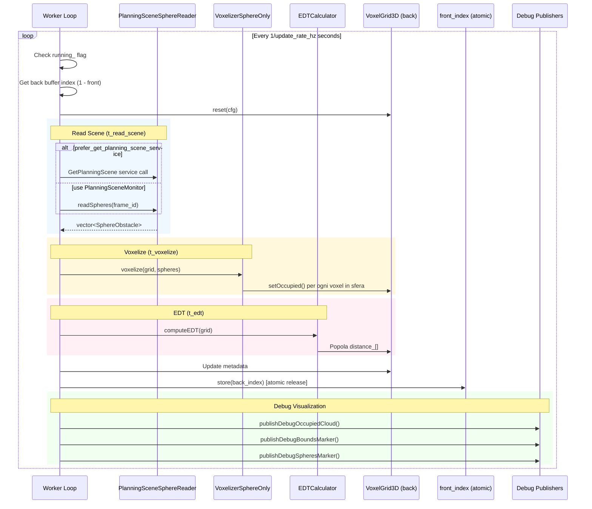
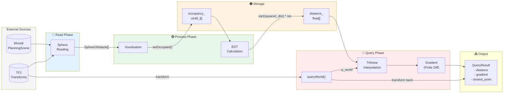
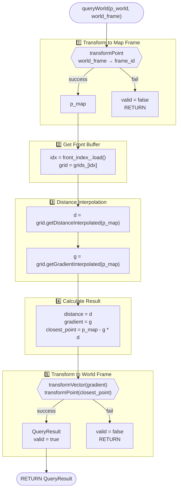
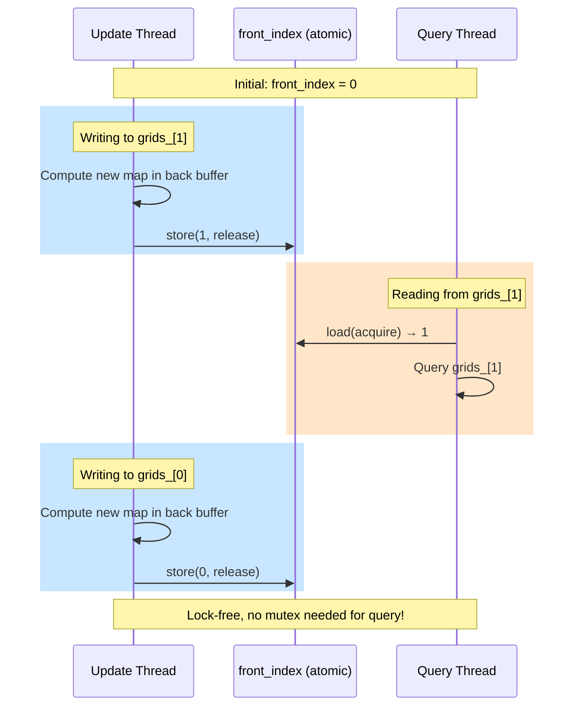

# Map3D - Architettura della Mappa 3D per Obstacle Avoidance

Questo documento descrive l'architettura e il funzionamento della mappa 3D implementata nel pacchetto `cartesian_velocity_controller` per il rilevamento e l'evitamento degli ostacoli.

---

## 📑 Indice

1. [Panoramica Generale](#panoramica-generale)
2. [Diagramma dell'Architettura](#diagramma-dellarchitettura)
3. [Componenti Principali](#componenti-principali)
4. [Pipeline di Aggiornamento](#pipeline-di-aggiornamento)
5. [Flusso dei Dati](#flusso-dei-dati)
6. [Query della Distanza](#query-della-distanza)
7. [Strutture Dati](#strutture-dati)
8. [Configurazione](#configurazione)
9. [Debug e Visualizzazione](#debug-e-visualizzazione)

---

## Panoramica Generale

La mappa 3D implementa un **Distance Field** (campo di distanza) per obstacle avoidance in tempo reale. L'architettura è basata su:

- **Lettura ostacoli**: Sfere dalla PlanningScene di MoveIt
- **Voxelizzazione**: Conversione degli ostacoli in una griglia 3D
- **EDT (Euclidean Distance Transform)**: Calcolo delle distanze euclidee
- **Double Buffering**: Aggiornamenti lock-free per alte performance

```
┌─────────────────────────────────────────────────────────────────────┐
│                         MAP3D MANAGER                                │
│  ┌─────────────┐   ┌─────────────┐   ┌─────────────┐   ┌──────────┐ │
│  │ PlanningScene│──▶│  Voxelizer  │──▶│ EDT Calc    │──▶│ Distance │ │
│  │ Sphere Reader│   │ (Spheres)   │   │ (F&H 2012)  │   │   Grid   │ │
│  └─────────────┘   └─────────────┘   └─────────────┘   └──────────┘ │
│                                                              │      │
│                                     ┌────────────────────────▼───┐  │
│                                     │   Query API (world frame)  │  │
│                                     │  - distance (meters)       │  │
│                                     │  - gradient (normalized)   │  │
│                                     │  - closest_point           │  │
│                                     └────────────────────────────┘  │
└─────────────────────────────────────────────────────────────────────┘
```

---

## Diagramma dell'Architettura

### Diagramma a Blocchi - Vista Generale



### Diagramma delle Classi



---

## Componenti Principali

### 1. Map3DManager

**File**: `map3d_manager.hpp/cpp`

Il componente centrale che orchestra l'intero sistema della mappa 3D.

| Responsabilità | Descrizione |
|----------------|-------------|
| **Lifecycle** | `start()` / `stop()` per thread di aggiornamento |
| **Config** | Caricamento parametri da ROS Parameter Server |
| **Update Loop** | Thread background per aggiornamenti periodici |
| **Query API** | `queryWorld()` - interfaccia pubblica per interrogare distanze |
| **TF** | Trasformazioni tra frame (world ↔ map) |
| **Debug** | Pubblicazione marker e point cloud per RViz |

### 2. VoxelGrid3D

**File**: `voxel_grid_3d.hpp/cpp`

Implementa la griglia voxel 3D con supporto per occupancy e distance field.

```
┌────────────────────────────────────────────────────────────┐
│                    VOXEL GRID 3D                           │
│                                                            │
│   origin_center_ (map frame)                               │
│           │                                                │
│           ▼                                                │
│   ┌───────────────────────────────┐                        │
│   │       size_z                  │                        │
│   │  ┌────────────────────┐       │                        │
│   │  │    █ █             │       │  █ = occupied voxel    │
│   │  │  █ █ █ █           │size_y │  · = free voxel        │
│   │  │    █ █             │       │                        │
│   │  │                    │       │                        │
│   │  └────────────────────┘       │                        │
│   │         size_x                │                        │
│   └───────────────────────────────┘                        │
│                                                            │
│   Storage:                                                 │
│   - occupancy_[total] : uint8_t (0=free, 255=occupied)     │
│   - distance_[total]  : float (meters to nearest obstacle) │
│                                                            │
│   Index = iz * (nx * ny) + iy * nx + ix                    │
└────────────────────────────────────────────────────────────┘
```

**Metodi chiave**:

| Metodo | Descrizione |
|--------|-------------|
| `worldToVoxel()` | Converte coordinate mondo → indici voxel |
| `voxelToWorld()` | Converte indici voxel → centro voxel (mondo) |
| `setOccupied()` | Marca un voxel come occupato |
| `getDistanceInterpolated()` | **Interpolazione trilineare** della distanza |
| `getGradientInterpolated()` | Gradiente via differenze finite |

### 3. VoxelizerSphereOnly

**File**: `voxelizer_sphere.hpp/cpp`

Converte primitive sferiche in voxel occupati.

```
┌─────────────────────────────────────────────────────────────┐
│                   VOXELIZATION PROCESS                      │
│                                                             │
│   Input: SphereObstacle                                     │
│          - center (x, y, z)                                 │
│          - radius r                                         │
│          - obstacle_margin m                                │
│                                                             │
│   Effective radius: R = r + m                               │
│                                                             │
│   ┌───────────────────────┐                                 │
│   │     · · · · · · ·     │  1. Calcola bounding box        │
│   │   · · █ █ █ █ · ·     │     pmin = center - (R,R,R)     │
│   │   · █ █ █ █ █ █ ·     │     pmax = center + (R,R,R)     │
│   │   · █ █ ● █ █ █ ·     │                                 │
│   │   · █ █ █ █ █ █ ·     │  2. Per ogni voxel nel box:     │
│   │   · · █ █ █ █ · ·     │     if ||voxel_center - c|| ≤ R │
│   │     · · · · · · ·     │        setOccupied(voxel)       │
│   └───────────────────────┘                                 │
│                                                             │
│   ● = sphere center                                         │
│   █ = occupied voxels                                       │
│   · = free voxels                                           │
└─────────────────────────────────────────────────────────────┘
```

### 4. EDTCalculator

**File**: `edt_calculator.hpp/cpp`

Implementa l'**Euclidean Distance Transform** usando l'algoritmo di Felzenszwalb & Huttenlocher (2012).

```
┌──────────────────────────────────────────────────────────────────────┐
│                     EDT ALGORITHM (F&H 2012)                         │
│                                                                      │
│   Complessità: O(n) dove n = numero totale di voxel                  │
│                                                                      │
│   IDEA: Decomposizione separabile in 1D                              │
│                                                                      │
│   ┌────────────────────────────────────────────────────────────────┐ │
│   │                                                                │ │
│   │   Pass X:  Per ogni linea (y,z) fissa, EDT 1D lungo X          │ │
│   │            ──────────────────────▶                             │ │
│   │                                                                │ │
│   │   Pass Y:  Per ogni linea (x,z) fissa, EDT 1D lungo Y          │ │
│   │            │                                                   │ │
│   │            │                                                   │ │
│   │            ▼                                                   │ │
│   │                                                                │ │
│   │   Pass Z:  Per ogni linea (x,y) fissa, EDT 1D lungo Z          │ │
│   │            (profondità)                                        │ │
│   │                                                                │ │
│   └────────────────────────────────────────────────────────────────┘ │
│                                                                      │
│   1D EDT: Lower envelope di parabole                                 │
│                                                                      │
│        ▲ f(x)                        ▲ d(x)                          │
│        │    ∞     ∞                  │                               │
│        │ ┌──┐  ┌──┐                  │    ╱╲   ╱╲                     │
│        │ │  │  │  │    ────▶         │   ╱  ╲ ╱  ╲                   │
│        │─┴──┴──┴──┴──x              │──╱────╳────╲──x                │
│        0     █  █                    min distance                    │
│                                                                      │
│   Output: distance_[i] = distanza euclidea in metri                  │
└──────────────────────────────────────────────────────────────────────┘
```

### 5. PlanningSceneSphereReader

**File**: `planning_scene_sphere_reader.hpp/cpp`

Legge gli ostacoli sferici dalla PlanningScene di MoveIt.

```
┌─────────────────────────────────────────────────────────────┐
│               PLANNING SCENE SPHERE READER                  │
│                                                             │
│   ┌─────────────────┐                                       │
│   │  MoveIt         │                                       │
│   │  PlanningScene  │                                       │
│   │  Monitor        │                                       │
│   └────────┬────────┘                                       │
│            │                                                │
│            ▼                                                │
│   ┌─────────────────┐                                       │
│   │  World Objects  │  collision_detection::World           │
│   │  - obj1 (SPHERE)│                                       │
│   │  - obj2 (BOX)   │  ← filtrato (solo SPHERE)             │
│   │  - obj3 (SPHERE)│                                       │
│   └────────┬────────┘                                       │
│            │                                                │
│            ▼                                                │
│   ┌─────────────────┐                                       │
│   │  Transform      │  scene_frame → target_frame           │
│   │  (TF2 Buffer)   │  (es: world → base_link)              │
│   └────────┬────────┘                                       │
│            │                                                │
│            ▼                                                │
│   ┌─────────────────┐                                       │
│   │ SphereObstacle[]│                                       │
│   │  - id           │                                       │
│   │  - center       │  (in target_frame)                    │
│   │  - radius       │                                       │
│   └─────────────────┘                                       │
└─────────────────────────────────────────────────────────────┘
```

---

## Pipeline di Aggiornamento

### Sequence Diagram



### Update Once - Dettaglio Passi

```
┌──────────────────────────────────────────────────────────────────────┐
│                         updateOnce()                                 │
├──────────────────────────────────────────────────────────────────────┤
│                                                                      │
│  1. GET BACK BUFFER                                                  │
│     ┌─────────────────────────────────────────────────┐              │
│     │  front = front_index_.load()                    │              │
│     │  back = 1 - front                               │              │
│     │  grid = grids_[back]                            │              │
│     └─────────────────────────────────────────────────┘              │
│                                                                      │
│  2. RESET GRID                                                       │
│     ┌─────────────────────────────────────────────────┐              │
│     │  grid.reset(cfg)                                │              │
│     │  - Ricalcola nx, ny, nz                         │              │
│     │  - occupancy_ = [kFree, kFree, ...]             │              │
│     │  - distance_ = [+∞, +∞, ...]                    │              │
│     └─────────────────────────────────────────────────┘              │
│                                                                      │
│  3. READ SPHERES (t_read_scene)                                      │
│     ┌─────────────────────────────────────────────────┐              │
│     │  if (prefer_service)                            │              │
│     │    spheres = readSpheresFromGetPlanningScene()  │              │
│     │  else                                           │              │
│     │    spheres = sphere_reader_->readSpheres()      │              │
│     └─────────────────────────────────────────────────┘              │
│                                                                      │
│  4. VOXELIZE (t_voxelize)                                            │
│     ┌─────────────────────────────────────────────────┐              │
│     │  voxelizer_.setObstacleMargin(cfg.margin)       │              │
│     │  voxelizer_.voxelize(grid, spheres)             │              │
│     │  (marca voxel occupati)                         │              │
│     └─────────────────────────────────────────────────┘              │
│                                                                      │
│  5. EDT (t_edt)                                                      │
│     ┌─────────────────────────────────────────────────┐              │
│     │  EDTCalculator::computeEDT(grid)                │              │
│     │  (popola distance_ con valori in metri)         │              │
│     └─────────────────────────────────────────────────┘              │
│                                                                      │
│  6. SWAP BUFFERS                                                     │
│     ┌─────────────────────────────────────────────────┐              │
│     │  grid.metadata() = meta                         │              │
│     │  front_index_.store(back, memory_order_release) │              │
│     └─────────────────────────────────────────────────┘              │
│                                                                      │
│  7. PUBLISH DEBUG                                                    │
│     ┌─────────────────────────────────────────────────┐              │
│     │  publishDebugOccupiedCloud(grid)                │              │
│     │  publishDebugBoundsMarker(grid)                 │              │
│     │  publishDebugSpheresMarker(spheres)             │              │
│     └─────────────────────────────────────────────────┘              │
│                                                                      │
└──────────────────────────────────────────────────────────────────────┘
```

---

## Flusso dei Dati

### Data Flow Diagram



---

## Query della Distanza

### queryWorld() - Flusso Dettagliato



### Interpolazione Trilineare

```
┌──────────────────────────────────────────────────────────────────────┐
│                    TRILINEAR INTERPOLATION                           │
│                                                                      │
│   Dato un punto p_map, trova le 8 celle adiacenti e interpola:       │
│                                                                      │
│                  c001 ──────────── c101                              │
│                  ╱│               ╱│                                 │
│                 ╱ │              ╱ │                                 │
│               c011──────────── c111                                  │
│                │  │             │  │                                 │
│                │  c000 ─────────│─ c100                              │
│                │ ╱              │ ╱                                  │
│                │╱               │╱                                   │
│               c010 ──────────── c110                                 │
│                                                                      │
│   1. Calcola coordinate voxel frazionarie:                           │
│      fx = (p.x - minX) / resolution - 0.5                            │
│      ...                                                             │
│                                                                      │
│   2. Trova cella base (floor) e frazioni tx, ty, tz ∈ [0,1]          │
│                                                                      │
│   3. Sample 8 vertici:                                               │
│      c000, c100, c010, c110, c001, c101, c011, c111                  │
│                                                                      │
│   4. Interpola:                                                      │
│      c00 = c000*(1-tx) + c100*tx                                     │
│      c10 = c010*(1-tx) + c110*tx                                     │
│      c01 = c001*(1-tx) + c101*tx                                     │
│      c11 = c011*(1-tx) + c111*tx                                     │
│      c0 = c00*(1-ty) + c10*ty                                        │
│      c1 = c01*(1-ty) + c11*ty                                        │
│      c = c0*(1-tz) + c1*tz                                           │
│                                                                      │
│   Output: valore di distanza interpolato (continuo)                  │
└──────────────────────────────────────────────────────────────────────┘
```

### Calcolo del Gradiente

```
┌──────────────────────────────────────────────────────────────────────┐
│                    GRADIENT CALCULATION                              │
│                                                                      │
│   Differenze finite centrali con step = resolution                   │
│                                                                      │
│          ∂d      d(p + h·x̂) - d(p - h·x̂)                             │
│   dx = ──── = ─────────────────────────────                          │
│          ∂x              2·h                                         │
│                                                                      │
│   Analogo per dy, dz                                                 │
│                                                                      │
│   gradient = normalize(dx, dy, dz)                                   │
│                                                                      │
│   ⚠️ Fallback se norma ≈ 0:                                         │
│      - Direzione verso origin_center_ della griglia                  │
│      - Oppure UnitX() se anche quella è nulla                        │
│                                                                      │
│   Il gradiente punta VERSO lo spazio libero (away from obstacles)    │
└──────────────────────────────────────────────────────────────────────┘
```

---

## Strutture Dati

### Map3DConfig

```cpp
struct Map3DConfig {
    // ═══════════════ Grid Dimensions ═══════════════
    double size_x{3.0};        // [m] Larghezza totale
    double size_y{3.0};        // [m] Profondità totale  
    double size_z{2.0};        // [m] Altezza totale
    double resolution{0.05};   // [m] Dimensione voxel

    // ═══════════════ Reference Frame ═══════════════
    std::string frame_id{"base_link"};     // Frame della mappa
    Eigen::Vector3d origin_offset{0,0,0.5}; // Centro mappa in frame_id

    // ═══════════════ Obstacle Handling ═══════════════
    double obstacle_margin{0.05};  // [m] Margine aggiuntivo sugli ostacoli

    // ═══════════════ Query Parameters ═══════════════
    double min_distance_eps{1e-3};
    double gradient_eps{1e-6};
    double gradient_clamp_distance{0.02};

    // ═══════════════ Update Rate ═══════════════
    double update_rate_hz{20.0};  // Hz, 0 = fast as possible

    // ═══════════════ MoveIt Integration ═══════════════
    bool prefer_get_planning_scene_service{true};
    std::string get_planning_scene_service{"/get_planning_scene"};
    
    // ... (debug visualization params)
};
```

### QueryResult

```cpp
struct QueryResult {
    bool valid{false};           // Query eseguita correttamente?
    bool inside_bounds{true};    // Punto dentro i limiti della mappa?
    
    double distance{0.0};        // [m] Distanza dalla superficie ostacolo
                                 //     (inflated con obstacle_margin)
    
    Eigen::Vector3d gradient;    // Direzione normalizzata verso spazio libero
                                 // (nel frame di query)
    
    Eigen::Vector3d closest_point; // Punto più vicino sulla superficie ostacolo
                                   // (approssimazione: p - gradient * distance)
};
```

### MapMetadata

```cpp
struct MapMetadata {
    ros::Time stamp;           // Timestamp dell'aggiornamento
    uint64_t update_count{0};  // Contatore aggiornamenti
    
    // ═══════════════ Timing Telemetry (seconds) ═══════════════
    double t_read_scene{0.0};  // Tempo lettura PlanningScene
    double t_voxelize{0.0};    // Tempo voxelizzazione
    double t_edt{0.0};         // Tempo calcolo EDT
    double t_total{0.0};       // Tempo totale update
};
```

---

## Configurazione

### Parametri ROS

```yaml
# cartesian_velocity_controller/config/map3d.yaml

map3d:
  # ═══════════════ Grid ═══════════════
  size_x: 3.0          # [m]
  size_y: 3.0          # [m]
  size_z: 2.0          # [m]
  resolution: 0.05     # [m] 5cm voxels → 60x60x40 = 144,000 voxels
  
  frame_id: "base_link"
  origin_offset: [0.0, 0.0, 0.5]  # Centro della griglia sopra base_link
  
  # ═══════════════ Safety ═══════════════
  obstacle_margin: 0.05  # [m] Inflazione ostacoli
  
  # ═══════════════ Performance ═══════════════  
  update_rate_hz: 20.0   # ~50ms budget per update
  
  # ═══════════════ MoveIt ═══════════════
  prefer_get_planning_scene_service: true
  get_planning_scene_service: "/get_planning_scene"
  
  # ═══════════════ Debug ═══════════════
  debug:
    publish_occupied_cloud: false
    publish_bounds_marker: true
    publish_spheres_marker: true
```

### Calcolo Dimensioni Griglia

```
┌──────────────────────────────────────────────────────────────────────┐
│                    GRID SIZE CALCULATION                             │
│                                                                      │
│   Esempio: size = 3.0m, resolution = 0.05m                           │
│                                                                      │
│   nx = floor(size_x / resolution) = floor(3.0 / 0.05) = 60           │
│   ny = floor(size_y / resolution) = 60                               │
│   nz = floor(size_z / resolution) = floor(2.0 / 0.05) = 40           │
│                                                                      │
│   total_voxels = 60 × 60 × 40 = 144,000 voxels                       │
│                                                                      │
│   Memory:                                                            │
│   - occupancy_: 144,000 × 1 byte = 144 KB                            │
│   - distance_:  144,000 × 4 bytes = 576 KB                           │
│   - Total per grid: ~720 KB                                          │
│   - Double buffer: ~1.4 MB                                           │
│                                                                      │
│   Performance (typical):                                             │
│   - Read scene: 1-5ms                                                │
│   - Voxelize: 0.1-1ms (dipende da # sfere)                           │
│   - EDT: 5-20ms                                                      │
│   - Total: 10-30ms @ 20Hz → OK                                       │
└──────────────────────────────────────────────────────────────────────┘
```

---

## Debug e Visualizzazione

### Topic di Debug

| Topic | Tipo | Descrizione |
|-------|------|-------------|
| `map3d/occupied_voxels` | `sensor_msgs/PointCloud2` | Voxel occupati (downsampled) |
| `map3d/bounds` | `visualization_msgs/Marker` | Wireframe box dei limiti mappa |
| `map3d/spheres` | `visualization_msgs/MarkerArray` | Sfere lette dalla PlanningScene |

### Visualizzazione in RViz

```
┌──────────────────────────────────────────────────────────────────────┐
│                        RVIZ VISUALIZATION                            │
│                                                                      │
│   ┌─────────────────────────────────────────────────────────────┐    │
│   │                                                             │    │
│   │        ┌─────────────────────────────────────┐              │    │
│   │        │ ░░░░░░░░░░░░░░░░░░░░░░░░░░░░░░░░░░  │ ← bounds     │    │
│   │        │ ░                                ░  │   marker     │    │
│   │        │ ░     ████                       ░  │              │    │
│   │        │ ░    ██████  ←─ occupied cloud   ░  │              │    │
│   │        │ ░     ████                       ░  │              │    │
│   │        │ ░                    ⬤           ░  │ ← sphere     │    │
│   │        │ ░                                ░  │   marker     │    │
│   │        │ ░░░░░░░░░░░░░░░░░░░░░░░░░░░░░░░░░░  │              │    │
│   │        └─────────────────────────────────────┘              │    │
│   │                                                             │    │
│   └─────────────────────────────────────────────────────────────┘    │
│                                                                      │
│   Legenda:                                                           │
│   █ = Point cloud dei voxel occupati (PointCloud2)                   │
│   ░ = Bordo wireframe della mappa (LINE_LIST marker)                 │
│   ⬤ = Sfere originali dalla PlanningScene (SPHERE markers)          │
└──────────────────────────────────────────────────────────────────────┘
```

---

## Appendice: Double Buffering

### Schema del Double Buffer



### Vantaggi

1. **Query Lock-Free**: `queryWorld()` non richiede lock
2. **No Starvation**: Writer e reader non si bloccano mai
3. **Consistenza**: Reader vede sempre una mappa completa e coerente
4. **Low Latency**: Nessun ritardo per acquisizione mutex

---

## Riferimenti

1. **Felzenszwalb, P.F. & Huttenlocher, D.P. (2012)** - Distance Transforms of Sampled Functions
2. **MoveIt PlanningSceneMonitor** - [docs.ros.org](https://docs.ros.org/)
3. **TF2** - [wiki.ros.org/tf2](http://wiki.ros.org/tf2)
