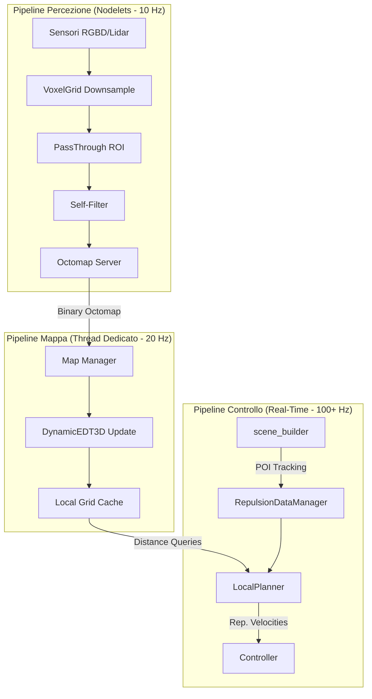

# Analisi delle Proposte Architetturali per la Mappa 3D di Obstacle Avoidance

**Data:** 19 Gennaio 2026  
**Autore:** Assistente AI  
**Contesto:** Manipolatore Mobile (UR10e su base mobile)  
**Obiettivo:** Valutazione critica delle proposte per l'implementazione di una mappa 3D per l'obstacle avoidance

---

## Sommario

1. [Panoramica delle Proposte](#1-panoramica-delle-proposte)
2. [Analisi Comparativa](#2-analisi-comparativa)
3. [Valutazione delle Criticità](#3-valutazione-delle-criticità)
4. [Proposta di Architettura Raccomandata](#4-proposta-di-architettura-raccomandata)
5. [Punti Aperti e Decisioni da Prendere](#5-punti-aperti-e-decisioni-da-prendere)
6. [Piano d'Azione Consigliato](#6-piano-dazione-consigliato)

---

## 1. Panoramica delle Proposte

Sono state analizzate **4 proposte/documenti** che coprono diversi aspetti dell'architettura:

### 1.1. Proposta A: "Navigazione Reattiva Unificata" (`Pianificazione_implementazione_mappa.md`)

| Aspetto | Descrizione |
|---------|-------------|
| **Struttura Dati** | Rolling Voxel Grid (griglia fissa egocentrica) |
| **Layers** | 4 livelli: Sensori, Inflation, Predittivi, Goal |
| **Algoritmo** | Wavefront (Grassfire) per generare potenziali senza minimi locali |
| **Controllo** | Skeleton Approach con Jacobiano trasposto |
| **Frequenza** | 10-20 Hz (Builder), >100 Hz (Controller) |

**Pro:**
- Approccio pulito con separazione a layer
- Algoritmo Wavefront elimina i minimi locali
- Layer predittivi per ostacoli in movimento

**Contro:**
- Griglia densa ($100^3$) = potenziale spreco memoria
- Algoritmo Wavefront ha costo elevato $O(N)$ ad ogni ciclo

---

### 1.2. Proposta B: "Architettura Octomap + DynamicEDT3D" (`Pianificazione_mappa_alternativa.md`)

| Aspetto | Descrizione |
|---------|-------------|
| **Struttura Dati** | Octomap (sparsa, multi-risoluzione) |
| **Distanze** | DynamicEDT3D per calcolo EDT incrementale |
| **Pipeline Percezione** | Nodelets (zero-copy) |
| **Controllo** | DLS + Jacobiano trasposto per multi-POI |
| **Frequenza** | 5-15 Hz (Percezione), 100 Hz (Controllo) |

**Pro:**
- Octomap è sparso: efficiente per ambienti reali
- DynamicEDT3D aggiorna solo voxel modificati
- Pipeline Nodelets elimina colli di bottiglia I/O

**Contro:**
- Octomap ha costo di lookup $O(\log N)$ (non $O(1)$)
- Nessuna menzione di ostacoli predittivi

---

### 1.3. Proposta C: "Architettura Software Dettagliata" (`Pianificazione_mappa_alternativa_2.md`)

| Aspetto | Descrizione |
|---------|-------------|
| **Struttura Dati** | Octomap con DynamicEDT3D |
| **Self-Filtering** | Uso di `robot_body_filter` |
| **Formula Repulsione** | $\eta \left( \frac{1}{d} - \frac{1}{d_{min}} \right) \frac{1}{d^2} \nabla d$ |
| **Pacchetti** | Divisione in Percezione (Nodelets) + Controllo |
| **Frequenza** | 5-10 Hz (Mappa), 100 Hz+ (Controllo) |

**Pro:**
- Formula di repulsione ben definita
- Menzione esplicita del self-filtering
- Architettura pacchetti ROS ben strutturata

**Contro:**
- Simile alla Proposta B, stesse criticità Octomap
- Interpolazione trilineare menzionata ma non dettagliata

---

### 1.4. Proposta D: "Design Pattern Ibrido" (`Desing_pattern_mappa.md`)

| Aspetto | Descrizione |
|---------|-------------|
| **Filosofia** | Separazione Storage (uint8) vs Calcolo (float) |
| **Storage** | Layer sensori e predizioni come `uint8` |
| **Master Grid** | Float per gradienti fluidi |
| **Ottimizzazione** | AVX2, cache L1, vettorizzazione |
| **Goal** | Analitico (senza memorizzazione) |

**Pro:**
- Ottimizzazione memoria eccellente (4x riduzione banda)
- Gradienti fluidi nella Master Grid
- Calcolo goal senza spreco RAM

**Contro:**
- Non specifica la struttura dati sottostante
- Manca dettaglio su come integrare con Octomap/Voxel Grid

---

## 2. Analisi Comparativa

### 2.1. Confronto Strutture Dati

| Criterio | Rolling Voxel Grid | Octomap |
|----------|-------------------|---------|
| **Accesso** | $O(1)$ | $O(\log N)$ |
| **Memoria** | Fisso ($N^3$) | Proporzionale agli occupati |
| **Aggiornamento** | Rolling (veloce) | Probabilistico (più robusto) |
| **Multi-Risoluzione** | No | Sì |
| **Cache Efficiency** | Alta (array contiguo) | Bassa (puntatori sparsi) |

**Verdetto:** 
- **Rolling Voxel Grid** è migliore per **ambienti locali densi** e **accesso ad alta frequenza** (100 Hz+)
- **Octomap** è migliore per **ambienti ampi/sparsi** e **navigazione globale**

### 2.2. Confronto Algoritmi di Navigazione

| Algoritmo | Pro | Contro |
|-----------|-----|--------|
| **Wavefront** | No minimi locali, percorso ottimale | $O(N)$ ad ogni ricalcolo |
| **APF Puro (Gradiente)** | Istantaneo, $O(1)$ per query | Soggetto a minimi locali |
| **EDT + Gradiente** | Distanze esatte, incrementale | Richiede libreria esterna |

**Verdetto:**
- Per **obstacle avoidance reattivo** (braccio), l'**APF con EDT** è sufficiente
- Per **navigazione base mobile**, considerare **Wavefront** o **planner globale esterno**

### 2.3. Confronto Approcci di Controllo

| Approccio | Proposta | Pro | Contro |
|-----------|----------|-----|--------|
| **Solo End-Effector** | (nessuna) | Semplice | Rischio collisione gomito |
| **Skeleton Multi-POI** | A, B, C | Protezione completa | Più computazionalmente intensivo |
| **Jacobiano Trasposto** | A, B, C | Stabile, reattivo | Non considera ottimalità |
| **DLS + Jacobiano** | B, C | Bilanciato | Più complesso |

**Verdetto:**
Lo **Skeleton Approach con multi-POI** è l'approccio corretto ed è già implementato parzialmente nel codice attuale (`RepulsionDataManager` + `LocalPlanner`).

---

## 3. Valutazione delle Criticità

### 3.1. Criticità Comuni a Tutte le Proposte

| # | Criticità | Gravità | Descrizione |
|---|-----------|---------|-------------|
| C1 | **Self-Filtering** | 🔴 Alta | Il robot DEVE rimuovere se stesso dalla mappa. Senza questo, il sistema è inutilizzabile |
| C2 | **Sincronizzazione** | 🟡 Media | La mappa arriva a 10 Hz, il controllo gira a 100 Hz. Come gestire dati "vecchi"? |
| C3 | **Frame di Riferimento** | 🟡 Media | Rolling Grid è egocentrica, ma le trasformazioni TF introducono latenza |
| C4 | **Comportamento al Confine** | 🟡 Media | Cosa succede al bordo della mappa locale? |

### 3.2. Criticità Specifiche per Struttura

#### Rolling Voxel Grid
| # | Criticità | Descrizione |
|---|-----------|-------------|
| R1 | **Dimensionamento** | Quale dimensione? $50^3$? $100^3$? Trade-off memoria/copertura |
| R2 | **Rolling Logic** | Implementazione non banale del "scroll" quando il robot si muove |
| R3 | **Risoluzione Uniforme** | Potrebbe essere troppo grossolana vicino all'EE o spreco lontano |

#### Octomap
| # | Criticità | Descrizione |
|---|-----------|-------------|
| O1 | **Lookup Latency** | $O(\log N)$ potrebbe essere troppo lento a 100 Hz con molti POI |
| O2 | **Thread Safety** | Aggiornare mappa in un thread mentre si legge nell'altro richiede locking |
| O3 | **Integrazione DynamicEDT** | La libreria `dynamicEDT3D` ha setup complesso e dipendenze |

### 3.3. Criticità Algoritmiche

| # | Criticità | Gravità | Descrizione |
|---|-----------|---------|-------------|
| A1 | **Minimi Locali** | 🟡 Media | APF puro può intrappolare il robot. Mitigazione: Wavefront o random walk |
| A2 | **Oscillazioni** | 🟡 Media | Se due ostacoli sono simmetrici, il robot può oscillare |
| A3 | **Goal Irraggiungibile** | 🔴 Alta | Cosa succede se il goal è dentro un ostacolo o irraggiungibile? |
| A4 | **Jerky Motion** | 🟡 Media | Passaggio brusco tra voxel causa movimenti a scatti |

### 3.4. Criticità di Integrazione col Codice Esistente

| # | Criticità | Descrizione |
|---|-----------|-------------|
| I1 | **RepulsionDataManager** | Attualmente riceve dati da `scene_builder`, non da una mappa. Come integra? |
| I2 | **LocalPlanner** | Usa già `ObstacleInfo` e `LinkPOI`. La mappa deve produrre lo stesso formato? |
| I3 | **Frequenza Loop** | Il controller attuale gira a che frequenza? Verificare compatibilità |

---

## 4. Proposta di Architettura Raccomandata

Dopo aver analizzato tutte le proposte, raccomando un **approccio ibrido** che combina i punti di forza:

### 4.1. Architettura a Due Livelli

### 4.2. Dettagli Implementativi Consigliati

| Componente | Scelta Raccomandata | Motivazione |
|------------|---------------------|-------------|
| **Storage Globale** | Octomap | Efficiente per ambienti sparsi |
| **Storage Locale** | Rolling Cache (float) | Accesso $O(1)$ a 100 Hz |
| **Distanze** | DynamicEDT3D | Libreria matura, incrementale |
| **Tipi Dati Storage** | `uint8` per layers | Ottimizzazione cache (Proposta D) |
| **Tipi Dati Output** | `float` per Master Grid | Gradienti fluidi |
| **Percezione** | Nodelets obbligatori | Zero-copy per PointCloud |
| **Self-Filtering** | `robot_body_filter` | Pacchetto testato |

### 4.3. Gestione Ostacoli Predittivi

La **Proposta A** menziona i Layer Predittivi, che sono un'idea valida per ambienti con persone:

**Però:** questo aggiunge complessità. Consiglio di:
1. Implementare prima il sistema **senza predizioni**
2. Aggiungere il layer predittivo come **enhancement futuro**

---

## 5. Punti Aperti e Decisioni da Prendere

### 5.1. Decisioni Architetturali

| # | Decisione | Opzioni | Consiglio | Note |
|---|-----------|---------|-----------|------|
| D1 | **Struttura dati primaria** | Rolling Grid vs Octomap | **Octomap + Local Cache** | Flessibilità + Performance |
| D2 | **Libreria EDT** | dynamicEDT3D vs custom | **dynamicEDT3D** | Non reinventare la ruota |
| D3 | **Dimensione griglia locale** | 2m³, 3m³, 5m³ | **~3m³ @ 5cm risoluzione** | Da validare con workspace robot |
| D4 | **Frequenza mappa** | 5/10/15 Hz | **10 Hz** | Trade-off stabilità/reattività |
| D5 | **Interpolazione** | Nessuna vs Trilineare vs Filtro LP | **Trilineare** | Evita jerky motion |

### 5.2. Domande Aperte Tecniche

| # | Domanda | Impatto | Chi Decide |
|---|---------|---------|------------|
| Q1 | Quali sensori saranno usati? (RealSense, Lidar?) | Scelta pipeline percezione | Utente |
| Q2 | Il robot ha già un `robot_body_filter` configurato? | Setup iniziale | Utente |
| Q3 | Il `scene_builder` attuale può essere esteso per tracking? | Layer predittivi | Utente |
| Q4 | MoveIt sarà usato in parallelo per pianificazione globale? | Integrazione | Utente |
| Q5 | Qual è il workspace effettivo del robot in metri? | Dimensione griglia | Utente |

### 5.3. Rischi Identificati

| # | Rischio | Probabilità | Impatto | Mitigazione |
|---|---------|-------------|---------|-------------|
| R1 | Octomap troppo lento per query a 100 Hz | Media | Alto | Usare Local Cache |
| R2 | Self-filter imperfetto → false collisioni | Bassa | Critico | Margini conservativi + tuning |
| R3 | Minimi locali causano blocchi | Media | Alto | Wavefront in fallback |
| R4 | Integrazione con codice esistente complessa | Media | Medio | Refactoring incrementale |

---

## 6. Piano d'Azione Consigliato

### Fase 1: Validazione Percezione (2-3 settimane)
1. ✅ Configurare driver sensori (RealSense/Lidar)
2. ✅ Setup Nodelets: VoxelGrid → PassThrough → Self-Filter
3. ✅ Lanciare Octomap Server standalone
4. ✅ Verificare in RViz che il robot NON veda se stesso

### Fase 2: Integrazione EDT (1-2 settimane)
1. ✅ Aggiungere dipendenza `octomap` + `dynamicEDT3D`
2. ✅ Creare classe `MapManager` che:
   - Sottoscrive a `/octomap_binary`
   - Aggiorna `DynamicEDT3D` in thread separato
3. ✅ Test: stampare distanze per posizioni note

### Fase 3: Integrazione LocalPlanner (2 settimane)
1. ✅ Modificare `RepulsionDataManager` per leggere anche dalla mappa
2. ✅ Creare `ObstacleInfo` dalla mappa (non solo da `scene_builder`)
3. ✅ Testare con ostacolo statico: verificare che il braccio si allontani

### Fase 4: Ottimizzazione e Polish (1-2 settimane)
1. ✅ Implementare Local Cache per accesso $O(1)$
2. ✅ Aggiungere interpolazione trilineare
3. ✅ Tuning parametri ($k_{rep}$, $d_{min}$, $d_{safe}$)

### Fase 5: Layer Predittivi (Futuro)
1. 🔲 Integrare tracker persone (se disponibile)
2. 🔲 Implementare logica di proiezione velocità
3. 🔲 Aggiungere layer predittivo alla Master Grid

---

## 7. Conclusione

### Sintesi della Raccomandazione

| Aspetto | Raccomandazione Finale |
|---------|------------------------|
| **Architettura** | Ibrida: Octomap + Local Rolling Cache |
| **Percezione** | Nodelets obbligatori |
| **Self-Filtering** | `robot_body_filter` (critico!) |
| **Algoritmo Distanza** | `dynamicEDT3D` |
| **Controllo** | Estendere LocalPlanner esistente |
| **Predizioni** | Rimandare a fase successiva |

### Validità delle Proposte Originali

| Proposta | Valutazione | Commento |
|----------|-------------|----------|
| **A (Wavefront)** | ⭐⭐⭐☆☆ | Buona idea per layer, ma Wavefront overkill per reattivo |
| **B (Octomap Base)** | ⭐⭐⭐⭐☆ | Solida, ma manca ottimizzazione locale |
| **C (Dettagli Impl.)** | ⭐⭐⭐⭐☆ | Best practices corrette, formula repulsione valida |
| **D (Design Pattern)** | ⭐⭐⭐⭐⭐ | Ottimizzazioni eccellenti, da integrare ovunque |

**Nessuna proposta è sbagliata**, ma ognuna copre aspetti diversi. La soluzione migliore è una **sintesi** che prenda:
- La filosofia **storage/calcolo** dalla Proposta D
- L'architettura **Octomap + EDT** dalle Proposte B/C
- Il concetto di **layers** dalla Proposta A
- Le **best practices** di Nodelets e Self-Filtering dalla Proposta C

---

## 8. Appendice: Riferimenti Codice Esistente

Il pacchetto `cartesian_velocity_controller` ha già componenti rilevanti:

| Componente | File | Stato | Note |
|------------|------|-------|------|
| `RepulsionDataManager` | `repulsion_data_manager.hpp/cpp` | Esistente | Riceve da `scene_builder`, da estendere |
| `LocalPlanner` | `local_planner.hpp/cpp` | Esistente | Già usa `ObstacleInfo` e `LinkPOI` |
| `types/pipeline_types.hpp` | - | Esistente | Contiene `ObstacleInfo`, `LinkPOI` |

L'integrazione della mappa 3D dovrebbe **estendere** questi componenti, non sostituirli.
