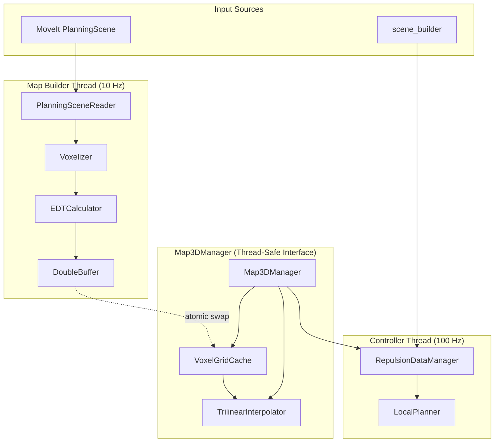
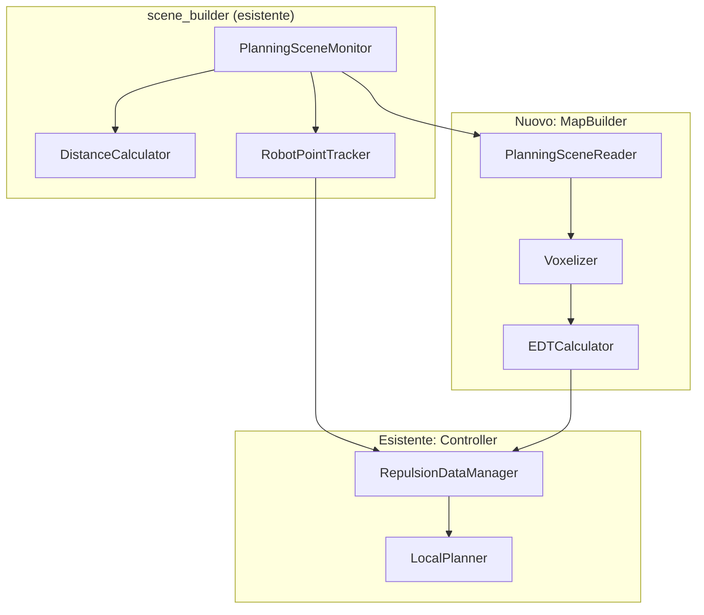

# Proposta Architettura Mappa 3D per Obstacle Avoidance

**Data:** 19 Gennaio 2026  
**Versione:** 2.0  
**Stato:** Proposta Dettagliata  

---

## Sommario

1. [Contesto e Requisiti Aggiornati](#1-contesto-e-requisiti-aggiornati)
2. [Architettura Proposta](#2-architettura-proposta)
3. [Struttura Dati della Mappa](#3-struttura-dati-della-mappa)
4. [Gestione Dati Asincroni (10 Hz → 100 Hz)](#4-gestione-dati-asincroni-10-hz--100-hz)
5. [Frame di Riferimento e Rolling Strategy](#5-frame-di-riferimento-e-rolling-strategy)
6. [Gestione Bordi della Mappa](#6-gestione-bordi-della-mappa)
7. [Integrazione con Planning Scene MoveIt](#7-integrazione-con-planning-scene-moveit)
8. [Refactoring del Codice Esistente](#8-refactoring-del-codice-esistente)
9. [Piano di Implementazione Dettagliato](#9-piano-di-implementazione-dettagliato)

---

## 1. Contesto e Requisiti Aggiornati

### 1.1. Vincoli di Progetto

| Vincolo | Descrizione |
|---------|-------------|
| **Robot** | Manipolatore mobile (UR10e + base) |
| **Fase attuale** | Solo braccio, base in futuro |
| **Frame mappa** | Solidale col robot (base_footprint o base del braccio) |
| **Sorgente dati (test)** | Planning Scene di MoveIt |
| **Sorgente dati (produzione)** | RGBD + Lidar (futuro) |
| **Retrocompatibilità** | Non richiesta |
| **Approccio controllo** | Skeleton Multi-POI (mantenere) |

### 1.2. Sfide da Risolvere

| Sfida | Soluzione Proposta |
|-------|-------------------|
| Mappa a 10 Hz, controllo a 100 Hz | **Double Buffering + Interpolazione** |
| TF latency con mappa egocentrica | **Mappa fissa rispetto a TF del robot** |
| Comportamento ai bordi della mappa | **Strategia di repulsione graduale** |

---

## 2. Architettura Proposta

### 2.1. Vista d'Insieme

L'architettura si basa su **tre componenti principali** che operano a frequenze diverse:

```
┌───────────────────────────────────────────────────────────────────────────┐
│                      ARCHITETTURA COMPLETA                                 │
├───────────────────────────────────────────────────────────────────────────┤
│                                                                           │
│  ┌─────────────────────────────────────────────────────────────────────┐  │
│  │                    MAP BUILDER (10-20 Hz)                           │  │
│  │  ┌───────────────┐    ┌───────────────┐    ┌───────────────┐       │  │
│  │  │ PlanningScene │───▶│  Voxelizer    │───▶│   EDT Calc    │       │  │
│  │  │   Reader      │    │  (popolam.)   │    │  (distanze)   │       │  │
│  │  └───────────────┘    └───────────────┘    └───────┬───────┘       │  │
│  │                                                     │               │  │
│  │                                                     ▼               │  │
│  │                                           ┌─────────────────┐       │  │
│  │                                           │  Double Buffer  │       │  │
│  │                                           │  (swap atomico) │       │  │
│  │                                           └────────┬────────┘       │  │
│  └────────────────────────────────────────────────────┼────────────────┘  │
│                                                        │                  │
│  ┌─────────────────────────────────────────────────────┼────────────────┐  │
│  │                    MAP CACHE (accesso 100 Hz)       │                │  │
│  │                                                     ▼                │  │
│  │  ┌─────────────────────────────────────────────────────────────┐    │  │
│  │  │              VoxelGridCache (O(1) access)                   │    │  │
│  │  │  - Griglia distanze (float)                                 │    │  │
│  │  │  - Griglia gradienti pre-calcolati (optional)              │    │  │
│  │  │  - Interpolazione trilineare built-in                       │    │  │
│  │  └──────────────────────────────┬──────────────────────────────┘    │  │
│  │                                  │                                   │  │
│  └──────────────────────────────────┼───────────────────────────────────┘  │
│                                     │                                      │
│  ┌──────────────────────────────────┼───────────────────────────────────┐  │
│  │              CONTROLLER LAYER (100 Hz)                                │  │
│  │                                  ▼                                    │  │
│  │  ┌───────────────────────────────────────────────────────────────┐   │  │
│  │  │                    LocalPlanner (esistente)                   │   │  │
│  │  │  - Skeleton POI già implementati                              │   │  │
│  │  │  - Integrazione nuove query dalla mappa                       │   │  │
│  │  └───────────────────────────────────────────────────────────────┘   │  │
│  │                                                                       │  │
│  └───────────────────────────────────────────────────────────────────────┘  │
│                                                                           │
└───────────────────────────────────────────────────────────────────────────┘
```

### 2.2. Diagramma dei Componenti



### 2.3. Responsabilità dei Componenti

| Componente | Responsabilità | Thread | Frequenza |
|------------|----------------|--------|-----------|
| `PlanningSceneReader` | Legge collision objects da MoveIt | Map Builder | 10 Hz |
| `Voxelizer` | Converte primitive 3D in voxel occupati | Map Builder | 10 Hz |
| `EDTCalculator` | Calcola distanza euclidea per ogni voxel | Map Builder | 10 Hz |
| `DoubleBuffer` | Gestisce swap atomico tra buffer | Shared | - |
| `VoxelGridCache` | Storage O(1) per query rapide | Controller | 100 Hz |
| `TrilinearInterpolator` | Interpola valori tra voxel | Controller | 100 Hz |
| `Map3DManager` | Interfaccia thread-safe per la mappa | Controller | 100 Hz |
| `RepulsionDataManager` | Combina dati mappa + scene_builder | Controller | 100 Hz |
| `LocalPlanner` | Calcola velocità repulsive | Controller | 100 Hz |

---

## 3. Struttura Dati della Mappa

### 3.1. Classe `VoxelGrid3D`

La griglia è la struttura dati centrale. Seguendo il design pattern proposto (storage `uint8`, calcolo `float`):

```cpp
/**
 * @class VoxelGrid3D
 * @brief Griglia 3D efficiente per mappa locale di obstacle avoidance
 * 
 * La griglia è FISSA rispetto a un frame TF del robot (es. base_link).
 * Quando il robot si muove, la mappa NON scrolla - il mondo esterno 
 * si muove rispetto alla griglia.
 */
class VoxelGrid3D
{
public:
    // ============== CONFIGURAZIONE ==============
    struct Config
    {
        // Dimensioni griglia
        double size_x = 3.0;      // metri (totale, es. -1.5 a +1.5)
        double size_y = 3.0;      // metri
        double size_z = 2.0;      // metri (verticale)
        
        // Risoluzione
        double resolution = 0.05; // 5 cm per voxel
        
        // Frame di riferimento
        std::string frame_id = "base_link";  // TF solidale col robot
        
        // Offset origine (centro della griglia rispetto al frame)
        double origin_offset_x = 0.0;   // centro in X
        double origin_offset_y = 0.0;   // centro in Y  
        double origin_offset_z = 0.5;   // leggermente sopra base
        
        // Valori speciali
        float free_value = 0.0f;         // spazio libero
        float occupied_value = 1.0f;     // ostacolo
        float unknown_value = -1.0f;     // ignoto (fuori mappa)
        float max_distance = 1.0f;       // distanza massima tracciata (m)
    };
    
    // ============== STORAGE ==============
private:
    // Layer di Storage (compatti, cache-friendly)
    std::vector<uint8_t> occupancy_grid_;     // 0=free, 255=occupied
    
    // Layer di Calcolo (per query rapide)  
    std::vector<float> distance_grid_;        // distanza in metri
    std::vector<Eigen::Vector3f> gradient_grid_;  // gradiente (opzionale)
    
    // Dimensioni calcolate
    size_t nx_, ny_, nz_;   // numero voxel per asse
    size_t total_voxels_;
    
public:
    // ============== QUERY PRINCIPALI ==============
    
    /**
     * @brief Query distanza con interpolazione trilineare
     * @param point_in_frame Punto nel frame della griglia (es. base_link)
     * @return Distanza interpolata in metri, o max_distance se fuori
     */
    float getDistance(const Eigen::Vector3d& point_in_frame) const;
    
    /**
     * @brief Query gradiente (direzione verso spazio libero)
     * @param point_in_frame Punto nel frame della griglia
     * @return Vettore gradiente normalizzato
     */
    Eigen::Vector3f getGradient(const Eigen::Vector3d& point_in_frame) const;
    
    /**
     * @brief Controlla se un punto è dentro i confini della mappa
     * @return true se dentro, false se fuori
     */
    bool isInsideBounds(const Eigen::Vector3d& point_in_frame) const;
    
    /**
     * @brief Ottieni la distanza dal bordo più vicino della mappa
     * @param point_in_frame Punto nel frame della griglia
     * @return Distanza dal bordo in metri (negativa se fuori)
     */
    float getDistanceToBoundary(const Eigen::Vector3d& point_in_frame) const;
    
    // ============== POPOLAZIONE ==============
    
    /**
     * @brief Reset completo a stato libero
     */
    void clear();
    
    /**
     * @brief Marca un voxel come occupato
     */
    void setOccupied(int ix, int iy, int iz);
    
    /**
     * @brief Popola da una lista di punti (centers delle primitive)
     */
    void populateFromPoints(const std::vector<Eigen::Vector3d>& points);
    
    /**
     * @brief Popola da primitive MoveIt (box, sphere, cylinder)
     */
    void populateFromPrimitives(
        const std::vector<shape_msgs::SolidPrimitive>& shapes,
        const std::vector<geometry_msgs::Pose>& poses);
    
    /**
     * @brief Calcola EDT (Euclidean Distance Transform)
     * @note Chiamare DOPO aver popolato la griglia
     */
    void computeEDT();
    
    /**
     * @brief Pre-calcola i gradienti (opzionale, per performance)
     */
    void precomputeGradients();
};
```

### 3.2. Dimensionamento Raccomandato

Per un UR10e (reach ~1.3m):

| Parametro | Valore Raccomandato | Motivazione |
|-----------|---------------------|-------------|
| `size_x` | 3.0 m | Copre reach + margine anteriore |
| `size_y` | 3.0 m | Simmetrico |
| `size_z` | 2.0 m | Altezza operativa robot |
| `resolution` | 0.05 m (5 cm) | Buon compromesso precisione/memoria |
| **Voxel totali** | 60 × 60 × 40 = **144,000** | ~576 KB per `float` |
| **Memoria occupancy** | 144 KB | `uint8` |
| **Memoria distance** | 576 KB | `float` |
| **Memoria gradient** | 1.7 MB (opzionale) | `Vector3f` |

### 3.3. Indirizzamento e Conversione Coordinate

```cpp
// Conversione mondo -> indice voxel
inline bool worldToVoxel(const Eigen::Vector3d& world_point,
                         int& ix, int& iy, int& iz) const
{
    // Offset dal centro della griglia
    double local_x = world_point.x() - origin_.x();
    double local_y = world_point.y() - origin_.y();
    double local_z = world_point.z() - origin_.z();
    
    // Converti in indici
    ix = static_cast<int>(std::floor(local_x / resolution_));
    iy = static_cast<int>(std::floor(local_y / resolution_));
    iz = static_cast<int>(std::floor(local_z / resolution_));
    
    // Bounds check
    return (ix >= 0 && ix < nx_ && 
            iy >= 0 && iy < ny_ && 
            iz >= 0 && iz < nz_);
}

// Accesso O(1) con linearizzazione
inline size_t voxelToIndex(int ix, int iy, int iz) const
{
    return iz * (nx_ * ny_) + iy * nx_ + ix;
}
```

---

## 4. Gestione Dati Asincroni (10 Hz → 100 Hz)

### 4.1. Problema

La mappa viene aggiornata a **10 Hz**, ma il controller la legge a **100 Hz**. Questo significa che per ~10 cicli di controllo, il controller usa la **stessa mappa**.

### 4.2. Soluzione: Double Buffering + Copia Atomica

```
┌─────────────────────────────────────────────────────────────────────┐
│                       DOUBLE BUFFERING                              │
├─────────────────────────────────────────────────────────────────────┤
│                                                                     │
│   MAP BUILDER THREAD                    CONTROLLER THREAD           │
│   (scrive sul back buffer)              (legge dal front buffer)    │
│                                                                     │
│   ┌──────────────────┐                  ┌──────────────────┐       │
│   │   Back Buffer    │                  │   Front Buffer   │       │
│   │   (in update)    │     SWAP         │   (in lettura)   │       │
│   │                  │◄════════════════▶│                  │       │
│   └──────────────────┘   (atomico)      └──────────────────┘       │
│                                                                     │
│   Dopo update completo:                 Letture O(1) thread-safe   │
│   swap_buffers() atomico                senza lock contention      │
│                                                                     │
└─────────────────────────────────────────────────────────────────────┘
```

### 4.3. Implementazione

```cpp
/**
 * @class DoubleBufferedGrid
 * @brief Gestione thread-safe con double buffering
 */
class DoubleBufferedGrid
{
private:
    // Due buffer: 0 e 1
    std::array<VoxelGrid3D, 2> buffers_;
    
    // Indice del buffer "front" (quello letto dal controller)
    std::atomic<int> front_index_{0};
    
    // Lock per l'aggiornamento (usato solo dal builder thread)
    std::mutex update_mutex_;
    
public:
    /**
     * @brief Ottieni riferimento read-only al buffer corrente
     * Thread-safe, lock-free per le letture
     */
    const VoxelGrid3D& getReadBuffer() const
    {
        return buffers_[front_index_.load(std::memory_order_acquire)];
    }
    
    /**
     * @brief Ottieni riferimento al buffer di scrittura
     * DA USARE SOLO DAL THREAD DI UPDATE
     */
    VoxelGrid3D& getWriteBuffer()
    {
        return buffers_[1 - front_index_.load()];
    }
    
    /**
     * @brief Swap atomico dei buffer
     * Chiamato DOPO che l'update del back buffer è completo
     */
    void swapBuffers()
    {
        std::lock_guard<std::mutex> lock(update_mutex_);
        int old_front = front_index_.load();
        front_index_.store(1 - old_front, std::memory_order_release);
    }
    
    /**
     * @brief Lock per update esclusivo
     * Previene swap durante un update parziale
     */
    std::unique_lock<std::mutex> lockForUpdate()
    {
        return std::unique_lock<std::mutex>(update_mutex_);
    }
};
```

### 4.4. Workflow del Map Builder

```cpp
void MapBuilder::updateCycle()
{
    // 1. Acquisisci lock e buffer di scrittura
    auto lock = double_buffer_.lockForUpdate();
    VoxelGrid3D& write_buffer = double_buffer_.getWriteBuffer();
    
    // 2. Clear e ri-popola
    write_buffer.clear();
    
    // 3. Leggi ostacoli dalla PlanningScene
    auto obstacles = readPlanningScene();
    
    // 4. Popola griglia
    for (const auto& obs : obstacles)
    {
        write_buffer.populateFromPrimitives(obs.shapes, obs.poses);
    }
    
    // 5. Calcola EDT
    write_buffer.computeEDT();
    
    // 6. (Opzionale) Pre-calcola gradienti
    write_buffer.precomputeGradients();
    
    // 7. Swap atomico - ora il controller vede la nuova mappa
    lock.unlock();
    double_buffer_.swapBuffers();
}
```

### 4.5. Perché Questo Approccio è Robusto

| Aspetto | Beneficio |
|---------|-----------|
| **Lock-free reads** | Il controller a 100 Hz non viene mai bloccato |
| **Consistenza** | Il controller vede sempre una mappa completa e consistente |
| **Latenza** | Al massimo 100ms (1 ciclo mappa) di "ritardo" dei dati |
| **No tearing** | Nessun rischio di leggere dati parzialmente aggiornati |

### 4.6. Gestione della "Vecchiaia" dei Dati

Per sapere quanto sono "vecchi" i dati:

```cpp
struct MapMetadata
{
    ros::Time timestamp;        // Quando la mappa è stata generata
    uint64_t update_count;      // Contatore aggiornamenti
    double age_seconds() const  // Età in secondi
    {
        return (ros::Time::now() - timestamp).toSec();
    }
};

// Nel controller:
const auto& map = map_manager_->getReadBuffer();
if (map.metadata().age_seconds() > 0.5)
{
    ROS_WARN_THROTTLE(1.0, "Map data is stale (%.2f s old)", 
                      map.metadata().age_seconds());
    // Opzione: aumentare margini di sicurezza
}
```

---

## 5. Frame di Riferimento e Rolling Strategy

### 5.1. Analisi delle Opzioni

| Opzione | Pro | Contro |
|---------|-----|--------|
| **Mappa in world frame** | Stabile, nessun ricalcolo | Richiede scroll, costoso |
| **Mappa in base_link** | Segue il robot "gratis" | Ostacoli si muovono nella mappa |
| **Mappa in base_footprint** | Come base_link, più stabile | Idem |

### 5.2. Raccomandazione: Mappa Fissa in `base_link`

**La tua idea è corretta e robusta.** Ecco perché:

```
┌─────────────────────────────────────────────────────────────────────┐
│           MAPPA FISSA IN base_link - COME FUNZIONA                  │
├─────────────────────────────────────────────────────────────────────┤
│                                                                     │
│  La mappa è una "bolla" attorno al robot che si muove CON LUI.      │
│                                                                     │
│  ┌─────────────────────┐      ┌─────────────────────┐              │
│  │      t = 0          │      │      t = 1s         │              │
│  │                     │      │                     │              │
│  │    ┌───────┐        │      │         ┌───────┐   │              │
│  │    │ MAPPA │        │      │         │ MAPPA │   │              │
│  │    │       │        │      │         │       │   │              │
│  │    │ [R]   │  →     │      │         │ [R]   │   │              │
│  │    │       │        │ 🚗   │         │       │   │              │
│  │    └───────┘        │══════│         └───────┘   │              │
│  │                     │      │                     │              │
│  │  ○ = ostacolo fisso │      │  ○ = ora "dietro"   │              │
│  └──────────○──────────┘      └───────────────────○─┘              │
│                                                                     │
│  L'ostacolo ○ era dentro la mappa, ora è uscito.                   │
│  Non serve "scrollare" - basta ri-popolare al prossimo ciclo.      │
│                                                                     │
└─────────────────────────────────────────────────────────────────────┘
```

### 5.3. Implementazione

```cpp
class Map3DManager
{
private:
    std::string map_frame_{"base_link"};  // Frame della mappa
    tf2_ros::Buffer& tf_buffer_;
    
public:
    /**
     * @brief Trasforma un punto dal world frame al frame della mappa
     */
    bool transformToMapFrame(const Eigen::Vector3d& point_world,
                             const std::string& world_frame,
                             Eigen::Vector3d& point_map_out) const
    {
        try
        {
            geometry_msgs::TransformStamped tf = 
                tf_buffer_.lookupTransform(map_frame_, world_frame, 
                                          ros::Time(0), ros::Duration(0.01));
            
            Eigen::Isometry3d transform = tf2::transformToEigen(tf.transform);
            point_map_out = transform * point_world;
            return true;
        }
        catch (const tf2::TransformException& ex)
        {
            ROS_WARN_THROTTLE(1.0, "TF error: %s", ex.what());
            return false;
        }
    }
    
    /**
     * @brief Query distanza per un punto espresso nel world frame
     */
    float getDistanceWorldFrame(const Eigen::Vector3d& point_world,
                                 const std::string& world_frame) const
    {
        Eigen::Vector3d point_map;
        if (!transformToMapFrame(point_world, world_frame, point_map))
        {
            return -1.0f;  // Errore TF
        }
        
        return grid_.getDistance(point_map);
    }
};
```

### 5.4. Perché NON Serve lo Scroll

Con l'approccio "mappa fissa in `base_link`":

1. **Ad ogni ciclo (10 Hz)**: La mappa viene **completamente rigenerata**
2. **Gli ostacoli vengono trasformati**: Da world frame → `base_link`
3. **Zero costo di scroll**: Non serve spostare dati in memoria

Questo è efficiente perché:
- La rigenerazione completa costa ~10-20 ms (accettabile a 10 Hz)
- Il costo è **costante** indipendentemente da quanto si muove il robot
- Non c'è accumulo di errori

### 5.5. Nota sulla Latenza TF

> *"Le trasformazioni TF introducono latenza"*

Sì, ma la **latenza TF (1-5 ms)** è trascurabile perché:
- La mappa ha già un "ritardo" di 100 ms (10 Hz update rate)
- Le trasformazioni TF sono sempre backward-looking (`ros::Time(0)`)
- Non stiamo facendo predizioni, solo lettura stato corrente

---

## 6. Gestione Bordi della Mappa

### 6.1. Il Problema

Quando un POI del robot (es. TCP) si avvicina al bordo della mappa:
- La query di distanza potrebbe fallire (fuori bounds)
- Non sappiamo cosa c'è oltre il bordo

### 6.2. Soluzioni Proposte

#### Soluzione A: Bordo come "Zona Ignota" (Conservativa)

```cpp
float VoxelGrid3D::getDistance(const Eigen::Vector3d& point) const
{
    if (!isInsideBounds(point))
    {
        // Fuori dalla mappa = potenziale ostacolo
        // Ritorna 0 (massima repulsione) o valore negativo
        return 0.0f;  // "Come se ci fosse un muro"
    }
    
    // Query normale...
    return getInterpolatedDistance(point);
}
```

**Pro:** Sicuro, il robot non esce mai dalla zona nota
**Contro:** Potrebbe essere troppo restrittivo

#### Soluzione B: Repulsione Graduale ai Bordi (Raccomandata)

```cpp
float VoxelGrid3D::getDistanceWithBoundary(const Eigen::Vector3d& point) const
{
    // 1. Calcola distanza dal bordo più vicino
    float dist_to_boundary = getDistanceToBoundary(point);
    
    // 2. Se siamo dentro, query normale
    if (isInsideBounds(point) && dist_to_boundary > boundary_margin_)
    {
        return getInterpolatedDistance(point);
    }
    
    // 3. Zona di transizione: blend tra distanza reale e repulsione bordo
    if (dist_to_boundary > 0 && dist_to_boundary <= boundary_margin_)
    {
        float internal_dist = getInterpolatedDistance(point);
        float boundary_factor = dist_to_boundary / boundary_margin_;
        
        // Blend: più siamo vicini al bordo, più la distanza "appare" piccola
        return internal_dist * boundary_factor;
    }
    
    // 4. Completamente fuori: repulsione massima
    return 0.0f;
}

float VoxelGrid3D::getDistanceToBoundary(const Eigen::Vector3d& point) const
{
    float dx_min = point.x() - (origin_.x() - size_x_ / 2);
    float dx_max = (origin_.x() + size_x_ / 2) - point.x();
    float dy_min = point.y() - (origin_.y() - size_y_ / 2);
    float dy_max = (origin_.y() + size_y_ / 2) - point.y();
    float dz_min = point.z() - (origin_.z() - size_z_ / 2);
    float dz_max = (origin_.z() + size_z_ / 2) - point.z();
    
    return std::min({dx_min, dx_max, dy_min, dy_max, dz_min, dz_max});
}
```

#### Soluzione C: Bordo "Infinito" (Ottimistica)

```cpp
float VoxelGrid3D::getDistance(const Eigen::Vector3d& point) const
{
    if (!isInsideBounds(point))
    {
        // Assume spazio libero oltre la mappa
        return config_.max_distance;
    }
    return getInterpolatedDistance(point);
}
```

**Pro:** Nessuna restrizione artificiale
**Contro:** Potenzialmente pericoloso se ci sono ostacoli fuori mappa

### 6.3. Raccomandazione: Soluzione B con Parametri Configurabili

```yaml
# config/map3d_params.yaml
map3d:
  # Dimensioni (metri)
  size_x: 3.0
  size_y: 3.0
  size_z: 2.0
  resolution: 0.05
  
  # Frame
  frame_id: "base_link"
  
  # Gestione bordi
  boundary_mode: "gradual"  # "hard", "gradual", "ignore"
  boundary_margin: 0.3      # Zona di transizione (metri)
  boundary_min_distance: 0.05  # Distanza minima "virtuale" al bordo
```

### 6.4. Visualizzazione RViz (Debug)

Per debugging, pubblicare markers che mostrano:
- Volume della mappa (wireframe box)
- Zona di transizione ai bordi (colore diverso)
- POI che sono vicini/fuori dal bordo

---

## 7. Integrazione con Planning Scene MoveIt

### 7.1. Architettura di Lettura

Poiché per ora i dati vengono dalla **Planning Scene di MoveIt** (non da sensori), possiamo riutilizzare le classi esistenti in `scene_builder`:



### 7.2. Classe `PlanningSceneReader`

```cpp
/**
 * @class PlanningSceneReader
 * @brief Legge collision objects dalla PlanningScene e li prepara per voxelization
 */
class PlanningSceneReader
{
public:
    struct CollisionObjectData
    {
        std::string id;
        std::vector<shape_msgs::SolidPrimitive> primitives;
        std::vector<geometry_msgs::Pose> primitive_poses;
        // Tutto già nel frame della mappa (base_link)
    };
    
    /**
     * @brief Legge tutti i collision objects dalla planning scene
     * @param frame_id Frame in cui trasformare le pose
     * @return Vettore di oggetti pronti per voxelization
     */
    std::vector<CollisionObjectData> readCollisionObjects(
        const std::string& frame_id);
    
private:
    planning_scene_monitor::PlanningSceneMonitorPtr monitor_;
    tf2_ros::Buffer& tf_buffer_;
};
```

### 7.3. Voxelizzazione Primitivi

```cpp
/**
 * @brief Voxelizza una sfera
 */
void Voxelizer::voxelizeSphere(VoxelGrid3D& grid,
                                const Eigen::Vector3d& center,
                                double radius)
{
    // Bounding box della sfera
    int ix_min, iy_min, iz_min, ix_max, iy_max, iz_max;
    grid.worldToVoxel(center - Eigen::Vector3d(radius, radius, radius),
                      ix_min, iy_min, iz_min);
    grid.worldToVoxel(center + Eigen::Vector3d(radius, radius, radius),
                      ix_max, iy_max, iz_max);
    
    // Itera sui voxel nel bounding box
    for (int iz = iz_min; iz <= iz_max; ++iz)
    for (int iy = iy_min; iy <= iy_max; ++iy)
    for (int ix = ix_min; ix <= ix_max; ++ix)
    {
        Eigen::Vector3d voxel_center = grid.voxelToWorld(ix, iy, iz);
        double dist_to_center = (voxel_center - center).norm();
        
        if (dist_to_center <= radius)
        {
            grid.setOccupied(ix, iy, iz);
        }
    }
}

/**
 * @brief Voxelizza un box
 */
void Voxelizer::voxelizeBox(VoxelGrid3D& grid,
                             const Eigen::Isometry3d& pose,
                             const Eigen::Vector3d& half_extents)
{
    // Trasforma i voxel nel frame del box per check di appartenenza
    Eigen::Isometry3d pose_inv = pose.inverse();
    
    // Bounding box world-aligned (conservativo)
    double max_extent = half_extents.maxCoeff() * 1.5;  // margine per rotazione
    // ... similar logic to sphere
}
```

### 7.4. Calcolo EDT (Euclidean Distance Transform)

Per l'EDT, consiglio di usare un algoritmo ottimizzato. L'implementazione più efficiente è quella di **Felzenszwalb & Huttenlocher**:

```cpp
/**
 * @brief Calcola EDT usando l'algoritmo di Felzenszwalb-Huttenlocher
 * @note Complessità O(N) dove N = numero voxel
 */
void VoxelGrid3D::computeEDT()
{
    // L'EDT può essere calcolato separatamente per ogni asse (separabilità)
    // Questo riduce la complessità da O(N²) a O(N)
    
    // 1. Inizializza: occupato=0, libero=INFINITY
    std::vector<float> temp(total_voxels_);
    for (size_t i = 0; i < total_voxels_; ++i)
    {
        temp[i] = (occupancy_grid_[i] == 255) ? 0.0f : 
                   std::numeric_limits<float>::max();
    }
    
    // 2. EDT lungo X
    for (size_t z = 0; z < nz_; ++z)
    for (size_t y = 0; y < ny_; ++y)
    {
        edtPass1D(temp.data() + z * nx_ * ny_ + y * nx_, nx_);
    }
    
    // 3. EDT lungo Y
    std::vector<float> column(ny_);
    for (size_t z = 0; z < nz_; ++z)
    for (size_t x = 0; x < nx_; ++x)
    {
        // Estrai colonna
        for (size_t y = 0; y < ny_; ++y)
            column[y] = temp[z * nx_ * ny_ + y * nx_ + x];
        
        edtPass1D(column.data(), ny_);
        
        // Riscrivi
        for (size_t y = 0; y < ny_; ++y)
            temp[z * nx_ * ny_ + y * nx_ + x] = column[y];
    }
    
    // 4. EDT lungo Z (simile)
    
    // 5. Converti in distanze metriche
    for (size_t i = 0; i < total_voxels_; ++i)
    {
        distance_grid_[i] = std::sqrt(temp[i]) * resolution_;
        distance_grid_[i] = std::min(distance_grid_[i], config_.max_distance);
    }
}
```

**Nota:** Se preferisci non implementare l'EDT da zero, puoi usare la libreria `dynamicEDT3D` che fa parte del pacchetto `octomap`. Tuttavia, per una griglia fissa (non sparsa come Octomap), un'implementazione custom è spesso più efficiente.

---

## 8. Refactoring del Codice Esistente

### 8.1. Componenti da Modificare

| Componente | Modifiche Necessarie |
|------------|---------------------|
| `RepulsionDataManager` | Aggiungere sorgente dati "mappa 3D" |
| `LocalPlanner` | Nessuna modifica se interface `ObstacleInfo` rimane |
| `cartesian_velocity_controller` | Inizializzare nuovo `Map3DManager` |

### 8.2. Nuova Interfaccia `RepulsionDataManager`

```cpp
// repulsion_data_manager.hpp (modificato)

class RepulsionDataManager
{
public:
    // ============== NUOVI: Sorgenti Dati ==============
    
    enum class DataSource
    {
        SCENE_BUILDER,      // Da topic /robot_points_info (esistente)
        MAP_3D,             // Dalla mappa voxel 3D (nuovo)
        BOTH                // Fusione di entrambi
    };
    
    /**
     * @brief Imposta la sorgente dati per la repulsione
     */
    void setDataSource(DataSource source);
    
    /**
     * @brief Imposta il Map3DManager (se DataSource != SCENE_BUILDER)
     */
    void setMap3DManager(std::shared_ptr<Map3DManager> map_manager);
    
    // ============== MODIFICATO: getRepulsionData ==============
    
    /**
     * @brief Ottiene dati repulsivi combinando le sorgenti attive
     * 
     * Se source = SCENE_BUILDER:
     *   - Usa solo scene_builder::RobotPointsInfo
     * Se source = MAP_3D:
     *   - Query la mappa 3D per ogni POI dello scheletro
     * Se source = BOTH:
     *   - Prende il MIN delle distanze tra le due sorgenti
     */
    void getRepulsionData(
        std::vector<ObstacleInfo>& obstacles_out,
        std::vector<LinkPOI>& link_pois_out,
        const Eigen::Isometry3d& current_tcp_pose,
        const std::string& global_frame);
    
private:
    DataSource data_source_{DataSource::SCENE_BUILDER};
    std::shared_ptr<Map3DManager> map_manager_;
    
    // Query la mappa per un singolo POI
    std::optional<ObstacleInfo> queryMapForPOI(
        const std::string& poi_name,
        const Eigen::Vector3d& position_world,
        const std::string& world_frame);
};
```

### 8.3. Query Mappa per POI

```cpp
std::optional<ObstacleInfo> RepulsionDataManager::queryMapForPOI(
    const std::string& poi_name,
    const Eigen::Vector3d& position_world,
    const std::string& world_frame)
{
    if (!map_manager_)
        return std::nullopt;
    
    // 1. Trasforma posizione nel frame della mappa
    Eigen::Vector3d position_map;
    if (!map_manager_->transformToMapFrame(position_world, world_frame, position_map))
        return std::nullopt;
    
    // 2. Query distanza e gradiente
    float distance = map_manager_->getDistance(position_map);
    Eigen::Vector3f gradient = map_manager_->getGradient(position_map);
    
    // 3. Il "vettore distanza" punta VERSO lo spazio libero
    //    Per la repulsione, vogliamo il vettore DALL'ostacolo verso il POI
    Eigen::Vector3d distance_vector = gradient.cast<double>() * distance;
    
    // 4. Crea ObstacleInfo
    ObstacleInfo info;
    info.id = "map_obstacle_" + poi_name;
    info.distance = distance;
    info.distance_vector = distance_vector;
    info.is_from_map = true;  // Nuovo flag per distinguere
    
    // Il punto più vicino sull'ostacolo è:
    info.closest_point_on_obstacle = position_world - distance_vector;
    
    return info;
}
```

### 8.4. Struttura Directory Proposta

```
cartesian_velocity_controller/
├── include/cartesian_velocity_controller/
│   ├── components/
│   │   ├── ...
│   │   └── repulsion_data_manager.hpp  (modificato)
│   ├── map/                             (NUOVO)
│   │   ├── voxel_grid_3d.hpp
│   │   ├── double_buffered_grid.hpp
│   │   ├── edt_calculator.hpp
│   │   ├── voxelizer.hpp
│   │   ├── planning_scene_reader.hpp
│   │   └── map_3d_manager.hpp
│   └── ...
├── src/
│   ├── components/
│   │   └── repulsion_data_manager.cpp  (modificato)
│   ├── map/                             (NUOVO)
│   │   ├── voxel_grid_3d.cpp
│   │   ├── edt_calculator.cpp
│   │   ├── voxelizer.cpp
│   │   ├── planning_scene_reader.cpp
│   │   └── map_3d_manager.cpp
│   └── ...
└── config/
    └── map3d_params.yaml               (NUOVO)
```

---

## 9. Piano di Implementazione Dettagliato

### Fase 0: Preparazione (1 giorno)
- [ ] Creare struttura directory `/map/`
- [ ] Aggiungere dipendenze in `CMakeLists.txt` e `package.xml`
- [ ] Creare file di configurazione `map3d_params.yaml`

### Fase 1: Core Data Structure (2-3 giorni)
- [ ] Implementare `VoxelGrid3D` (storage, accesso, conversione coordinate)
- [ ] Implementare `DoubleBufferedGrid` (swap atomico)
- [ ] Unit test per accesso O(1) e bounds checking

### Fase 2: Voxelization (2 giorni)
- [ ] Implementare `Voxelizer` per sfere, box, cilindri
- [ ] Implementare `PlanningSceneReader` per leggere da MoveIt
- [ ] Test: visualizzare griglia di occupancy in RViz

### Fase 3: EDT (2 giorni)
- [ ] Implementare `EDTCalculator` (Felzenszwalb o dynamicEDT3D)
- [ ] Implementare interpolazione trilineare
- [ ] Test: verificare distanze con ostacoli noti

### Fase 4: Integration (2-3 giorni)
- [ ] Implementare `Map3DManager` (interfaccia thread-safe)
- [ ] Modificare `RepulsionDataManager` per supportare data source MAP_3D
- [ ] Test: verificare che LocalPlanner riceva dati corretti

### Fase 5: Testing & Tuning (2-3 giorni)
- [ ] Test con singolo ostacolo statico
- [ ] Test con più ostacoli
- [ ] Test con ostacolo in movimento (via `object_command_node`)
- [ ] Tuning parametri (margini bordo, risoluzione, frequenza)

### Totale Stimato: **10-14 giorni lavorativi**

---

## 10. FAQ e Decisioni Finali

### Q1: Devo usare Octomap o griglia fissa?

**Risposta: Griglia fissa.** Per questi motivi:
- La mappa è piccola (3m³) → memoria non è un problema
- Accesso O(1) è critico per 100 Hz
- Rigenerazione completa a 10 Hz è più semplice che update incrementale

### Q2: Devo pre-calcolare i gradienti?

**Risposta: Opzionale, ma consigliato.**
- Pre-calcolo: +~2ms a 10 Hz, risparmio ~0.1ms per query a 100 Hz
- Con 10+ POI × 100 Hz = 1000+ query/s → risparmio totale ~100ms/s
- Consiglio: implementa prima senza, poi aggiungi se necessario

### Q3: Come gestisco il self-filtering?

**Risposta: La Planning Scene di MoveIt lo fa già.**
- MoveIt non include i link del robot nella distance query vs world objects
- Quando passeremo a sensori reali, dovremo aggiungere `robot_body_filter`

### Q4: Posso testare senza base mobile?

**Risposta: Sì.**
- Il frame della mappa può essere `base_link` del braccio
- La logica non cambia, solo il TF
- Quando aggiungerai la base, cambierai solo `frame_id` nel config

---

## 11. Riferimenti

- **Felzenszwalb, P. F., & Huttenlocher, D. P.** (2012). Distance transforms of sampled functions.
- **dynamicEDT3D**: https://github.com/OctoMap/octomap/tree/devel/dynamicEDT3D
- **Khatib, O.** (1986). Real-time obstacle avoidance for manipulators and mobile robots.
