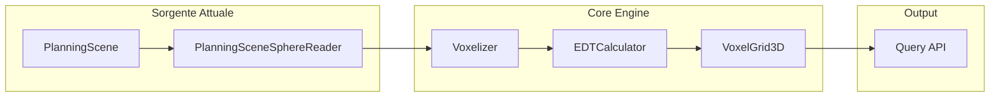
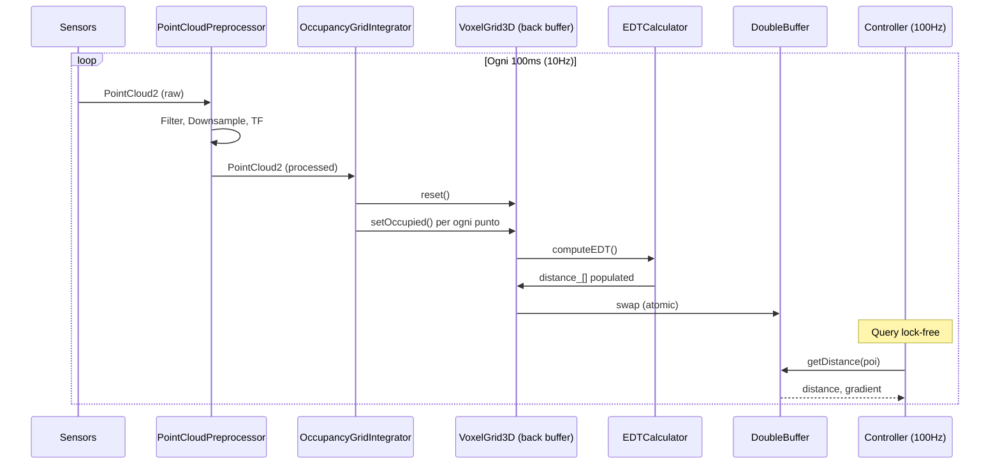

# Integrazione Sistemi di Rilevamento Ostacoli per la Mappa 3D

**Data:** 26 Gennaio 2026  
**Versione:** 1.0  
**Stato:** Documento Concettuale  

---

## Sommario

1. [Introduzione](#1-introduzione)
2. [Panoramica dell'Architettura Attuale](#2-panoramica-dellarchitettura-attuale)
3. [Tipologie di Sensori](#3-tipologie-di-sensori)
4. [Architettura di Integrazione Sensoriale](#4-architettura-di-integrazione-sensoriale)
5. [Integrazione Camere RGBD](#5-integrazione-camere-rgbd)
6. [Integrazione LiDAR 3D](#6-integrazione-lidar-3d)
7. [Fusione Multi-Sensore](#7-fusione-multi-sensore)
8. [Pipeline di Popolamento della Mappa](#8-pipeline-di-popolamento-della-mappa)
9. [Considerazioni Pratiche](#9-considerazioni-pratiche)
10. [Roadmap di Implementazione](#10-roadmap-di-implementazione)

---

## 1. Introduzione

### 1.1. Obiettivo

Questo documento descrive come integrare **sistemi di rilevamento ostacoli** (camere RGBD, LiDAR 3D) all'interno dell'architettura della mappa 3D del `cartesian_velocity_controller`. L'obiettivo è passare dalla sorgente dati attuale (PlanningScene di MoveIt con sfere simulate) a **dati sensoriali reali** per la navigazione e l'obstacle avoidance in ambienti dinamici.

### 1.2. Contesto Attuale

L'architettura attuale prevede:
- Una **VoxelGrid3D** di dimensione 3m × 3m × 2m a 5 cm di risoluzione (~144.000 voxel)
- Popolamento dalla **PlanningScene di MoveIt** (primitive sferiche)
- Calcolo EDT (Euclidean Distance Transform) per distanze precise
- **Double Buffering** per accesso lock-free a 100 Hz

```
┌──────────────────────────────────────────────────────────────────────────┐
│                        ARCHITETTURA ATTUALE                               │
│                                                                          │
│   PlanningScene        Voxelizer         EDT            VoxelGrid3D      │
│   (sfere simulate) → (occupancy) → (distance field) → (query 100Hz)     │
│                                                                          │
│   ⚠️ Limitazione: i dati provengono da simulazione, non da sensori      │
└──────────────────────────────────────────────────────────────────────────┘
```

### 1.3. Obiettivo Futuro

```
┌──────────────────────────────────────────────────────────────────────────┐
│                        ARCHITETTURA TARGET                                │
│                                                                          │
│   ┌────────────┐  ┌────────────┐                                         │
│   │ Camera RGB │  │  LiDAR 3D  │      Dati sensoriali reali              │
│   └─────┬──────┘  └─────┬──────┘                                         │
│         │               │                                                │
│         ▼               ▼                                                │
│   ┌─────────────────────────────┐                                        │
│   │    Sensor Fusion Layer      │      Accumulo e filtraggio            │
│   └──────────────┬──────────────┘                                        │
│                  │                                                       │
│                  ▼                                                       │
│   ┌──────────────────────────────┐                                       │
│   │  Occupancy Grid Integrator   │      Voxelizzazione                  │
│   └──────────────┬───────────────┘                                       │
│                  │                                                       │
│                  ▼                                                       │
│   ┌──────────────────────────────┐                                       │
│   │        VoxelGrid3D           │      EDT + Query                     │
│   └──────────────────────────────┘                                       │
└──────────────────────────────────────────────────────────────────────────┘
```

---

## 2. Panoramica dell'Architettura Attuale

### 2.1. Flusso Dati Esistente

L'architettura del `Map3DManager` già supporta l'astrazione della sorgente dati:



### 2.2. Punto di Estensione

Il **punto di ingresso** per i sensori è a monte del `Voxelizer`. Attualmente il `PlanningSceneSphereReader` produce una lista di `SphereObstacle`:

```cpp
struct SphereObstacle {
    std::string id;
    Eigen::Vector3d center;  // nel frame della mappa
    double radius;
};
```

Per i sensori reali, l'input cambierà in **Point Cloud** o **Depth Images**, che devono essere convertiti in voxel occupati.

---

## 3. Tipologie di Sensori

### 3.1. Camere RGBD (RGB + Depth)

| Caratteristica | Descrizione |
|----------------|-------------|
| **Output** | Immagine RGB + Depth map |
| **Risoluzione tipica** | 640×480 @ 30Hz / 1280×720 @ 15Hz |
| **Range** | 0.2m – 10m (tipico) |
| **FOV** | ~60-90° orizzontale |
| **Esempi** | Intel RealSense D435/D455, Azure Kinect, Orbbec Astra |
| **ROS Topic** | `sensor_msgs/Image` (depth), `sensor_msgs/PointCloud2` |

**Caratteristiche chiave:**
- ✅ Basso costo
- ✅ Buona risoluzione spaziale
- ✅ Informazioni di colore (utili per segmentazione)
- ❌ Sensibile a condizioni di luce (sole diretto)
- ❌ Superfici riflettenti problematiche
- ❌ FOV limitato

### 3.2. LiDAR 3D

| Caratteristica | Descrizione |
|----------------|-------------|
| **Output** | Point Cloud 3D |
| **Punti per secondo** | 300K – 1.2M punti/s |
| **Range** | 0.1m – 100m+ |
| **FOV** | 360° × 30-90° (multi-beam) |
| **Esempi** | Velodyne VLP-16, Ouster OS0/OS1, Livox Mid-360 |
| **ROS Topic** | `sensor_msgs/PointCloud2` |

**Caratteristiche chiave:**
- ✅ Alta precisione (mm)
- ✅ Insensibile a condizioni di luce
- ✅ Long range
- ✅ FOV ampio (360°)
- ❌ Costo elevato
- ❌ Risoluzione angolare limitata (gap tra raggi)

### 3.3. Confronto per Applicazione

| Scenario | Camera RGBD | LiDAR 3D | Raccomandazione |
|----------|-------------|----------|-----------------|
| **Indoor vicino** | ✅✅✅ | ✅✅ | Camera RGBD |
| **Outdoor** | ❌ | ✅✅✅ | LiDAR 3D |
| **Ostacoli piccoli** | ✅✅✅ | ✅ | Camera RGBD |
| **Copertura 360°** | ❌ | ✅✅✅ | LiDAR 3D |
| **Costo** | Basso | Alto | Dipende dal budget |
| **Manipolatore mobile** | ✅✅ | ✅✅ | **Combinazione** |

---

## 4. Architettura di Integrazione Sensoriale

### 4.1. Componenti Proposti

```
┌──────────────────────────────────────────────────────────────────────────┐
│                    ARCHITETTURA INTEGRAZIONE SENSORI                      │
├──────────────────────────────────────────────────────────────────────────┤
│                                                                          │
│  ┌────────────────────────────────────────────────────────────────────┐  │
│  │                     SENSOR DRIVERS (ROS)                           │  │
│  │  ┌──────────────┐  ┌──────────────┐  ┌──────────────┐             │  │
│  │  │ RealSense    │  │ LiDAR        │  │ Altri        │             │  │
│  │  │ Driver Node  │  │ Driver Node  │  │ Sensori      │             │  │
│  │  └──────┬───────┘  └──────┬───────┘  └──────┬───────┘             │  │
│  │         │                  │                  │                    │  │
│  │         ▼                  ▼                  ▼                    │  │
│  │     PointCloud2       PointCloud2        PointCloud2              │  │
│  └─────────┬──────────────────┬──────────────────┬───────────────────┘  │
│            │                  │                  │                      │
│  ┌─────────▼──────────────────▼──────────────────▼───────────────────┐  │
│  │              POINTCLOUD PREPROCESSOR                               │  │
│  │  ┌─────────────┐  ┌─────────────┐  ┌─────────────┐                │  │
│  │  │ Downsampling│  │ Filtering   │  │ TF Transform│                │  │
│  │  │ (Voxel Grid)│  │ (Outliers)  │  │ (to map     │                │  │
│  │  │             │  │             │  │  frame)     │                │  │
│  │  └─────────────┘  └─────────────┘  └─────────────┘                │  │
│  └─────────────────────────────────┬─────────────────────────────────┘  │
│                                    │                                    │
│  ┌─────────────────────────────────▼─────────────────────────────────┐  │
│  │                  OCCUPANCY GRID INTEGRATOR                         │  │
│  │  ┌─────────────┐  ┌─────────────┐  ┌─────────────┐                │  │
│  │  │ Raycasting  │  │ Voxel       │  │ Probabilistic│               │  │
│  │  │ (free space)│  │ Marking     │  │ Update       │               │  │
│  │  └─────────────┘  └─────────────┘  └─────────────┘                │  │
│  └─────────────────────────────────┬─────────────────────────────────┘  │
│                                    │                                    │
│  ┌─────────────────────────────────▼─────────────────────────────────┐  │
│  │                    VOXELGRID3D (esistente)                         │  │
│  │  ┌─────────────────────────────────────────────────────────────┐  │  │
│  │  │  occupancy_[] → EDTCalculator → distance_[] → Query API     │  │  │
│  │  └─────────────────────────────────────────────────────────────┘  │  │
│  └───────────────────────────────────────────────────────────────────┘  │
│                                                                          │
└──────────────────────────────────────────────────────────────────────────┘
```

### 4.2. Nuove Classi Proposte

| Componente | Responsabilità |
|------------|----------------|
| `PointCloudPreprocessor` | Filtraggio, downsampling, trasformazione TF |
| `OccupancyGridIntegrator` | Conversione PointCloud → voxel occupati |
| `SensorFusionManager` | Coordinamento multi-sensore |

### 4.3. Interfaccia Comune: `OccupancySource`

Per mantenere l'architettura modulare, si propone un'**interfaccia comune** per le sorgenti dati:

```cpp
/**
 * @interface IOccupancySource
 * @brief Interfaccia astratta per sorgenti di occupancy
 */
class IOccupancySource
{
public:
    virtual ~IOccupancySource() = default;
    
    /**
     * @brief Popola la griglia con i dati correnti
     * @param grid Griglia da popolare (già nel frame target)
     * @return true se aggiornamento riuscito
     */
    virtual bool populateGrid(VoxelGrid3D& grid) = 0;
    
    /**
     * @brief Ritorna il timestamp dell'ultimo dato
     */
    virtual ros::Time getLastUpdateTime() const = 0;
    
    /**
     * @brief Nome descrittivo della sorgente
     */
    virtual std::string getName() const = 0;
};

// Implementazioni concrete:
class PlanningSceneSource : public IOccupancySource { /*...*/ };  // Attuale
class PointCloudSource : public IOccupancySource { /*...*/ };     // Nuovo
class DepthImageSource : public IOccupancySource { /*...*/ };     // Nuovo
```

---

## 5. Integrazione Camere RGBD

### 5.1. Pipeline di Elaborazione

```
┌──────────────────────────────────────────────────────────────────────────┐
│                     PIPELINE CAMERA RGBD                                  │
├──────────────────────────────────────────────────────────────────────────┤
│                                                                          │
│  1. ACQUISIZIONE                                                         │
│     ┌───────────────────────────────────────────────────────────────┐   │
│     │  sensor_msgs/Image (depth)     sensor_msgs/CameraInfo        │   │
│     │        │                              │                       │   │
│     │        └──────────────┬───────────────┘                       │   │
│     └───────────────────────┼───────────────────────────────────────┘   │
│                             │                                           │
│  2. DEPTH TO POINTCLOUD     ▼                                           │
│     ┌───────────────────────────────────────────────────────────────┐   │
│     │  depth_image_proc/point_cloud_xyz                             │   │
│     │  (o conversione custom)                                       │   │
│     │                                                               │   │
│     │  Per ogni pixel (u, v) con depth d:                          │   │
│     │    X = (u - cx) * d / fx                                     │   │
│     │    Y = (v - cy) * d / fy                                     │   │
│     │    Z = d                                                     │   │
│     └───────────────────────┬───────────────────────────────────────┘   │
│                             │                                           │
│  3. FILTRAGGIO              ▼                                           │
│     ┌───────────────────────────────────────────────────────────────┐   │
│     │  - Range filter: 0.3m < d < 3.0m                              │   │
│     │  - Statistical outlier removal                                │   │
│     │  - Voxel downsampling (a risoluzione mappa)                   │   │
│     └───────────────────────┬───────────────────────────────────────┘   │
│                             │                                           │
│  4. TRASFORMAZIONE TF       ▼                                           │
│     ┌───────────────────────────────────────────────────────────────┐   │
│     │  camera_frame → base_link (frame della mappa)                 │   │
│     │  (usando tf2_ros::Buffer)                                     │   │
│     └───────────────────────┬───────────────────────────────────────┘   │
│                             │                                           │
│  5. VOXELIZZAZIONE          ▼                                           │
│     ┌───────────────────────────────────────────────────────────────┐   │
│     │  Per ogni punto nel PointCloud:                               │   │
│     │    (ix, iy, iz) = worldToVoxel(point)                         │   │
│     │    grid.setOccupied(ix, iy, iz)                               │   │
│     └───────────────────────────────────────────────────────────────┘   │
│                                                                          │
└──────────────────────────────────────────────────────────────────────────┘
```

### 5.2. Posizionamento Camere sul Manipolatore

Per un manipolatore mobile, si consigliano **multiple camere** per aumentare la copertura:

```
                    TOP VIEW
                    ─────────
                    
                    ┌───────┐
                    │ CAM3  │  (su end-effector, opzionale)
                    │  ↓    │
           ┌────────┴───────┴────────┐
           │                         │
    CAM1 ← │      ROBOT ARM          │ → CAM2
           │                         │
           └────────────┬────────────┘
                        │
           ┌────────────┴────────────┐
           │                         │
           │     MOBILE BASE         │
           │                         │
           │    CAM4 ↑   ↑ CAM5      │  (frontali, su base)
           └─────────────────────────┘
           
           
    SIDE VIEW                   
    ─────────
    
         CAM3 (wrist)
           │
           ▼
        ┌─────┐
        │ TCP │
        └──┬──┘
           │
           │  ← ARM
           │
    ───────┴───────  ← base_link
    
        CAM4/5 (base)
           ↓
```

### 5.3. Considerazioni per Camere RGBD

| Aspetto | Raccomandazione |
|---------|-----------------|
| **Frequenza** | 15-30 Hz (più lento della mappa 10Hz va bene) |
| **Auto-esclusione** | Mascherare il robot stesso nella depth image |
| **Sincronizzazione** | Utilizzare approximate time sync per multi-camera |
| **Calibrazione** | Calibrazione estrinseca precisa rispetto a base_link |
| **Zona cieca** | Ogni camera ha un range minimo (~0.2-0.3m) |

### 5.4. Pacchetti ROS Utili

| Pacchetto | Uso |
|-----------|-----|
| `realsense2_camera` | Driver Intel RealSense |
| `depth_image_proc` | Conversione depth → PointCloud |
| `pcl_ros` | Filtraggio e processing PointCloud |
| `tf2_sensor_msgs` | Trasformazione PointCloud tra frame |

---

## 6. Integrazione LiDAR 3D

### 6.1. Pipeline di Elaborazione

```
┌──────────────────────────────────────────────────────────────────────────┐
│                       PIPELINE LIDAR 3D                                   │
├──────────────────────────────────────────────────────────────────────────┤
│                                                                          │
│  1. ACQUISIZIONE                                                         │
│     ┌───────────────────────────────────────────────────────────────┐   │
│     │  sensor_msgs/PointCloud2                                      │   │
│     │  (direttamente dal driver LiDAR)                              │   │
│     │                                                               │   │
│     │  Campi tipici:                                                │   │
│     │  - x, y, z (posizione)                                        │   │
│     │  - intensity (riflettività)                                   │   │
│     │  - ring (ID raggio, per LiDAR multi-beam)                     │   │
│     └───────────────────────┬───────────────────────────────────────┘   │
│                             │                                           │
│  2. FILTRAGGIO SELF-FILTER  ▼                                           │
│     ┌───────────────────────────────────────────────────────────────┐   │
│     │  Rimozione punti che colpiscono il robot stesso:              │   │
│     │  - URDF-based self filtering (MoveIt)                         │   │
│     │  - Bounding box attorno ai link del robot                     │   │
│     └───────────────────────┬───────────────────────────────────────┘   │
│                             │                                           │
│  3. CROPPING (ROI)          ▼                                           │
│     ┌───────────────────────────────────────────────────────────────┐   │
│     │  Mantieni solo punti dentro l'area della mappa:               │   │
│     │  - CropBox filter con limiti della VoxelGrid3D                │   │
│     │  - |x| < 1.5m, |y| < 1.5m, 0 < z < 2.0m                       │   │
│     └───────────────────────┬───────────────────────────────────────┘   │
│                             │                                           │
│  4. DOWNSAMPLING            ▼                                           │
│     ┌───────────────────────────────────────────────────────────────┐   │
│     │  VoxelGrid filter con leaf_size = map.resolution (5cm)        │   │
│     │  Riduce ~300K punti → ~10K punti (nella ROI)                  │   │
│     └───────────────────────┬───────────────────────────────────────┘   │
│                             │                                           │
│  5. TRASFORMAZIONE TF       ▼                                           │
│     ┌───────────────────────────────────────────────────────────────┐   │
│     │  lidar_frame → base_link                                      │   │
│     │  (usando tf2_ros::Buffer)                                     │   │
│     └───────────────────────┬───────────────────────────────────────┘   │
│                             │                                           │
│  6. VOXELIZZAZIONE          ▼                                           │
│     ┌───────────────────────────────────────────────────────────────┐   │
│     │  Per ogni punto:                                              │   │
│     │    grid.setOccupied(worldToVoxel(point))                      │   │
│     └───────────────────────────────────────────────────────────────┘   │
│                                                                          │
└──────────────────────────────────────────────────────────────────────────┘
```

### 6.2. Posizionamento LiDAR

```
                    TOP VIEW (360° LiDAR)
                    ───────────────────────
                    
                              ↑
                              │ FOV
                     ╱────────┼────────╲
                   ╱          │          ╲
                 ╱            │            ╲
               ╱    ┌─────────┴─────────┐    ╲
              │     │                   │     │
         ← ───│     │   LIDAR (top)     │───→ │
              │     │       ◉           │     │
               ╲    └───────────────────┘    ╱
                 ╲           │             ╱
                   ╲         │           ╱
                     ╲───────┼─────────╱
                              │
                              ↓
                              
    SIDE VIEW
    ─────────
    
         ◉ LIDAR (alto, per vedere sopra ostacoli bassi)
         │
         │  1.0-1.5m sopra base
         │
    ─────┴─────  ← base_link
    
    ⚠️ Zona cieca: sotto il LiDAR, dipende dall'angolo verticale
```

### 6.3. Considerazioni per LiDAR

| Aspetto | Raccomandazione |
|---------|-----------------|
| **Frequenza** | 10-20 Hz (tipicamente 10Hz per Velodyne) |
| **Self-filtering** | Critico! Il robot appare nel scan |
| **Motion compensation** | Per robot in movimento veloce |
| **Ground removal** | Se LiDAR vede il pavimento, rimuoverlo |
| **Range minimo** | Tipicamente 0.1-0.5m |

### 6.4. Pacchetti ROS Utili

| Pacchetto | Uso |
|-----------|-----|
| `velodyne_driver` / `ouster_driver` | Driver HW specifici |
| `robot_self_filter` | Filtraggio punti sul robot |
| `pcl_ros` | VoxelGrid, CropBox filter |
| `pointcloud_to_laserscan` | Se serve anche 2D scan |

---

## 7. Fusione Multi-Sensore

### 7.1. Perché la Fusione?

Un singolo sensore ha limitazioni intrinseche. La **fusione multi-sensore** permette di:

| Vantaggio | Spiegazione |
|-----------|-------------|
| **Copertura completa** | Camera frontale + LiDAR 360° = nessun angolo cieco |
| **Ridondanza** | Se un sensore fallisce, l'altro fornisce dati |
| **Range combinato** | Camera per vicino + LiDAR per lontano |
| **Robustezza** | Diverse condizioni ambientali (luce, riflessioni) |

### 7.2. Strategie di Fusione

#### Strategia 1: Fusione a Livello di PointCloud (Early Fusion)

```
┌────────────┐  ┌────────────┐  ┌────────────┐
│  Camera 1  │  │  Camera 2  │  │  LiDAR     │
└─────┬──────┘  └─────┬──────┘  └─────┬──────┘
      │               │               │
      ▼               ▼               ▼
   PointCloud     PointCloud     PointCloud
      │               │               │
      └───────────────┼───────────────┘
                      │
                      ▼
              ┌───────────────┐
              │   MERGE       │  (concatenate + downsample)
              │   PointCloud  │
              └───────┬───────┘
                      │
                      ▼
              ┌───────────────┐
              │  Voxelizer    │
              └───────────────┘
```

**Pro:** Semplice, tutti i punti trattati uniformemente  
**Contro:** Non distingue tra sorgenti

#### Strategia 2: Fusione a Livello di Occupancy (Late Fusion)

```
┌────────────┐  ┌────────────┐  ┌────────────┐
│  Camera 1  │  │  Camera 2  │  │  LiDAR     │
└─────┬──────┘  └─────┬──────┘  └─────┬──────┘
      │               │               │
      ▼               ▼               ▼
   PointCloud     PointCloud     PointCloud
      │               │               │
      ▼               ▼               ▼
┌───────────┐  ┌───────────┐  ┌───────────┐
│Occupancy 1│  │Occupancy 2│  │Occupancy 3│
└─────┬─────┘  └─────┬─────┘  └─────┬─────┘
      │               │               │
      └───────────────┼───────────────┘
                      │
                      ▼
              ┌───────────────┐
              │  FUSION RULE  │
              │  (OR / MAX /  │
              │   Bayesian)   │
              └───────┬───────┘
                      │
                      ▼
              ┌───────────────┐
              │  VoxelGrid3D  │
              └───────────────┘
```

**Pro:** Può pesare diversamente i sensori  
**Contro:** Più complesso

#### Strategia 3: Fusione Probabilistica (Raccomandata per Scenari Dinamici)

```cpp
/**
 * @brief Update probabilistico della occupancy
 * 
 * Ogni sensore aggiorna la probabilità di occupancy usando
 * un modello log-odds (come in OctoMap)
 */
float updateLogOdds(float current_log_odds, 
                    bool observed_occupied,
                    float sensor_confidence)
{
    float update = observed_occupied 
                   ? +sensor_confidence   // hit → aumenta
                   : -sensor_confidence;  // miss → diminuisce
    
    return std::clamp(current_log_odds + update, 
                      MIN_LOG_ODDS, MAX_LOG_ODDS);
}

// Conversione log-odds ↔ probabilità
float logOddsToProb(float l) { return 1.0f / (1.0f + exp(-l)); }
float probToLogOdds(float p) { return log(p / (1.0f - p)); }
```

**Pro:** Gestisce incertezza, robusto al noise  
**Contro:** Richiede parametri di tuning

### 7.3. Sincronizzazione Temporale

I sensori hanno timestamp diversi. Opzioni:

| Metodo | Descrizione | Uso |
|--------|-------------|-----|
| **Approx Time Sync** | Combina messaggi entro tolleranza temporale (es. 50ms) | Multi-camera |
| **Latest All** | Usa l'ultimo dato di ogni sensore | Real-time semplice |
| **Interpolation** | Interpola TF al timestamp esatto | Alta precisione |

---

## 8. Pipeline di Popolamento della Mappa

### 8.1. Flusso Completo



### 8.2. Pseudo-codice del Ciclo di Update

```cpp
void MapUpdateLoop::run()
{
    ros::Rate rate(update_rate_hz_);  // 10 Hz
    
    while (ros::ok() && running_)
    {
        // --- 1. Raccolta dati sensoriali ---
        std::vector<pcl::PointCloud<pcl::PointXYZ>::Ptr> sensor_clouds;
        
        for (auto& source : sensor_sources_)
        {
            auto cloud = source->getLatestCloud();
            if (cloud)
            {
                sensor_clouds.push_back(cloud);
            }
        }
        
        // --- 2. Preprocessing ---
        pcl::PointCloud<pcl::PointXYZ>::Ptr merged_cloud(new pcl::PointCloud<pcl::PointXYZ>);
        
        for (auto& cloud : sensor_clouds)
        {
            // Trasforma nel frame della mappa
            pcl::PointCloud<pcl::PointXYZ> transformed;
            pcl_ros::transformPointCloud(map_frame_, *cloud, transformed, tf_buffer_);
            
            // Concatena
            *merged_cloud += transformed;
        }
        
        // Downsample
        pcl::VoxelGrid<pcl::PointXYZ> voxel_filter;
        voxel_filter.setInputCloud(merged_cloud);
        voxel_filter.setLeafSize(resolution_, resolution_, resolution_);
        voxel_filter.filter(*merged_cloud);
        
        // --- 3. Popolamento griglia ---
        VoxelGrid3D& back_buffer = double_buffer_.getWriteBuffer();
        back_buffer.clear();
        
        for (const auto& point : merged_cloud->points)
        {
            if (back_buffer.isInsideBounds(Eigen::Vector3d(point.x, point.y, point.z)))
            {
                int ix, iy, iz;
                back_buffer.worldToVoxel(Eigen::Vector3d(point.x, point.y, point.z),
                                         ix, iy, iz);
                back_buffer.setOccupied(ix, iy, iz);
            }
        }
        
        // --- 4. EDT ---
        EDTCalculator::computeEDT(back_buffer);
        
        // --- 5. Swap ---
        double_buffer_.swapBuffers();
        
        rate.sleep();
    }
}
```

### 8.3. Raycasting per Spazio Libero (Opzionale)

Per ambienti dinamici, è utile **tracciare raggi** verso i punti per marcare come "libero" lo spazio tra sensore e ostacolo:

```
        Sensore
           │
           │  ← Raggi
           │╲
           │ ╲
    ○○○○○○○│○ ● Punto hit = OCCUPATO
           │
           │
    ────────────────
    
    ○ = voxel attraversati dal raggio = LIBERI
    ● = voxel con punto = OCCUPATO
```

Questo è particolarmente utile per:
- Cancellare ostacoli che si sono mossi
- Distinguere "non visto" da "visto libero"

---

## 9. Considerazioni Pratiche

### 9.1. Performance

| Operazione | Tempo Tipico | Note |
|------------|--------------|------|
| Lettura PointCloud | 1-2 ms | |
| TF lookup | < 1 ms | Cache TF |
| Downsampling (300K → 10K) | 5-10 ms | PCL VoxelGrid |
| Self-filter | 2-5 ms | Dipende da complessità URDF |
| Voxelizzazione (10K punti) | 1-2 ms | O(n) |
| EDT (144K voxel) | 10-20 ms | F&H algorithm |
| **Totale** | **20-40 ms** | ✅ Accettabile per 10Hz |

### 9.2. Gestione Errori

| Problema | Soluzione |
|----------|-----------|
| Sensore offline | Timeout su dati, usa ultimo valido con warning |
| TF non disponibile | Skip frame, log warning |
| PointCloud corrotta | Validazione (NaN check, bounds check) |
| Troppi punti (overload) | Downsampling più aggressivo |
| Latenza eccessiva | Profiling, ottimizzazione |

### 9.3. Parametri Configurabili

```yaml
# config/sensor_integration.yaml

sensor_sources:
  - name: "front_camera"
    type: "PointCloud"
    topic: "/camera/depth/points"
    frame: "camera_color_optical_frame"
    min_range: 0.3
    max_range: 3.0
    
  - name: "lidar"
    type: "PointCloud"
    topic: "/velodyne_points"
    frame: "velodyne"
    min_range: 0.5
    max_range: 10.0

preprocessing:
  downsample_resolution: 0.05  # Match map resolution
  statistical_outlier_filter:
    mean_k: 10
    std_dev_mul: 1.0
  self_filter:
    enabled: true
    urdf_param: "robot_description"
    padding: 0.05  # Extra margin around robot

fusion:
  method: "early"  # "early", "late", "probabilistic"
  sync_tolerance: 0.05  # seconds
```

### 9.4. Self-Filtering Critico

Il robot **appare** nei dati sensoriali e deve essere **rimosso**:

```
┌─────────────────────────────────────────────────────────────────────┐
│                     SELF-FILTERING                                   │
├─────────────────────────────────────────────────────────────────────┤
│                                                                     │
│   SENZA self-filter:              CON self-filter:                   │
│                                                                     │
│   ┌─────────────────────┐         ┌─────────────────────┐           │
│   │   ████████████████  │         │                     │           │
│   │   ████  ARM  █████  │ ✗       │    (ARM rimosso)    │ ✓         │
│   │   ████  ↑    █████  │         │     ↑               │           │
│   │   ████ LiDAR █████  │         │   LiDAR             │           │
│   │   ██████████ █████  │         │                     │           │
│   │   ███ BASE ████████ │         │   (BASE rimossa)    │           │
│   │   ██████████████████│         │                     │           │
│   └─────────────────────┘         └─────────────────────┘           │
│                                                                     │
│   Il robot appare come              Solo ostacoli esterni           │
│   ostacolo → blocco!               → comportamento corretto         │
│                                                                     │
└─────────────────────────────────────────────────────────────────────┘
```

Opzioni per self-filtering:
1. **URDF-based** (MoveIt `robot_self_filter`): usa le collision geometry del robot
2. **Bounding-box manuale**: cubi/sfere attorno ai link
3. **Link TF-based**: esclude punti entro raggio dai link frame

---

## 10. Roadmap di Implementazione

### Fase 1: Infrastruttura Base (1-2 settimane)

| Task | Descrizione |
|------|-------------|
| 1.1 | Definire interfaccia `IOccupancySource` |
| 1.2 | Refactor `PlanningSceneSphereReader` come `PlanningSceneSource` |
| 1.3 | Creare `PointCloudSource` (classe base) |
| 1.4 | Test con PointCloud dummy/simulato |

### Fase 2: Integrazione Singolo Sensore (2-3 settimane)

| Task | Descrizione |
|------|-------------|
| 2.1 | Integrazione camera RGBD (es. RealSense) |
| 2.2 | Pipeline preprocessing (filter, downsample, TF) |
| 2.3 | Self-filtering con URDF |
| 2.4 | Test end-to-end con camera reale |

### Fase 3: Multi-Sensore (2-3 settimane)

| Task | Descrizione |
|------|-------------|
| 3.1 | Integrazione LiDAR 3D |
| 3.2 | `SensorFusionManager` per early fusion |
| 3.3 | Sincronizzazione temporale |
| 3.4 | Test con setup multi-sensore |

### Fase 4: Ottimizzazione (1-2 settimane)

| Task | Descrizione |
|------|-------------|
| 4.1 | Profiling e ottimizzazione performance |
| 4.2 | Raycasting per free-space (opzionale) |
| 4.3 | Fusione probabilistica (opzionale) |
| 4.4 | Tuning parametri per scenario specifico |

### Diagramma di Gantt (semplificato)

```
        Settimana:    1   2   3   4   5   6   7   8
                      │   │   │   │   │   │   │   │
Fase 1: Infrastruttura ███████│   │   │   │   │   │
                              │   │   │   │   │   │
Fase 2: Singolo Sensore       │███████████│   │   │
                              │   │   │   │   │   │
Fase 3: Multi-Sensore         │   │   │   │███████████
                              │   │   │   │   │   │
Fase 4: Ottimizzazione        │   │   │   │   │   ████
```

---

## Appendice A: Confronto con Soluzioni Esistenti

### OctoMap

| Caratteristica | OctoMap | Nostra Soluzione |
|----------------|---------|------------------|
| Struttura dati | Octree (risoluzione variabile) | VoxelGrid uniforme |
| EDT integrato | No (va calcolato separatamente) | Sì |
| Complessità | Più complesso | Più semplice |
| Performance query | O(log n) | O(1) |
| Memoria | Efficiente per mappe sparse | Fissa |
| Raccomandazione | Mappe grandi, navigazione | Obstacle avoidance locale |

### Voxblox

| Caratteristica | Voxblox | Nostra Soluzione |
|----------------|---------|------------------|
| ESDF integrato | Sì (incrementale) | Sì (ricalcolo completo) |
| Tsdf Layer | Sì | No (solo occupancy) |
| Performance EDT | Incrementale (più efficiente) | Batch (più semplice) |
| Complessità setup | Alta | Bassa |
| Raccomandazione | UAVs, grandi spazi | Manipolatore mobile |

### Conclusione

Per il caso d'uso del `cartesian_velocity_controller`:
- **Mappa piccola** (3m × 3m × 2m) → VoxelGrid uniforme è sufficiente
- **EDT ogni ciclo** è accettabile a 10Hz con 144K voxel
- **Semplicità** è preferita inizialmente; si può migrare a soluzioni più complesse se necessario

---

## Appendice B: Riferimenti

1. **Intel RealSense ROS**: https://github.com/IntelRealSense/realsense-ros
2. **PCL (Point Cloud Library)**: https://pointclouds.org/
3. **OctoMap**: https://octomap.github.io/
4. **Voxblox**: https://github.com/ethz-asl/voxblox
5. **robot_self_filter**: http://wiki.ros.org/robot_self_filter
6. **depth_image_proc**: http://wiki.ros.org/depth_image_proc

---

*Documento creato per il pacchetto `cartesian_velocity_controller` - Integrazione Sensori per Mappa 3D*
