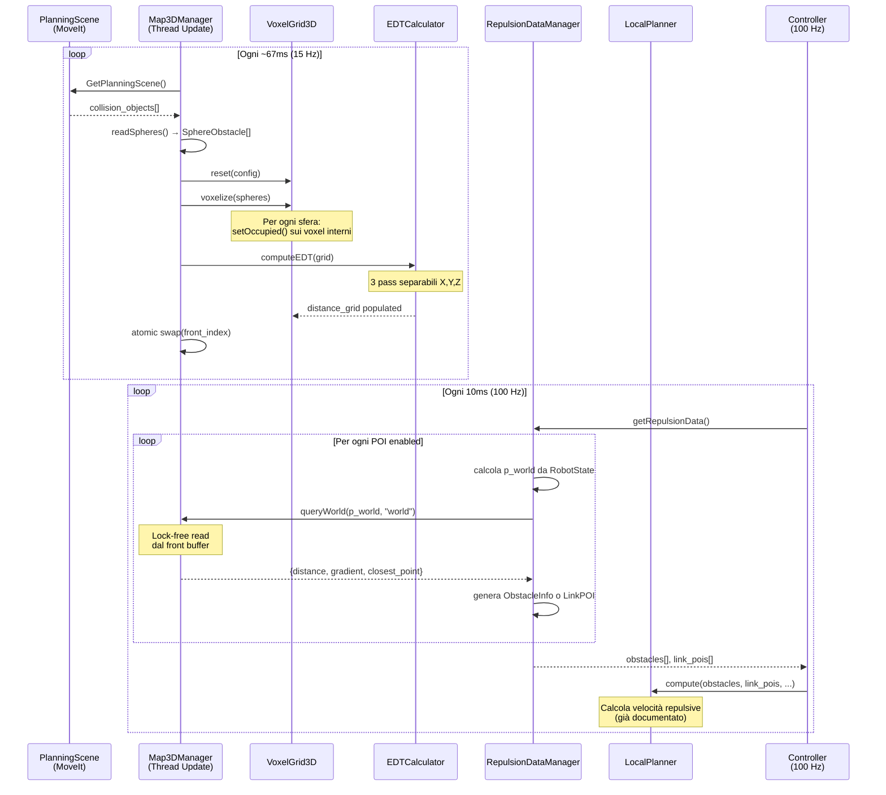

# Sistema di Rilevamento Ostacoli e Generazione Velocità Repulsive

**Data:** 28 Gennaio 2026  
**Versione:** 1.0  
**Stato:** Documentazione del Sistema Attuale + Architettura Target  

---

## Sommario

1. [Introduzione](#1-introduzione)
2. [Panoramica dell'Architettura Attuale](#2-panoramica-dellarchitettura-attuale)
3. [Blocchi Logici del Sistema](#3-blocchi-logici-del-sistema)
4. [Pipeline Dettagliata: Dalla Sorgente Ostacoli al Planner](#4-pipeline-dettagliata-dalla-sorgente-ostacoli-al-planner)
5. [Scenario Applicativo: Integrazione Camere RGBD e LiDAR](#5-scenario-applicativo-integrazione-camere-rgbd-e-lidar)
6. [Parametri di Configurazione](#6-parametri-di-configurazione)

---

## 1. Introduzione

### 1.1. Obiettivo del Documento

Questo documento descrive l'architettura del **sistema di rilevamento ostacoli e generazione di velocità repulsive** implementato nel pacchetto `cartesian_velocity_controller`. Il sistema utilizza una **mappa 3D voxelizzata** per rilevare ostacoli e calcolare forze repulsive che permettono al manipolatore di evitare collisioni in tempo reale.

### 1.2. Contesto

Il sistema è progettato per un **manipolatore robot** (inizialmente UR10e) e implementa una pipeline di controllo multi-livello:

- **Global Planner** (Level A): Gestione waypoint
- **Local Planner** (Level B): Calcolo velocità attrattive + repulsive
- **Motion Generator** (Level C): Filtro velocità cartesiana
- **PID + IK** (Level D): Controllo in anello chiuso

Questo documento si concentra sulla parte **upstream** del sistema, ovvero:
- Acquisizione dati ostacoli
- Costruzione mappa 3D
- Calcolo distanze (EDT)
- Generazione dati repulsivi per il Local Planner

---

## 2. Panoramica dell'Architettura Attuale

### 2.1. Schema ad Alto Livello

Il sistema è composto da tre macro-blocchi che lavorano in pipeline:

```
┌─────────────────────────────────────────────────────────────────────────────────────────┐
│                              SISTEMA RILEVAMENTO OSTACOLI                                │
├─────────────────────────────────────────────────────────────────────────────────────────┤
│                                                                                         │
│   ┌───────────────────────────────────────────────────────────────────────────────┐    │
│   │  1. SORGENTE OSTACOLI                                                          │    │
│   │                                                                                │    │
│   │   SIMULAZIONE (attuale)              │   REALE (futuro)                        │    │
│   │   ┌───────────────────┐              │   ┌───────────────┐  ┌──────────────┐  │    │
│   │   │  MoveIt Planning  │              │   │  Camere RGBD  │  │  LiDAR 3D    │  │    │
│   │   │     Scene         │              │   │ (RealSense,   │  │ (Velodyne,   │  │    │
│   │   │  (sfere simulate) │              │   │  Kinect)      │  │  Ouster)     │  │    │
│   │   └─────────┬─────────┘              │   └───────┬───────┘  └──────┬───────┘  │    │
│   │             │                        │           │                  │          │    │
│   │             ▼                        │           └──────────────────┘          │    │
│   │   ┌───────────────────┐              │                    │                    │    │
│   │   │ GetPlanningScene  │              │                    ▼                    │    │
│   │   │     Service       │              │           ┌───────────────┐             │    │
│   │   └─────────┬─────────┘              │           │   PointCloud  │             │    │
│   │             │                        │           │   Processor   │             │    │
│   │             ▼                        │           └───────┬───────┘             │    │
│   │   ┌───────────────────┐              │                   │                     │    │
│   │   │  SphereObstacle[] │              │                   ▼                     │    │
│   │   │  (centro, raggio) │              │           ┌───────────────┐             │    │
│   │   └─────────┬─────────┘              │           │ OccupiedVoxels│             │    │
│   │             │                        │           └───────┬───────┘             │    │
│   └─────────────┼────────────────────────┴───────────────────┼─────────────────────┘    │
│                 │                                            │                          │
│   ┌─────────────▼────────────────────────────────────────────▼─────────────────────┐    │
│   │  2. MAPPA 3D (Map3DManager)                                                     │    │
│   │                                                                                 │    │
│   │   ┌───────────────┐    ┌───────────────┐    ┌───────────────┐                  │    │
│   │   │  VoxelGrid3D  │    │   Voxelizer   │    │ EDTCalculator │                  │    │
│   │   │ (3.5×3.5×2 m) │ ◀──│ (sfere→voxel) │ ──▶│  (distance    │                  │    │
│   │   │  res: 3 cm    │    │               │    │   transform)  │                  │    │
│   │   └───────┬───────┘    └───────────────┘    └───────────────┘                  │    │
│   │           │                                                                     │    │
│   │           ▼                                                                     │    │
│   │   ┌───────────────────────────────────────────────────────────────────┐        │    │
│   │   │         DOUBLE BUFFER (accesso lock-free @ 100 Hz)                 │        │    │
│   │   │  ┌─────────────┐    ┌─────────────┐                               │        │    │
│   │   │  │  Buffer A   │    │  Buffer B   │   ← swap atomico @ 15 Hz      │        │    │
│   │   │  │ (occupancy, │    │ (occupancy, │                               │        │    │
│   │   │  │  distance)  │    │  distance)  │                               │        │    │
│   │   │  └─────────────┘    └─────────────┘                               │        │    │
│   │   └───────────────────────────────────────┬───────────────────────────┘        │    │
│   └───────────────────────────────────────────┼─────────────────────────────────────┘    │
│                                               │                                          │
│   ┌───────────────────────────────────────────▼─────────────────────────────────────┐    │
│   │  3. GESTIONE DATI REPULSIVI (RepulsionDataManager)                               │    │
│   │                                                                                  │    │
│   │   Per ogni POI (Point of Interest) configurato:                                  │    │
│   │   ┌─────────────────────────────────────────────────────────────────────┐       │    │
│   │   │  TCP, Elbow, Wrist, Forearm_mid                                     │       │    │
│   │   │       │                                                              │       │    │
│   │   │       ▼                                                              │       │    │
│   │   │  ┌──────────────────┐                                               │       │    │
│   │   │  │ Calcola posizione│ ─▶ RobotState + LinkTransform + Offset       │       │    │
│   │   │  │ POI nel world   │                                                │       │    │
│   │   │  └────────┬─────────┘                                               │       │    │
│   │   │           │                                                          │       │    │
│   │   │           ▼                                                          │       │    │
│   │   │  ┌──────────────────┐                                               │       │    │
│   │   │  │ Query Map3D      │ ─▶ distance, gradient (verso spazio libero)  │       │    │
│   │   │  └────────┬─────────┘                                               │       │    │
│   │   │           │                                                          │       │    │
│   │   │           ▼                                                          │       │    │
│   │   │  ┌──────────────────────────────────────────────────────────┐       │       │    │
│   │   │  │ Output: ObstacleInfo (TCP) oppure LinkPOI (altri link)   │       │       │    │
│   │   │  └──────────────────────────────────────────────────────────┘       │       │    │
│   │   └─────────────────────────────────────────────────────────────────────┘       │    │
│   │                                                                                  │    │
│   └──────────────────────────────────────────────────────────────────────────────────┘    │
│                                                                                         │
└───────────────────┬─────────────────────────────────────────────────────────────────────┘
                    │
                    ▼
        ┌───────────────────────┐
        │     Local Planner     │   (già documentato separatamente)
        │  (velocità repulsive) │
        └───────────────────────┘
```

### 2.2. Flusso Dati in Mermaid

```mermaid
flowchart TD
    subgraph "1. Sorgente Ostacoli (Simulazione)"
        PS[MoveIt PlanningScene]
        GPS[GetPlanningScene Service]
        PSR[PlanningSceneSphereReader]
    end
    
    subgraph "2. Map3DManager"
        VOX[VoxelizerSphereOnly]
        VG[VoxelGrid3D<br/>3.5×3.5×2 m @ 3cm]
        EDT[EDTCalculator<br/>Felzenszwalb]
        DB[Double Buffer<br/>lock-free swap]
    end
    
    subgraph "3. RepulsionDataManager"
        POI[POI Definitions<br/>TCP, Elbow, Wrist...]
        RS[RobotStateManager<br/>LinkTransform]
        QRY[queryWorld]
        OUT[ObstacleInfo / LinkPOI]
    end
    
    subgraph "4. Pipeline Controllo"
        LP[LocalPlanner]
    end
    
    PS -->|service call| GPS
    GPS -->|collision objects| PSR
    PSR -->|SphereObstacle[]| VOX
    VOX -->|setOccupied| VG
    VG -->|occupancy grid| EDT
    EDT -->|distance field| VG
    VG --> DB
    
    DB -->|distance, gradient| QRY
    POI --> RS
    RS -->|world position| QRY
    QRY --> OUT
    
    OUT -->|obstacles, link_pois| LP
```

---

## 3. Blocchi Logici del Sistema

### 3.1. Map3DManager

Il cuore del sistema è il **Map3DManager**, responsabile di:

| Funzione | Descrizione |
|----------|-------------|
| **Acquisizione ostacoli** | Legge sfere dalla PlanningScene di MoveIt |
| **Voxelizzazione** | Converte geometrie primitive in voxel occupati |
| **Calcolo EDT** | Computa la Euclidean Distance Transform per ogni voxel |
| **Double buffering** | Permette query lock-free dal controller @ 100 Hz |
| **Debug visualization** | Pubblica marker per RViz (voxel, bounds, slice) |

```
┌─────────────────────────────────────────────────────────────────────────┐
│                           MAP3DMANAGER                                   │
├─────────────────────────────────────────────────────────────────────────┤
│                                                                         │
│  Thread di Update (~15 Hz)                Thread Controller (100 Hz)   │
│  ─────────────────────────                ───────────────────────────    │
│                                                                         │
│   ┌─────────────────────┐                                               │
│   │ 1. readSpheres()    │ ◀── GetPlanningScene service                  │
│   │    (t_read: ~5ms)   │                                               │
│   └──────────┬──────────┘                                               │
│              │                                                          │
│              ▼                                                          │
│   ┌─────────────────────┐                                               │
│   │ 2. voxelize()       │    Per ogni sfera:                            │
│   │    (t_vox: ~2ms)    │      - Calcola bounding box                   │
│   │                     │      - Per ogni voxel in BB:                  │
│   │                     │        if dist(voxel, center) < radius:       │
│   │                     │          setOccupied(voxel)                   │
│   └──────────┬──────────┘                                               │
│              │                                                          │
│              ▼                                                          │
│   ┌─────────────────────┐                                               │
│   │ 3. computeEDT()     │    Algoritmo Felzenszwalb (O(n)):             │
│   │    (t_edt: ~15ms)   │      - Pass X, Y, Z separabili                │
│   │                     │      - Produce distance_grid[x,y,z]           │
│   └──────────┬──────────┘                                               │
│              │                                                          │
│              ▼                                                          │
│   ┌─────────────────────┐                  ┌────────────────────────┐   │
│   │ 4. swap buffer      │ ────atomic────▶  │ queryWorld(p, frame)   │   │
│   │    (front_index)    │                  │                        │   │
│   └─────────────────────┘                  │ Return:                │   │
│                                            │  - distance (m)        │   │
│                                            │  - gradient (norm)     │   │
│                                            │  - closest_point       │   │
│                                            └────────────────────────┘   │
│                                                                         │
└─────────────────────────────────────────────────────────────────────────┘
```

### 3.2. VoxelGrid3D

Struttura dati che rappresenta lo spazio 3D discretizzato:

| Proprietà | Valore Default | Descrizione |
|-----------|----------------|-------------|
| `size_x` | 3.5 m | Estensione X |
| `size_y` | 3.5 m | Estensione Y |
| `size_z` | 2.0 m | Estensione Z |
| `resolution` | 0.03 m (3 cm) | Dimensione voxel |
| `frame_id` | base_link | Sistema di riferimento |
| `origin_offset` | [0, 0, 1] | Centro della griglia |

**Dimensioni effettive**: ~116 × 116 × 66 voxel = **~890.000 voxel**

Strutture dati interne:
- `occupancy_[]`: uint8 (0 = free, 255 = occupied)
- `distance_[]`: float (metri, da EDT)

### 3.3. EDTCalculator

Implementa l'algoritmo di **Felzenszwalb & Huttenlocher (2012)** per il calcolo della Euclidean Distance Transform:

```
Algoritmo EDT Separabile O(n):
─────────────────────────────

1. Inizializza f[]:
   - f[i] = 0 se occupato
   - f[i] = +∞ se libero

2. Pass X: per ogni riga (y,z), calcola EDT 1D lungo X
3. Pass Y: per ogni colonna (x,z), calcola EDT 1D lungo Y
4. Pass Z: per ogni pilastro (x,y), calcola EDT 1D lungo Z

5. Converti distanze in voxel → distanze in metri:
   distance_m = sqrt(distance_voxel²) × resolution
```

### 3.4. RepulsionDataManager

Interfaccia tra la mappa 3D e il sistema di controllo:

```
┌─────────────────────────────────────────────────────────────────────────┐
│                        REPULSION DATA MANAGER                            │
├─────────────────────────────────────────────────────────────────────────┤
│                                                                         │
│  CONFIG (da YAML)                                                       │
│  ────────────────                                                       │
│  POI Definitions:                                                       │
│   ┌──────────────────────────────────────────────────────────────────┐  │
│   │  tcp:         link="tool0",       offset=[0, 0, 0]               │  │
│   │  elbow:       link="forearm_link", offset=[0, 0, 0.12]           │  │
│   │  wrist:       link="wrist_1_link", offset=[0, 0, -0.05]          │  │
│   │  forearm_mid: link="forearm_link", offset=[-0.30, 0, 0.035]      │  │
│   └──────────────────────────────────────────────────────────────────┘  │
│                                                                         │
│  POI Config (per POI):                                                  │
│   - weight: 0.0 - 2.0 (peso nel calcolo repulsivo)                      │
│   - radius: 0.0 - 0.5 m (raggio inflazione POI)                         │
│   - enabled: true/false                                                 │
│   - is_tcp: true → genera ObstacleInfo, false → genera LinkPOI         │
│                                                                         │
├─────────────────────────────────────────────────────────────────────────┤
│                                                                         │
│  CICLO getRepulsionData()                                               │
│  ────────────────────────                                               │
│                                                                         │
│   Per ogni POI enabled:                                                 │
│   ┌─────────────────────────────────────────────────────────────────┐   │
│   │  1. Calcola posizione POI nel world:                            │   │
│   │     T_world_link = RobotState.getGlobalLinkTransform(link)      │   │
│   │     p_world = T_world_link × offset_link                        │   │
│   │                                                                 │   │
│   │  2. Query mappa 3D:                                             │   │
│   │     result = map3d_manager.queryWorld(p_world, "world")         │   │
│   │     → distance, gradient, closest_point                         │   │
│   │                                                                 │   │
│   │  3. (Opzionale) Predictive query:                               │   │
│   │     - Stima velocità POI                                        │   │
│   │     - Query a posizione futura (p + v × horizon)                │   │
│   │     - Usa min(d_now, d_pred) per conservatività                 │   │
│   │                                                                 │   │
│   │  4. Genera output:                                              │   │
│   │     if is_tcp:                                                  │   │
│   │       → ObstacleInfo (per repulsione diretta TCP)               │   │
│   │     else:                                                       │   │
│   │       → LinkPOI (per repulsione via Jacobiano parziale)         │   │
│   └─────────────────────────────────────────────────────────────────┘   │
│                                                                         │
└─────────────────────────────────────────────────────────────────────────┘
```

---

## 4. Pipeline Dettagliata: Dalla Sorgente Ostacoli al Planner

### 4.1. Diagramma di Sequenza



### 4.2. Tempi Tipici

| Fase | Tempo | Frequenza |
|------|-------|-----------|
| ReadSpheres (service call) | 3-5 ms | 15 Hz |
| Voxelizzazione | 1-3 ms | 15 Hz |
| EDT | 10-20 ms | 15 Hz |
| **Totale update mappa** | **15-30 ms** | **15 Hz** |
| Query singolo POI | < 0.1 ms | 100 Hz |
| getRepulsionData (4 POI) | < 0.5 ms | 100 Hz |

### 4.3. Strutture Dati di Output

**ObstacleInfo** (per TCP):
```cpp
struct ObstacleInfo {
    std::string id;                    // "map3d"
    Eigen::Vector3d position;          // closest point (world)
    double distance;                   // effective (d - poi_radius)
    double distance_raw;               // distanza EDT grezza
    double poi_radius;                 // raggio inflazione POI
    Eigen::Vector3d distance_vector;   // ostacolo → TCP
};
```

**LinkPOI** (per altri link):
```cpp
struct LinkPOI {
    std::string point_name;                    // "elbow", "wrist"...
    std::string link_name;                     // "forearm_link"
    Eigen::Vector3d position_world;            // posizione POI
    Eigen::Vector3d position_link;             // offset nel frame link
    double distance_to_closest_obstacle;       // effective
    double distance_raw;                       // EDT grezza
    Eigen::Vector3d distance_vector;           // POI → closest
    Eigen::Vector3d repulsive_direction;       // gradient normalizzato
    double weight;                             // peso repulsione
    double poi_radius;                         // raggio POI
};
```

---

## 5. Scenario Applicativo: Integrazione Camere RGBD e LiDAR

### 5.1. Architettura Target

Nello scenario applicativo reale, gli ostacoli non saranno generati dalla planning scene di MoveIt, ma rilevati da **sensori reali**: camere RGB-D e/o LiDAR 3D.

```
┌─────────────────────────────────────────────────────────────────────────────────────────┐
│                      ARCHITETTURA TARGET (SENSORI REALI)                                 │
├─────────────────────────────────────────────────────────────────────────────────────────┤
│                                                                                         │
│   SENSORI                                                                               │
│   ───────                                                                               │
│   ┌───────────────────┐     ┌───────────────────┐     ┌───────────────────┐            │
│   │   Camera RGBD 1   │     │   Camera RGBD 2   │     │    LiDAR 3D       │            │
│   │  (frontale robot) │     │ (su end-effector) │     │ (opzionale, base) │            │
│   │                   │     │                   │     │                   │            │
│   │  - Intel RealSense│     │  - Azure Kinect   │     │  - Velodyne VLP16 │            │
│   │  - 640×480 @ 30Hz │     │  - 640×576 @ 30Hz │     │  - 300K pts/s     │            │
│   │  - Range: 0.3-3m  │     │  - Range: 0.5-5m  │     │  - 360° × 30°     │            │
│   └─────────┬─────────┘     └─────────┬─────────┘     └─────────┬─────────┘            │
│             │                         │                         │                      │
│             │     PointCloud2         │      PointCloud2        │      PointCloud2     │
│             │                         │                         │                      │
│   ┌─────────▼─────────────────────────▼─────────────────────────▼─────────────────┐    │
│   │                    PREPROCESSING LAYER (nuovo componente)                      │    │
│   │                                                                                │    │
│   │   ┌─────────────────┐  ┌─────────────────┐  ┌─────────────────┐               │    │
│   │   │  Self-Filter    │  │  Range Filter   │  │  Downsampling   │               │    │
│   │   │ (rimuovi robot) │  │ (0.3m < d < 3m) │  │ (a risoluzione  │               │    │
│   │   │                 │  │                 │  │  mappa: 3cm)    │               │    │
│   │   └────────┬────────┘  └────────┬────────┘  └────────┬────────┘               │    │
│   │            │                    │                    │                        │    │
│   │            └────────────────────┼────────────────────┘                        │    │
│   │                                 │                                             │    │
│   │   ┌─────────────────────────────▼─────────────────────────────────────┐      │    │
│   │   │              TF Transform (sensor_frame → base_link)              │      │    │
│   │   └─────────────────────────────┬─────────────────────────────────────┘      │    │
│   │                                 │                                             │    │
│   └─────────────────────────────────┼─────────────────────────────────────────────┘    │
│                                     │                                                  │
│                                     │  PointCloud (processed, in base_link)           │
│                                     │                                                  │
│   ┌─────────────────────────────────▼─────────────────────────────────────────────┐    │
│   │          OCCUPANCY GRID INTEGRATOR (nuovo componente)                          │    │
│   │                                                                                │    │
│   │   Per ogni punto nel PointCloud:                                               │    │
│   │     (ix, iy, iz) = worldToVoxel(point)                                        │    │
│   │     if isInsideBounds(point):                                                 │    │
│   │       grid.setOccupied(ix, iy, iz)                                            │    │
│   │                                                                                │    │
│   │   (Opzionale) Raycasting per marcare spazio libero                            │    │
│   │                                                                                │    │
│   └─────────────────────────────────┬─────────────────────────────────────────────┘    │
│                                     │                                                  │
│                                     │  Occupancy Grid                                  │
│                                     │                                                  │
│   ┌─────────────────────────────────▼─────────────────────────────────────────────┐    │
│   │                    MAP3D ENGINE (esistente, riutilizzato)                       │    │
│   │                                                                                │    │
│   │   ┌───────────────┐    ┌───────────────┐    ┌───────────────┐                 │    │
│   │   │  VoxelGrid3D  │ ── │ EDTCalculator │ ── │ Double Buffer │                 │    │
│   │   └───────────────┘    └───────────────┘    └───────────────┘                 │    │
│   │                                                                                │    │
│   └─────────────────────────────────┬─────────────────────────────────────────────┘    │
│                                     │                                                  │
│                                     │  queryWorld() API                               │
│                                     │                                                  │
│   ┌─────────────────────────────────▼─────────────────────────────────────────────┐    │
│   │               REPULSION DATA MANAGER (esistente, invariato)                    │    │
│   │                                                                                │    │
│   │   POI → Query Map3D → ObstacleInfo / LinkPOI                                  │    │
│   │                                                                                │    │
│   └─────────────────────────────────┬─────────────────────────────────────────────┘    │
│                                     │                                                  │
│                                     ▼                                                  │
│                           ┌─────────────────────┐                                      │
│                           │    Local Planner    │                                      │
│                           │ (velocità repulsive)│                                      │
│                           └─────────────────────┘                                      │
│                                                                                         │
└─────────────────────────────────────────────────────────────────────────────────────────┘
```

### 5.2. Confronto: Simulazione vs Reale

```
┌────────────────────────────────────────────────────────────────────────────────────────┐
│                          CONFRONTO SORGENTE OSTACOLI                                    │
├────────────────────────────────────────────────────────────────────────────────────────┤
│                                                                                        │
│  SIMULAZIONE (attuale)                     REALE (target)                              │
│  ─────────────────────                     ──────────────                              │
│                                                                                        │
│  ┌──────────────────┐                      ┌──────────────────────────────────────┐   │
│  │  MoveIt Planning │                      │   Camere RGBD          LiDAR 3D      │   │
│  │     Scene        │                      │      │                    │          │   │
│  └────────┬─────────┘                      │      ▼                    ▼          │   │
│           │                                │  PointCloud2         PointCloud2     │   │
│           │                                │      │                    │          │   │
│           ▼                                │      └─────────┬──────────┘          │   │
│  ┌──────────────────┐                      │                │                     │   │
│  │  SphereObstacle  │                      │                ▼                     │   │
│  │    (primitive)   │                      │  ┌──────────────────────────────┐    │   │
│  └────────┬─────────┘                      │  │  PointCloud Preprocessor     │    │   │
│           │                                │  │  - Self filter               │    │   │
│           │                                │  │  - Range filter              │    │   │
│           │                                │  │  - Voxel downsampling        │    │   │
│           │                                │  │  - TF transform              │    │   │
│           │                                │  └────────────┬─────────────────┘    │   │
│           │                                │               │                      │   │
│           │                                └───────────────┼──────────────────────┘   │
│           │                                                │                          │
│           │                                                │                          │
│           ▼                                                ▼                          │
│  ┌──────────────────┐                      ┌──────────────────────────────────────┐   │
│  │   VoxelizerSphere│                      │   PointCloudVoxelizer               │   │
│  │     Only         │                      │   (setOccupied per ogni punto)      │   │
│  └────────┬─────────┘                      └────────────────┬─────────────────────┘   │
│           │                                                 │                         │
│           └─────────────────────┬───────────────────────────┘                         │
│                                 │                                                     │
│                                 ▼                                                     │
│                     ┌─────────────────────┐                                           │
│                     │  VoxelGrid3D + EDT  │ ◀── COMPONENTE COMUNE                     │
│                     │  (invariato)        │                                           │
│                     └─────────────────────┘                                           │
│                                                                                        │
└────────────────────────────────────────────────────────────────────────────────────────┘
```

### 5.3. Componenti da Implementare per Sensori Reali

| Componente | Responsabilità | Note |
|------------|----------------|------|
| **PointCloudPreprocessor** | Filtering, downsampling, TF | Nuovo |
| **SelfFilterNode** | Rimozione punti sul robot | Usa URDF |
| **PointCloudVoxelizer** | PointCloud → occupancy | Sostituisce VoxelizerSphereOnly |
| **SensorFusionManager** | Coordinamento multi-camera | Opzionale per multi-sensor |

### 5.4. Esempio Configurazione Camere RGBD

```yaml
# config/sensor_sources.yaml (futuro)

sensor_sources:
  - name: "front_camera"
    type: "rgbd"
    pointcloud_topic: "/camera_front/depth/color/points"
    depth_topic: "/camera_front/depth/image_rect_raw"
    camera_info_topic: "/camera_front/depth/camera_info"
    frame: "camera_front_depth_optical_frame"
    min_range: 0.28
    max_range: 3.0
    enabled: true
    
  - name: "wrist_camera"
    type: "rgbd"
    pointcloud_topic: "/camera_wrist/depth/color/points"
    frame: "camera_wrist_depth_optical_frame"
    min_range: 0.28
    max_range: 2.0
    enabled: true

preprocessing:
  # Downsampling alla risoluzione della mappa
  voxel_grid_leaf_size: 0.03  # match map3d resolution
  
  # Filtro statistico outlier
  statistical_outlier:
    enabled: true
    mean_k: 10
    std_dev_mul_threshold: 1.0
  
  # Self-filter (rimuovi punti sul robot)
  self_filter:
    enabled: true
    robot_description_param: "robot_description"
    padding: 0.03  # margine extra attorno ai link
```

---

## 6. Parametri di Configurazione

### 6.1. Parametri Map3D

```yaml
# config/controller_params.yaml (sezione map3d)

map3d:
  frame_id: "base_link"           # Frame di riferimento della mappa
  size_x: 3.5                     # Estensione X [m]
  size_y: 3.5                     # Estensione Y [m]
  size_z: 2.0                     # Estensione Z [m]
  resolution: 0.03                # Risoluzione voxel [m]
  origin_offset: [0.0, 0.0, 1.0]  # Centro mappa nel frame
  
  obstacle_margin: 0.02           # Inflazione ostacoli [m]
  gradient_clamp_distance: 0.02   # Distanza sotto cui bloccare gradient
  min_distance_eps: 0.001         # Minima distanza valida [m]
  
  update_rate_hz: 15.0            # Frequenza aggiornamento mappa

  # Sorgente ostacoli (attuale: MoveIt)
  prefer_get_planning_scene_service: true
  get_planning_scene_service: "/get_planning_scene"
```

### 6.2. Parametri Repulsione

```yaml
# config/controller_params.yaml (sezione repulsion)

repulsion:
  stale_timeout: 0.3              # Timeout dati obsoleti [s]
  tcp_point_name: "tcp"           # Nome POI che agisce come TCP
  
  # POI Definitions (link + offset)
  robot_points_of_interest:
    tcp:
      link: "tool0"
      offset: [0.0, 0.0, 0.0]
    elbow:
      link: "forearm_link"
      offset: [0.0, 0.0, 0.12]
    wrist:
      link: "wrist_1_link"
      offset: [0.0, 0.0, -0.05]
    forearm_mid:
      link: "forearm_link"
      offset: [-0.30, 0.0, 0.035]
  
  # POI Configuration (enable/disable, weight, radius)
  points:
    tcp:
      weight: 1.0
      radius: 0.08
      enabled: false
      is_tcp: true
    elbow:
      weight: 1.0
      radius: 0.05
      enabled: false
      is_tcp: false
```

### 6.3. Parametri Local Planner (riferimento)

```yaml
# config/controller_params.yaml (sezione local_planner)

local_planner:
  repulsive_enabled: true
  repulsive_obstacle_gain: 2.5    # Guadagno repulsione TCP
  repulsive_link_gain: 2.0        # Guadagno repulsione link
  influence_distance: 0.8         # Distanza di influenza [m]
  min_safe_distance: 0.1          # Distanza minima sicura [m]
  repulsive_velocity_profile: "QUADRATIC"  # LINEAR, QUADRATIC, SMOOTHSTEP
```

---

## Appendice: Diagramma Riepilogativo

```
┌─────────────────────────────────────────────────────────────────────────────────────────┐
│                            RIEPILOGO SISTEMA COMPLETO                                    │
├─────────────────────────────────────────────────────────────────────────────────────────┤
│                                                                                         │
│   SORGENTE OSTACOLI                                                                     │
│   ─────────────────                                                                     │
│                                                                                         │
│   [Simulazione]              [Reale - Futuro]                                           │
│   MoveIt PlanningScene  ───▶  RGBD Cameras / LiDAR 3D                                   │
│   (sfere)                     (PointCloud)                                              │
│        │                           │                                                    │
│        │                           ▼                                                    │
│        │                    Preprocessing                                               │
│        │                    (filter, TF, downsample)                                    │
│        │                           │                                                    │
│        └───────────┬───────────────┘                                                    │
│                    │                                                                    │
│   MAPPA 3D         ▼                                                                    │
│   ────────                                                                              │
│   ┌────────────────────────────────────────────────────────────────────────────────┐   │
│   │  Map3DManager                                                                   │   │
│   │  ┌────────────┐  ┌────────────┐  ┌────────────┐  ┌────────────────────────┐   │   │
│   │  │ Voxelizer  │─▶│ VoxelGrid  │─▶│    EDT     │─▶│   Double Buffer       │   │   │
│   │  │            │  │ 3.5×3.5×2m │  │ (distance) │  │ (lock-free @ 100Hz)   │   │   │
│   │  └────────────┘  └────────────┘  └────────────┘  └──────────┬─────────────┘   │   │
│   │                                                             │                  │   │
│   │                                              queryWorld() ──┘                  │   │
│   └────────────────────────────────────────────────────────────────────────────────┘   │
│                                                    │                                    │
│   GESTIONE REPULSIONE                              │                                    │
│   ───────────────────                              ▼                                    │
│   ┌────────────────────────────────────────────────────────────────────────────────┐   │
│   │  RepulsionDataManager                                                           │   │
│   │                                                                                 │   │
│   │   POI (TCP, Elbow, Wrist, ...)                                                  │   │
│   │        │                                                                        │   │
│   │        ▼                                                                        │   │
│   │   RobotState → world position → queryWorld() → distance, gradient              │   │
│   │        │                                                                        │   │
│   │        ▼                                                                        │   │
│   │   ObstacleInfo[] (TCP)                                                          │   │
│   │   LinkPOI[] (altri link)                                                        │   │
│   │                                                                                 │   │
│   └──────────────────────────────────────────────┬──────────────────────────────────┘   │
│                                                  │                                      │
│   PIPELINE CONTROLLO                             ▼                                      │
│   ──────────────────                                                                    │
│   ┌─────────────────┐    ┌─────────────────┐    ┌─────────────────┐                    │
│   │  GlobalPlanner  │───▶│  LocalPlanner   │───▶│  VelocityFilter │───▶ ...             │
│   │  (waypoints)    │    │  (attractive +  │    │  (rate limit)   │                    │
│   │                 │    │   REPULSIVE)    │    │                 │                    │
│   └─────────────────┘    └─────────────────┘    └─────────────────┘                    │
│                                                                                         │
└─────────────────────────────────────────────────────────────────────────────────────────┘
```

---

*Documento generato automaticamente dall'analisi del codice sorgente del pacchetto `cartesian_velocity_controller`.*
