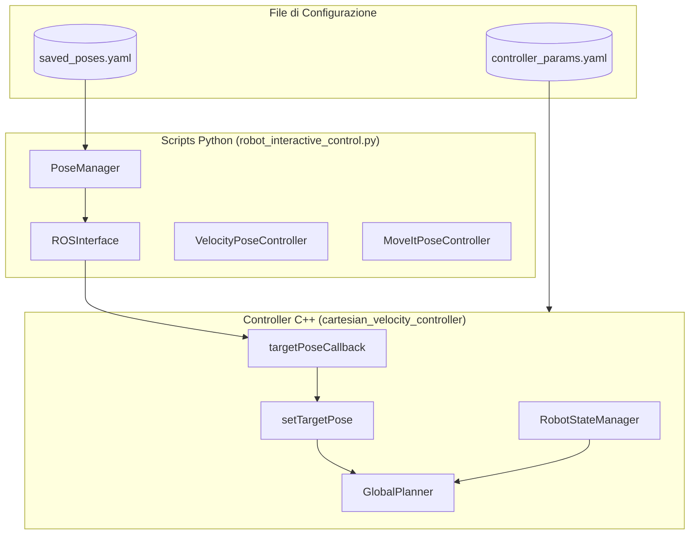
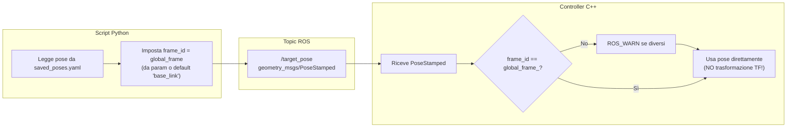
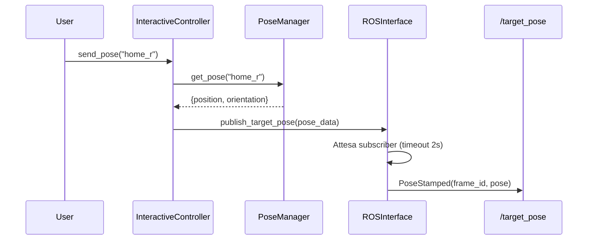
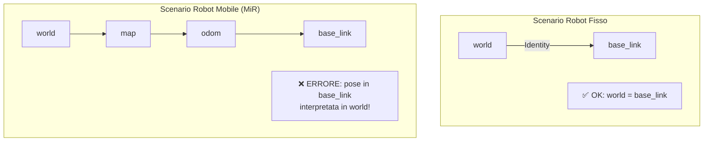

# Gestione Pose Target - Analisi Dettagliata

> **Documentazione per l'investigazione di bug relativi alle pose target**  
> **Ultimo aggiornamento:** 2026-02-03

---

## Indice

1. [Panoramica Generale](#1-panoramica-generale)
2. [Frame di Riferimento Globali](#2-frame-di-riferimento-globali)
3. [Salvataggio delle Pose (Scripts Python)](#3-salvataggio-delle-pose-scripts-python)
4. [Invio delle Pose al Robot](#4-invio-delle-pose-al-robot)
5. [Differenza tra MoveIt e Controllo Velocità](#5-differenza-tra-moveit-e-controllo-velocità)
6. [Calcolo del Jacobiano](#6-calcolo-del-jacobiano)
7. [Analisi delle Inconsistenze](#7-analisi-delle-inconsistenze)
8. [Raccomandazioni](#8-raccomandazioni)

---

## 1. Panoramica Generale

Il sistema di gestione delle pose target coinvolge tre componenti principali:



---

## 2. Frame di Riferimento Globali

### 2.1 Configurazione del Frame Globale

Il controller utilizza il parametro `global_frame` definito in `controller_params.yaml`:

```yaml
# controller_params.yaml (linea 17)
global_frame: "world"
```

**Importante:** Questo valore può essere diverso da quello usato dagli script Python!

### 2.2 Frame Usato lato C++ (Controller)

Nel file `cartesian_velocity_controller.cpp`, il frame globale viene caricato durante l'inizializzazione:

```cpp
// Estratto da loadParameters() in cartesian_velocity_controller.cpp
pnh_.param<std::string>("global_frame", global_frame_, "world");
```

Il controller **non esegue trasformazioni TF** quando riceve una pose:

```cpp
// cartesian_velocity_controller.cpp linee 2542-2552
bool CartesianVelocityController::setTargetPose(const geometry_msgs::PoseStamped& pose_stamped)
{
  // TODO: Add frame transformation if needed
  if (pose_stamped.header.frame_id != global_frame_ && !pose_stamped.header.frame_id.empty())
  {
    ROS_WARN_THROTTLE(5.0, "Target pose frame '%s' differs from global frame '%s'. "
                     "Frame transformation not implemented yet.",
                     pose_stamped.header.frame_id.c_str(), global_frame_.c_str());
  }
  
  return setTargetPose(pose_stamped.pose);  // ⚠️ Ignora il frame!
}
```

### 2.3 Frame Usato lato Python (Scripts)

Gli scripts Python usano un frame di default **diverso**:

```python
# config.py linea 32
DEFAULT_GLOBAL_FRAME: str = "base_link"  # ⚠️ Diverso da "world"!
```

Il `ROSInterface` tenta di leggere il frame dal parameter server:

```python
# ros_interface.py linee 91-94
self._global_frame = rospy.get_param(
    f'{self.controller_node_name}/global_frame',
    self._global_frame  # Fallback a DEFAULT_GLOBAL_FRAME se non trovato
)
```

### 2.4 Diagramma del Flusso Frame



---

## 3. Salvataggio delle Pose (Scripts Python)

### 3.1 Struttura del File saved_poses.yaml

Le pose vengono salvate in `config/saved_poses.yaml` con questo formato:

```yaml
home_r:
  description: Posa home del braccio destro
  orientation:
  - 0.7054137390734807   # qx
  - 0.7087889235811031   # qy
  - -0.0029125112703714774  # qz
  - -0.0011116713598161476  # qw
  position:
  - -0.14261931264980976  # x
  - -0.49453963249782806  # y
  - 1.5733576781502947    # z
```

### 3.2 Flusso di Salvataggio (save_current_pose)

```python
# interactive_controller.py linee 246-267
def save_current_pose(self, name: str, description: str = "") -> bool:
    # 1. Ottiene la posa attuale dell'EE via TF
    current_pose = self.ros.get_current_ee_pose()
    
    # 2. Salva nel PoseManager
    return self.poses.add_pose(
        name=name,
        position=current_pose["position"],
        orientation=current_pose["orientation"],
        description=description
    )
```

### 3.3 Come viene ottenuta la posa corrente

```python
# ros_interface.py linee 192-231
def get_current_ee_pose(self) -> Optional[Dict[str, Any]]:
    for global_frame, ee_frame in self._candidate_frame_pairs():
        try:
            transform = self.tf_buffer.lookup_transform(
                global_frame,   # Frame padre
                ee_frame,       # Frame figlio
                rospy.Time(0),  # Ultima trasformazione disponibile
                rospy.Duration(1.0)
            )
            
            # ⚠️ Cache i frame che funzionano
            self._global_frame = global_frame
            self.ee_frame = ee_frame
            
            pos = transform.transform.translation
            rot = transform.transform.rotation
            
            return {
                "position": [pos.x, pos.y, pos.z],
                "orientation": [rot.x, rot.y, rot.z, rot.w]
            }
```

**Nota critica:** La posa viene salvata nel frame che TF riesce a risolvere, non necessariamente nel frame `global_frame` configurato dal controller!

---

## 4. Invio delle Pose al Robot

### 4.1 Pipeline di Invio (lato Python)



### 4.2 Costruzione del Messaggio

```python
# ros_interface.py linee 262-276
pose_msg = PoseStamped()
pose_msg.header.stamp = rospy.Time.now()
pose_msg.header.frame_id = self._global_frame  # ⚠️ Frame dinamico!

pose_msg.pose.position.x = pose_data["position"][0]
pose_msg.pose.position.y = pose_data["position"][1]
pose_msg.pose.position.z = pose_data["position"][2]

pose_msg.pose.orientation.x = pose_data["orientation"][0]
pose_msg.pose.orientation.y = pose_data["orientation"][1]
pose_msg.pose.orientation.z = pose_data["orientation"][2]
pose_msg.pose.orientation.w = pose_data["orientation"][3]

self.target_pose_pub.publish(pose_msg)
```

### 4.3 Ricezione nel Controller C++

```cpp
// cartesian_velocity_controller.cpp linee 1895-1898
void CartesianVelocityController::targetPoseCallback(
    const geometry_msgs::PoseStamped::ConstPtr& msg)
{
  setTargetPose(*msg);
}

// linee 2469-2534
bool CartesianVelocityController::setTargetPose(const Eigen::Isometry3d& pose)
{
  // 1. Check reachability (IK)
  if (want_ik_solution)
  {
    const bool ok = robot_state_->checkPoseReachability(
        pose, tcp_offset, joint_solution, limits_ptr);
    
    if (reachability_check_enabled_ && !ok)
    {
      ROS_WARN("Target pose REJECTED (not reachable via IK)");
      return false;
    }
  }

  // 2. Imposta nel GlobalPlanner
  global_planner_->clearWaypoints();
  global_planner_->addWaypoint(pose);
  has_target_ = true;
  
  // 3. Opzionale: reset filtri
  if (reset_filter_on_target_change_)
  {
    resetVirtualTargetsToCurrentPose();
  }
}
```

---

## 5. Differenza tra MoveIt e Controllo Velocità

### 5.1 Selezione del Metodo

Lo script determina quale controller usare basandosi sullo stato del controller_manager:

```python
# interactive_controller.py linee 194-217
def send_pose(self, pose_name: str) -> bool:
    pose_data = self.poses.get_pose(pose_name)
    
    # Aggiorna stato controller
    self.controller_mgr.update_active_controller()
    
    if self.controller_mgr.is_moveit_active():
        # Usa MoveIt
        return self.moveit_ctrl.send_pose(pose_data, self.ros.global_frame)
    else:
        # Usa velocity controller
        return self.velocity_ctrl.send_pose(pose_data)
```

### 5.2 Confronto dei Due Metodi

| Caratteristica | Velocity Controller | MoveIt |
|----------------|---------------------|--------|
| **Esecuzione** | Immediata (streaming) | Pianificata (passo-passo) |
| **Verifica collisioni** | Runtime (map3d) | Pre-pianificazione |
| **Trasformazione frame** | ❌ Non implementata | ✅ Automatica |
| **Smooth path** | Via filtri interni | OMPL/altri planner |
| **Controllo traiettoria** | Velocità cartesiana | Joint trajectory |

### 5.3 Flusso MoveIt

```python
# moveit_controller.py linee 77-120
def send_pose(self, pose_data: Dict[str, Any], global_frame: str) -> bool:
    pose_target = PoseStamped()
    pose_target.header.frame_id = global_frame
    pose_target.header.stamp = rospy.Time.now()
    
    pose_target.pose.position.x = pose_data["position"][0]
    ...
    
    self._move_group.set_pose_target(pose_target)
    
    # Pianifica e esegue
    success = self._move_group.go(wait=True)
    
    self._move_group.stop()
    self._move_group.clear_pose_targets()
```

### 5.4 Flusso Velocity Controller

```python
# velocity_controller.py linee 27-41
def send_pose(self, pose_data: Dict[str, Any]) -> bool:
    return self.ros.publish_target_pose(pose_data)
```

```cpp
// Nel controller C++ (pipeline di esecuzione)
// cartesian_velocity_controller.cpp linee 1937-2262

void CartesianVelocityController::executePipeline(double dt)
{
  // Level A: GlobalPlanner - gestisce waypoint
  waypoint = global_planner_->getCurrentWaypoint();
  
  // Level B: LocalPlanner - calcola velocità attrattiva/repulsiva
  LocalPlannerOutput local_output = local_planner_->compute(...);
  
  // Level C: Velocity Filter - filtra velocità
  filtered_twist = velocity_filter_->filter(desired_twist, dt);
  
  // Level D: PID Controller
  pid_vel_linear = pid_position_->compute(position_error, feedforward_linear, dt);
  
  // Jacobian Inverse
  jacobian_pinv = jacobian_solver_->computeDampedWeightedPseudoInverse(jacobian, joint_weights_);
  joint_velocities = jacobian_pinv * command_twist;
  
  // Safety Limiter
  final_joint_velocities = safety_limiter_->limit(...);
  
  publishVelocityCommand(final_joint_velocities);
}
```

---

## 6. Calcolo del Jacobiano

### 6.1 Origine e Sorgente

Il Jacobiano viene calcolato tramite MoveIt nel `RobotStateManager`:

```cpp
// robot_state_manager.cpp linee 260-322
bool RobotStateManager::getJacobian(const std::string& link_name,
                                    const Eigen::Vector3d& reference_point,
                                    Eigen::MatrixXd& jacobian) const
{
  std::lock_guard<std::mutex> lock(state_mutex_);
  
  // Usa MoveIt per calcolare il Jacobiano
  bool success = robot_state_->getJacobian(
      joint_model_group_,
      robot_state_->getLinkModel(link_name),
      reference_point,  // Punto di riferimento nel link frame
      jacobian);
  
  // Rimappa le colonne se necessario (matching ordine joint_names_)
  if (needs_remapping)
  {
    Eigen::MatrixXd remapped_jacobian = Eigen::MatrixXd::Zero(6, joint_names_.size());
    for (size_t col = 0; col < joint_models.size(); ++col)
    {
      auto it = joint_index_map_.find(joint_models[col]->getName());
      if (it != joint_index_map_.end())
      {
        remapped_jacobian.col(it->second) = jacobian.col(col);
      }
    }
    jacobian = remapped_jacobian;
  }
}
```

### 6.2 Uso nel Pipeline

```cpp
// cartesian_velocity_controller.cpp linee 2075-2100
// Chiamata nel executePipeline()
if (!robot_state_->getJacobian(tcp_link_, tcp_offset.translation(), jacobian))
{
  ROS_WARN_THROTTLE(1.0, "Failed to compute Jacobian");
  publishZeroVelocity();
  return;
}

// Calcola pseudo-inversa pesata e smorzata
Eigen::MatrixXd jacobian_pinv = jacobian_solver_->computeDampedWeightedPseudoInverse(
    jacobian, joint_weights_);

// Converte twist cartesiano in velocità giunti
Eigen::VectorXd joint_velocities = jacobian_pinv * command_twist;
```

### 6.3 Algoritmo Damped Weighted Pseudo-Inverse (SDLS)

```cpp
// jacobian_solver.cpp linee 52-131
Eigen::MatrixXd JacobianSolver::computeDampedWeightedPseudoInverse(
    const Eigen::MatrixXd& jacobian,
    const Eigen::VectorXd& weights) const
{
  // 1. Costruisce W^{-1/2} dai pesi
  Eigen::VectorXd w_inv_sqrt(n_joints);
  for (int i = 0; i < n_joints; ++i)
  {
    double w = (i < weights.size()) ? weights[i] : 1.0;
    w_inv_sqrt[i] = 1.0 / std::sqrt(std::max(w, kEpsilon));
  }

  // 2. Pesa le colonne del Jacobiano
  Eigen::MatrixXd weighted_jacobian = jacobian;
  for (int i = 0; i < n_joints; ++i)
  {
    weighted_jacobian.col(i) *= w_inv_sqrt[i];
  }

  // 3. SVD del Jacobiano pesato
  Eigen::JacobiSVD<Eigen::MatrixXd> svd(
      weighted_jacobian, Eigen::ComputeThinU | Eigen::ComputeThinV);

  // 4. Calcola damping selettivo per ogni direzione
  for (int i = 0; i < r; ++i)
  {
    const double sigma = singular_values[i];
    
    double lambda_i = 0.0;
    if (sigma < threshold)  // Vicino a singolarità
    {
      const double ratio = sigma / threshold;
      const double lambda_sq = (1.0 - ratio * ratio) * max_damping * max_damping;
      lambda_i = std::sqrt(std::max(lambda_sq, 0.0));
    }

    // σᵢ / (σᵢ² + λᵢ²)
    const double denom = sigma * sigma + lambda_i * lambda_i;
    const double damp_coeff = (denom > kEpsilon) ? (sigma / denom) : 0.0;
    damped_sigma(i, i) = damp_coeff;
  }

  // 5. Pseudo-inversa: J⁺ = W^{-1/2} * V * Σ_damped * U^T
  Eigen::MatrixXd weighted_pinv = svd.matrixV() * damped_sigma * svd.matrixU().transpose();
  return Winv_sqrt * weighted_pinv;
}
```

---

## 7. Analisi delle Inconsistenze

### 7.1 🔴 CRITICA: Mismatch Frame di Riferimento

**Problema:** Il frame usato per salvare/leggere pose potrebbe essere diverso dal frame del controller.

**Evidenza:**
- `config.py`: `DEFAULT_GLOBAL_FRAME = "base_link"`
- `controller_params.yaml`: `global_frame: "world"`
- Lo script Python usa un fallback dinamico che può cambiare il frame usato

**Conseguenza:** Pose salvate in un frame vengono interpretate in un altro frame. Se `world` ≠ `base_link` nel TF tree (es. robot mobile), le pose saranno **completamente errate**.



### 7.2 🔴 CRITICA: Nessuna Trasformazione TF nel Controller

**Problema:** Il controller C++ **non trasforma** le pose ricevute anche se in frame diversi.

```cpp
// cartesian_velocity_controller.cpp linee 2542-2552
// TODO: Add frame transformation if needed
if (pose_stamped.header.frame_id != global_frame_ && ...)
{
  ROS_WARN_THROTTLE(5.0, "Frame mismatch...");  // Solo warning, nessuna azione!
}
return setTargetPose(pose_stamped.pose);  // Usa la pose così com'è
```

### 7.3 🟡 MODERATA: Frame Dinamico nello Script

**Problema:** `ros_interface.py` può cambiare `_global_frame` dinamicamente:

```python
# ros_interface.py linee 212-215
# ⚠️ Cache i frame che funzionano (può cambiare!)
self._global_frame = global_frame
self.ee_frame = ee_frame
```

Questo significa che durante la stessa sessione:
1. Una posa può essere **letta** usando `base_link`
2. Una posa può essere **inviata** usando un frame diverso se il TF fallisce e fa fallback

### 7.4 🟡 MODERATA: Quaternione Orientamento

**Problema:** L'ordine del quaternione nel file YAML non è esplicito.

```yaml
orientation:
- 0.705...  # È qx, qy, qz, qw o qw, qx, qy, qz?
```

Dal codice si deduce che l'ordine è `[qx, qy, qz, qw]`:

```python
# ros_interface.py linee 219-222
return {
    "position": [pos.x, pos.y, pos.z],
    "orientation": [rot.x, rot.y, rot.z, rot.w]  # ← qx, qy, qz, qw
}
```

**Rischio:** Se qualcuno genera pose manualmente con ordine diverso (es. convenzione `[qw, qx, qy, qz]`), il robot si muoverà verso orientamenti completamente errati.

### 7.5 🟢 MINORE: Non Validazione Quaternione

**Problema:** Non c'è validazione che il quaternione sia normalizzato.

```python
# pose_manager.py linea 111-115
self.saved_poses[clean_name] = {
    "position": list(position),
    "orientation": list(orientation),  # ← Nessuna normalizzazione/validazione
    "description": description
}
```

---

## 8. Raccomandazioni

### 8.1 Fix Immediati (Alta Priorità)

#### R1: Armonizzare il Frame di Default

```python
# config.py - CAMBIARE
DEFAULT_GLOBAL_FRAME: str = "world"  # Stesso del controller!
```

Oppure leggere SEMPRE dal parameter server:

```python
# ros_interface.py - MIGLIORAMENTO
def initialize(self):
    # Obbligatorio, solleva eccezione se non trovato
    self._global_frame = rospy.get_param(
        f'{self.controller_node_name}/global_frame'
    )
```

#### R2: Implementare Trasformazione TF nel Controller

```cpp
// cartesian_velocity_controller.cpp - NUOVO CODICE
bool CartesianVelocityController::setTargetPose(
    const geometry_msgs::PoseStamped& pose_stamped)
{
  geometry_msgs::PoseStamped transformed_pose;
  
  if (pose_stamped.header.frame_id != global_frame_ && 
      !pose_stamped.header.frame_id.empty())
  {
    try {
      // Trasforma nel frame globale
      tf_buffer_.transform(pose_stamped, transformed_pose, 
                           global_frame_, ros::Duration(0.1));
    } catch (tf2::TransformException& ex) {
      ROS_ERROR("TF transform failed: %s", ex.what());
      return false;
    }
    return setTargetPose(transformed_pose.pose);
  }
  
  return setTargetPose(pose_stamped.pose);
}
```

### 8.2 Miglioramenti Consigliati

#### R3: Salvare il Frame insieme alla Posa

```yaml
# saved_poses.yaml - NUOVO FORMATO
home_r:
  frame_id: "world"  # ← NUOVO
  description: Posa home del braccio destro
  position: [...]
  orientation: [...]
```

#### R4: Validare Quaternione

```python
# pose_manager.py - NUOVO METODO
def _validate_quaternion(self, quat: List[float]) -> bool:
    norm = math.sqrt(sum(q*q for q in quat))
    return abs(norm - 1.0) < 0.01

def add_pose(self, ...):
    if not self._validate_quaternion(orientation):
        print(f"Warning: Quaternion not normalized (|q|={norm})")
        orientation = [q/norm for q in orientation]  # Normalizza
```

#### R5: Log Diagnostico Frame

Aggiungere logging esplicito quando si salva/carica una posa:

```python
rospy.loginfo(f"Saving pose '{name}' in frame '{self._global_frame}' "
              f"at position {position}")
```

---

## Checklist di Debug

Quando investighi un bug relativo alle pose, verifica:

- [ ] Quale `global_frame` è configurato in `controller_params.yaml`?
- [ ] Quale frame ha usato lo script Python per salvare la posa?
- [ ] Il TF tree connette il frame della posa al frame del controller?
- [ ] Il quaternione è normalizzato (|q| ≈ 1)?
- [ ] L'ordine del quaternione è [qx, qy, qz, qw]?
- [ ] MoveIt e il velocity controller usano lo stesso `global_frame`?
- [ ] Se robot mobile: la posa è relativa a `base_link` o a `world`/`map`?
