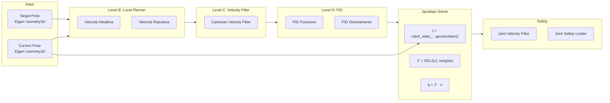
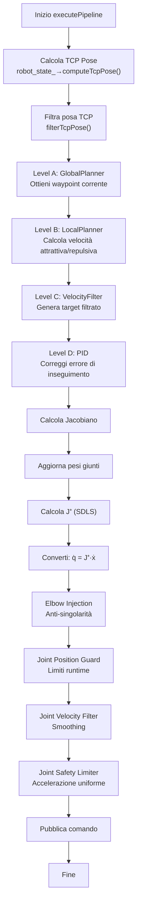

# Pipeline Jacobiano e Conversione Velocità Cartesiane → Giunti

> **Documentazione tecnica per debug avanzato**  
> **Ultimo aggiornamento:** 2026-02-03

---

## 1. Panoramica della Pipeline



---

## 2. Calcolo del Jacobiano

### 2.1 Sorgente (MoveIt)

Il Jacobiano viene calcolato da MoveIt nel `RobotStateManager`:

```cpp
// robot_state_manager.cpp linee 260-287
bool RobotStateManager::getJacobian(const std::string& link_name,
                                    const Eigen::Vector3d& reference_point,
                                    Eigen::MatrixXd& jacobian) const
{
  std::lock_guard<std::mutex> lock(state_mutex_);

  // MoveIt calcola il Jacobiano geometrico
  bool success = robot_state_->getJacobian(
      joint_model_group_,                    // Gruppo di giunti
      robot_state_->getLinkModel(link_name), // Link di riferimento
      reference_point,                       // Offset dal link frame
      jacobian);                             // Output: matrice 6×n
```

**Struttura del Jacobiano:**

```
     j₁    j₂    j₃    j₄    j₅    j₆
J = [ vx | vx | vx | vx | vx | vx ]  ← Velocità lineare X
    [ vy | vy | vy | vy | vy | vy ]  ← Velocità lineare Y  
    [ vz | vz | vz | vz | vz | vz ]  ← Velocità lineare Z
    [ ωx | ωx | ωx | ωx | ωx | ωx ]  ← Velocità angolare X
    [ ωy | ωy | ωy | ωy | ωy | ωy ]  ← Velocità angolare Y
    [ ωz | ωz | ωz | ωz | ωz | ωz ]  ← Velocità angolare Z
```

### 2.2 Reference Point (TCP Offset)

Il punto di riferimento per il Jacobiano include l'offset TCP:

```cpp
// cartesian_velocity_controller.cpp linee 2076-2077
if (!robot_state_->getJacobian(tcp_link_, 
                                tcp_offset.translation(),  // ← Offset!
                                jacobian))
```

**TCP Offset** viene definito in `controller_params.yaml`:

```yaml
tcp_offset_position: [0.0, 0.0, 0.0]
tcp_offset_orientation_rpy: [0.0, 0.0, 0.0]
```

---

## 3. Pseudo-Inversa Pesata e Smorzata (SDLS)

### 3.1 Teoria

La pseudo-inversa standard (Moore-Penrose):
```
J⁺ = Jᵀ(JJᵀ)⁻¹
```

**Problemi vicino alle singolarità:**
- Valori singolari σᵢ → 0
- J⁺ → ∞
- Velocità giunti esplodono

**Soluzione: Selectively Damped Least Squares (SDLS)**

```
J⁺_damped = V · Σ_damped · Uᵀ

dove Σ_damped(i,i) = σᵢ / (σᵢ² + λᵢ²)
```

### 3.2 Implementazione

```cpp
// jacobian_solver.cpp linee 52-131
Eigen::MatrixXd JacobianSolver::computeDampedWeightedPseudoInverse(
    const Eigen::MatrixXd& jacobian,
    const Eigen::VectorXd& weights) const
{
  const int n_joints = jacobian.cols();

  // ═══════════════════════════════════════
  // STEP 1: Costruzione matrice pesi
  // ═══════════════════════════════════════
  // W^{-1/2}: peso alto → meno movimento
  Eigen::VectorXd w_inv_sqrt(n_joints);
  for (int i = 0; i < n_joints; ++i)
  {
    double w = (i < weights.size()) ? weights[i] : 1.0;
    w_inv_sqrt[i] = 1.0 / std::sqrt(std::max(w, kEpsilon));
  }

  // ═══════════════════════════════════════
  // STEP 2: Pesatura colonne Jacobiano
  // ═══════════════════════════════════════
  Eigen::MatrixXd weighted_jacobian = jacobian;
  for (int i = 0; i < n_joints; ++i)
  {
    weighted_jacobian.col(i) *= w_inv_sqrt[i];
  }

  // ═══════════════════════════════════════
  // STEP 3: SVD
  // ═══════════════════════════════════════
  Eigen::JacobiSVD<Eigen::MatrixXd> svd(
      weighted_jacobian, Eigen::ComputeThinU | Eigen::ComputeThinV);

  const Eigen::VectorXd& singular_values = svd.singularValues();

  // ═══════════════════════════════════════
  // STEP 4: Calcolo damping selettivo
  // ═══════════════════════════════════════
  const double threshold = config_.singularity_threshold;  // es: 0.05
  const double max_damping = config_.max_damping;          // es: 0.3

  const int r = singular_values.size();
  Eigen::MatrixXd damped_sigma = Eigen::MatrixXd::Zero(r, r);

  for (int i = 0; i < r; ++i)
  {
    const double sigma = singular_values[i];

    // Calcola λᵢ basato su prossimità a singolarità
    double lambda_i = 0.0;
    if (sigma < threshold)  // Vicino a singolarità!
    {
      // Damping cresce quadraticamente quando σ → 0
      const double ratio = sigma / threshold;
      const double lambda_sq = (1.0 - ratio * ratio) * max_damping * max_damping;
      lambda_i = std::sqrt(std::max(lambda_sq, 0.0));
    }

    // Formula SDLS: σᵢ / (σᵢ² + λᵢ²)
    const double denom = sigma * sigma + lambda_i * lambda_i;
    const double damp_coeff = (denom > kEpsilon) ? (sigma / denom) : 0.0;
    damped_sigma(i, i) = damp_coeff;
  }

  // ═══════════════════════════════════════
  // STEP 5: Ricostruzione pseudo-inversa
  // ═══════════════════════════════════════
  // J⁺_weighted = V · Σ_damped · Uᵀ
  Eigen::MatrixXd weighted_pinv = 
      svd.matrixV() * damped_sigma * svd.matrixU().transpose();

  // ═══════════════════════════════════════
  // STEP 6: Rimuovi pesatura
  // ═══════════════════════════════════════
  // J⁺ = W^{-1/2} · (J·W^{-1/2})⁺
  Eigen::MatrixXd Winv_sqrt = w_inv_sqrt.asDiagonal();
  return Winv_sqrt * weighted_pinv;
}
```

### 3.3 Diagramma del Damping

```
λ (damping factor)
│
│max_damping
├──────────────────────┐
│                      │
│                    /
│                  /
│                /
│              /
│            /
│          /
│        / ← smooth transition
│      /
│    /
│  /
│/
0──────────────────────────────► σ (singular value)
         │
         singularity_threshold
```

---

## 4. Pesi dei Giunti (Joint Weights)

### 4.1 Scopo

I pesi permettono di:
- **Penalizzare** movimenti di certi giunti (es. giunti vicini a limiti)
- **Favorire** movimenti di altri (es. giunti del polso)
- **Evitare singolarità** aumentando peso del gomito

### 4.2 Gestione nel Controller

```cpp
// cartesian_velocity_controller.cpp linee 2088-2093
if (weight_manager_)
{
  weight_manager_->update(current_joint_positions);
  joint_weights_ = weight_manager_->getWeights();
}

// Usa i pesi nel calcolo della pseudo-inversa
Eigen::MatrixXd jacobian_pinv = jacobian_solver_->computeDampedWeightedPseudoInverse(
    jacobian, joint_weights_);
```

### 4.3 Elbow Singularity Avoidance

Configurazione in `controller_params.yaml`:

```yaml
singularity_avoidance:
  elbow_index: 2              # Giunto del gomito (UR: j3)
  buffer_zone: 0.4            # Radianti dalla singolarità
  max_weight_penalty: 1.0     # Peso massimo aggiunto
```

---

## 5. Conversione Velocità Cartesiane → Giunti

### 5.1 Formula Completa

```
q̇ = J⁺_weighted_damped · ẋ_command
```

dove:
- `q̇`: velocità giunti (rad/s)
- `J⁺`: pseudo-inversa 6×n → n×6
- `ẋ`: twist cartesiano [vx, vy, vz, ωx, ωy, ωz]

### 5.2 Codice

```cpp
// cartesian_velocity_controller.cpp linee 2096-2100
Eigen::MatrixXd jacobian_pinv = jacobian_solver_->computeDampedWeightedPseudoInverse(
    jacobian, joint_weights_);

// Conversione: q̇ = J⁺ · ẋ
Eigen::VectorXd joint_velocities = jacobian_pinv * command_twist;
```

---

## 6. Pipeline Completa di Esecuzione

### 6.1 executePipeline() - Flow Chart



### 6.2 Punti Critici per Debug

| Step | Variabile | Tipo | Descrizione |
|------|-----------|------|-------------|
| TCP Pose | `current_tcp_pose` | Isometry3d | Posa attuale end-effector |
| Waypoint | `waypoint` | Isometry3d | Target corrente |
| Target Raw | `local_output.target_raw` | Isometry3d | Target con leash applicato |
| Velocità desiderata | `desired_twist` | Vector6d | Input al filtro |
| Velocità filtrata | `filtered_twist` | Vector6d | Output del filtro |
| Target filtrato | `target_filtered` | Isometry3d | Posizione integrata |
| Position error | `position_error` | Vector3d | Errore posa |
| Orientation error | `orientation_error` | Vector3d | Errore orientamento (axis-angle) |
| PID output linear | `pid_vel_linear` | Vector3d | Correzione lineare |
| Command twist | `command_twist` | Vector6d | Input al Jacobiano |
| Jacobian | `jacobian` | Matrix6×n | Jacobiano geometrico |
| Joint velocities | `joint_velocities` | VectorXd | Output pseudo-inversa |
| Final velocities | `final_joint_velocities` | VectorXd | Comando finale |

---

## 7. Diagnostica e Debug

### 7.1 Valori Diagnostici dal Jacobian Solver

```cpp
// Disponibili dopo ogni computeDampedWeightedPseudoInverse()
jacobian_solver_->getLastMinSingularValue();   // σ_min
jacobian_solver_->getLastDampingFactor();      // max(λᵢ)
jacobian_solver_->getLastSingularValues();     // tutti i σ
jacobian_solver_->getLastDampingFactors();     // tutti i λ
```

### 7.2 Debug Message (PipelineDebugData)

Il controller pubblica un messaggio di debug completo:

```cpp
// cartesian_velocity_controller.cpp linee 2288-2430
PipelineDebugData debug_data;

// Level A
debug_data.current_pose = current_tcp_pose;
debug_data.active_waypoint = waypoint;
debug_data.distance_waypoint_to_current = ...;

// Level B
debug_data.v_goal_linear = local_output.attractive_linear;
debug_data.v_obs_linear = local_output.repulsive_obstacle_linear;

// Level C
debug_data.target_filtered = target_filtered;
debug_data.v_filtered_linear = filtered_twist.head<3>();

// Level D
debug_data.pid_position_error = position_error;
debug_data.cartesian_cmd_linear = command_twist.head<3>();
```

### 7.3 Comandi ROS per Debug

```bash
# Visualizza topic di debug
rostopic echo /cartesian_velocity_controller/pipeline_debug

# Visualizza comando pubblicato
rostopic echo /joint_group_vel_controller/command

# Visualizza stato giunti
rostopic echo /joint_states
```

---

## 8. Possibili Cause di Comportamento Anomalo

### 8.1 Jacobiano Singolare o Quasi-Singolare

**Sintomi:**
- Movimenti bruschi
- Velocità giunti eccessive
- Robot si blocca in certe configurazioni

**Verifica:**
```bash
# Controlla valore minimo singolare
rostopic echo /cartesian_velocity_controller/pipeline_debug -n1 | grep min_singular
```

Se `σ_min < 0.05` (threshold default), il damping si attiva.

### 8.2 Mismatch Ordine Giunti

**Problema:** Il Jacobiano MoveIt ha colonne ordinate diversamente dal `joint_names_`.

**Verifica:** Il `RobotStateManager` rimappa automaticamente (vedi linee 294-319), ma verifica che:

```cpp
// I nomi dei giunti corrispondano
robot_state_->getJointModelGroup(group_name)->getActiveJointModelNames()
```

### 8.3 TCP Offset Errato

**Problema:** L'offset TCP cambia la posizione del punto di riferimento del Jacobiano.

**Verifica:**
```yaml
# controller_params.yaml
tcp_offset_position: [0.0, 0.0, 0.0]  # Dovrebbe essere offset fisico!
```

Se l'offset è sbagliato, il Jacobiano calcolerà velocità per il punto sbagliato.

### 8.4 Pesi Giunti Degenerati

**Problema:** Pesi troppo alti (es. > 100) possono causare movimenti bloccati.

**Verifica:** Controlla il `JointWeightManager` e la configurazione di singularity avoidance.

---

## 9. Formule di Riferimento

### Jacobiano Geometrico

```
     ∂p         z_{i-1} × (p - o_{i-1})     giunto rotoidale
J_i = ─── = {
     ∂q_i       z_{i-1}                     giunto prismatico
```

### Pseudo-Inversa Moore-Penrose

```
J⁺ = Jᵀ(JJᵀ)⁻¹                    se m < n (sottovincolato)
J⁺ = (JᵀJ)⁻¹Jᵀ                    se m > n (sovravincolato)
```

### Damped Least Squares

```
J⁺_DLS = Jᵀ(JJᵀ + λ²I)⁻¹
```

### Weighted Pseudo-Inverse

```
J⁺_W = W⁻¹Jᵀ(JW⁻¹Jᵀ)⁻¹
```

### SDLS (Selectively Damped)

```
J = UΣVᵀ                          (SVD)
Σ_damped(i,i) = σ_i/(σ_i² + λ_i²)
J⁺_SDLS = VΣ_damped Uᵀ
```
