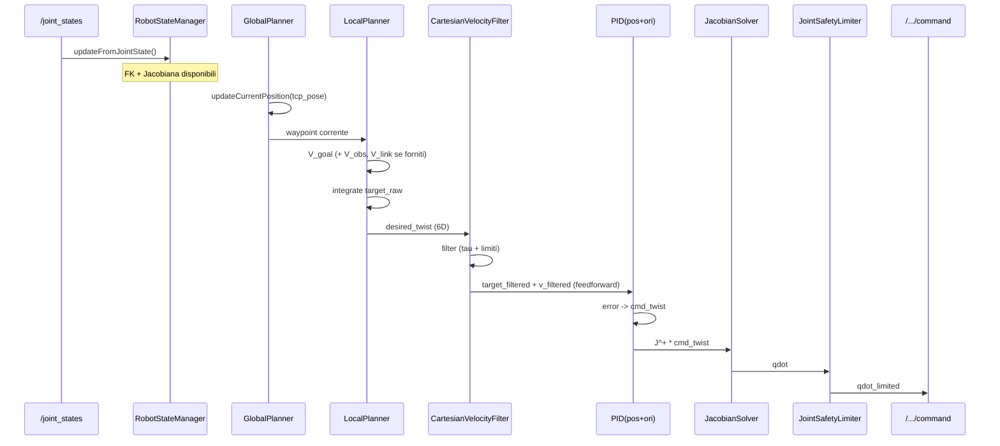
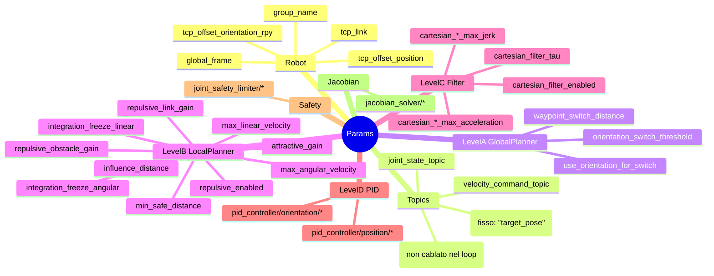

# Cartesian Velocity Controller — Overview (sintetico + schemi)

Questo documento riassume **il funzionamento end-to-end** del pacchetto ROS `cartesian_velocity_controller` e propone un’estensione per integrare **controlli fuzzy** che modificano il comportamento del **Local Planner**, con taratura tramite **Reinforcement Learning (RL)**.

> Nota “reality check”: nel loop C++ attuale il `LocalPlanner` viene chiamato con **ostacoli vuoti** (quindi l’evitamento ostacoli non è cablato nel nodo principale), anche se la logica repulsiva è già presente nel `LocalPlanner` e ci sono parametri dedicati (`local_planner/repulsive_*`) + un topic configurato `distance_topic: /distance_info`.

---

## Architettura ad alto livello

Il nodo principale è `cartesian_velocity_node` (eseguibile del pacchetto). Al suo interno, `CartesianVelocityController` orchestra una pipeline a livelli:

- **A — Global Planner**: gestisce lista waypoint e lo “switch” al prossimo.
- **B — Local Planner**: calcola velocità desiderata (attrattiva + opzionale repulsiva) e integra il **virtual target** `target_raw`.
- **C — Motion Generator**: filtra la velocità cartesiana (limiti su jerk/acc/vel) e produce `target_filtered`.
- **D — PID + IK**: PID in cartesiano (con feedforward dal filtro) + pseudo-inversa della Jacobiana (damped/weighted) per ottenere \( \dot{q} \).
- **E — Joint Safety Limiter**: limita \( \dot{q} \) e \( \ddot{q} \) con scaling uniforme.

### Schema pipeline (blocco funzionale)

```mermaid
flowchart LR
  A[Level A<br/>GlobalPlanner<br/>waypoints + switch] --> B[Level B<br/>LocalPlanner<br/>V_desired + integrate target_raw]
  B --> C[Level C<br/>CartesianVelocityFilter<br/>limits + tau -> target_filtered]
  C --> D[Level D<br/>PID (pos+ori)<br/>+ Jacobian IK]
  D --> E[Final<br/>JointSafetyLimiter<br/>scaling]
  E --> CMD[(Joint velocity cmd<br/>std_msgs/Float64MultiArray)]
```

### Perché esiste il “virtual target”

Il `LocalPlanner` non invia direttamente un “salto” di posa; integra invece una posa target nel tempo:

```text
target_raw(t+dt) = target_raw(t) + V_desired * dt
```

Questo rende più **smooth** l’inseguimento (il PID insegue un target che si muove “continuamente”).

---

## Interfacce ROS (cosa entra/uscita dal nodo)

### Topic sottoscritti

- **`/joint_states`** (`sensor_msgs/JointState`): stato giunti per FK/Jacobiana (via `RobotStateManager`).
- **`target_pose`** (`geometry_msgs/PoseStamped`): obiettivo (single-waypoint mode).

> Config presente ma non usata nel loop C++: **`/distance_info`** (da `controller_params.yaml` come `distance_topic`). È il punto naturale per cablare i dati di distanza/contatto (es. `scene_builder/DistanceContact`) verso `LocalPlanner`.

### Topic pubblicati

- **Comando**: `velocity_command_topic` (default **`/joint_group_vel_controller/command`**) — `std_msgs/Float64MultiArray` con \( \dot{q} \) finale.
- **Debug/monitoring**:
  - `end_effector_state` (`cartesian_velocity_controller/EndEffectorState`)
  - `pipeline_debug` (`cartesian_velocity_controller/PipelineDebug`)
  - `joint_velocity_feedback` (`cartesian_velocity_controller/JointVelocityFeedback`)
- **RViz markers**:
  - `velocity_markers` (`visualization_msgs/MarkerArray`)
  - `target_markers` (`visualization_msgs/MarkerArray`)
  - `command_markers` (`visualization_msgs/MarkerArray`)

### Servizi (controller_manager)

Il nodo può fare switching di controller tramite:

- `/controller_manager/list_controllers` (`controller_manager_msgs/ListControllers`)
- `/controller_manager/switch_controller` (`controller_manager_msgs/SwitchController`)

---

## Loop di controllo (una iterazione)

### Sequenza (semplificata)



### Dati di debug “osservabili”

`pipeline_debug` espone (quasi) tutto: distanze, `target_raw`, `target_filtered`, componenti PID, damping Jacobiana, scaling safety limiter. È ideale sia per tuning manuale sia per logging in training RL.

---

## Configurazione (parametri chiave)

La configurazione base è in `config/controller_params.yaml` + `config/velocity_filter_params.yaml`. A runtime puoi modificare molti parametri via **dynamic_reconfigure** (`cfg/ControllerTuning.cfg`).

### Parametri tipici (mappa mentale)



---

## Stato attuale dell’evitamento ostacoli (hook già presenti)

Il `LocalPlanner` supporta già:

- **TCP/payload repulsion** via `std::vector<ObstacleInfo>`
- **link POI repulsion** via `std::vector<LinkPOI>`

Ma il nodo principale oggi fa:

```text
obstacles = {}
link_pois = {}
local_planner.compute(current_pose, waypoint, obstacles, link_pois, dt)
```

Quindi per “accendere” davvero l’evitamento, serve **cablare** una sorgente ostacoli (es. `scene_builder/DistanceContact` da `/distance_info`) in `CartesianVelocityController::executePipeline()` e trasformarla in `ObstacleInfo` / `LinkPOI`.

---

## Obiettivo: integrare controlli fuzzy nel Local Planner (adattamento all’ambiente)

### Idea

Inserire un modulo **Fuzzy Supervisor** che, in base a segnali di contesto (distanza ostacoli, errori tracking, prossimità a singolarità, ecc.), **modifica online** alcuni parametri del Local Planner (e opzionalmente del filtro), per ottenere un comportamento adattivo:

- **vicino ostacoli**: aumentare repulsione, ridurre velocità max, aumentare smoothing
- **lontano da ostacoli**: ridurre repulsione, aumentare attrattiva e velocità max
- **tracking scarso**: privilegiare attrattiva / aumentare limiti

### Dove agganciarlo (punto pulito)

Aggancio consigliato: **tra Level A e Level B**, prima della `local_planner_->compute(...)`:

```mermaid
flowchart LR
  GP[GlobalPlanner] -->|waypoint| FZ[Fuzzy Supervisor<br/>(policy)]
  SENS[(Sensing / distances<br/>+ PipelineDebug)] --> FZ
  FZ -->|param updates| LP[LocalPlanner]
  LP --> VF[VelocityFilter] --> PID[PID + IK] --> SL[SafetyLimiter]
```

### Variabili fuzzy (candidate)

- **Input (stato)**:
  - \(d_{min}\): distanza minima ostacolo (da `/distance_info`)
  - \(\|e_p\|\), \(\|e_\omega\|\): errori PID (da `pipeline_debug`)
  - \( \sigma_{min} \): minimo valore singolare Jacobiana (da `pipeline_debug`)
  - \(s\): scaling del safety limiter (da `pipeline_debug`)
  - opzionale: velocità attuale, jerk, ecc.

- **Output (azioni)**:
  - `local_planner/attractive_gain`
  - `local_planner/repulsive_obstacle_gain`, `local_planner/repulsive_link_gain`
  - `local_planner/max_linear_velocity`, `local_planner/max_angular_velocity`
  - `local_planner/influence_distance`, `local_planner/min_safe_distance`
  - opzionale: `cartesian_filter_tau` (più smooth quando serve)

> Nel pacchetto esiste già `types/fuzzy_types.hpp` (e supporto opzionale a `fuzzylite` via CMake) che può essere riusato come base concettuale per un “gain scheduler” fuzzy.

---

## Taratura dei fuzzy mediante Reinforcement Learning (RL)

### Cosa “impara” l’RL

Due opzioni pratiche:

1. **RL ottimizza parametri del fuzzy** (consigliato): membership functions, scale/normalizzazioni, pesi/guadagni, soglie (es. come mappare \(d_{min}\) → `repulsive_gain`).
2. **RL sostituisce il fuzzy** con una policy neurale end-to-end (più potente ma meno interpretabile).

Qui assumiamo l’opzione 1: **fuzzy interpretabile + RL come tuner**.

### Pipeline di training (schema)

```mermaid
flowchart TB
  ENV[Sim/Real Env] --> OBS[Osservazioni<br/>d_min, e_p, e_w, sigma_min, scaling...]
  OBS --> AGENT[RL Tuner]
  AGENT --> PARAMS[Parametri fuzzy<br/>(membership/rules/scale)]
  PARAMS --> FZ[Fuzzy Supervisor]
  FZ --> ACT[Azione: set parametri LP/VF]
  ACT --> ENV
  ENV --> RWD[Reward<br/>tracking + safety + smoothness]
  RWD --> AGENT
```

### Reward (esempio compatto)

Un reward tipico è una somma pesata:

\[
R = -w_1\|e_p\| - w_2\|e_\omega\| - w_3\max(0, d_{safe}-d_{min}) - w_4(1-s) - w_5\|\dot{q}\| - w_6\|\ddot{q}\|
\]

Interpretazione:
- premia tracking,
- penalizza violazioni di distanza di sicurezza,
- penalizza quando il safety limiter deve scalare (indice di comando “troppo aggressivo”),
- penalizza comandi troppo “nervosi”.

### Deployment “sicuro”

In esecuzione reale:
- la policy RL **non deve** bypassare i limiti: il **Safety Limiter resta ultimo gate**;
- imporre **clamp** e **rate-limit** sugli output fuzzy (variazioni graduali);
- opzionale: “fallback” a parametri nominali se input non validi o sensori assenti.

---

## File utili da consultare (punti di ingresso)

- **Nodo**: `src/cartesian_velocity_node.cpp`
- **Orchestratore pipeline**: `src/cartesian_velocity_controller.cpp`, `include/.../cartesian_velocity_controller.hpp`
- **Planner**: `src/components/global_planner.cpp`, `src/components/local_planner.cpp`
- **Filtro**: `src/velocity_filter.cpp`
- **Debug**: `src/components/feedback_publisher.cpp` + `msg/PipelineDebug.msg`
- **Visual**: `src/components/marker_publisher.cpp`
- **Dynamic reconfigure**: `cfg/ControllerTuning.cfg`
- **Documenti già presenti**:
  - `docs/GLOBAL_PLANNER.md`
  - `docs/LOCAL_PLANNER.md`
  - `docs/PID_CONTROLLER.md`
  - `docs/PIPELINE_DEBUG_MESSAGE.md`


