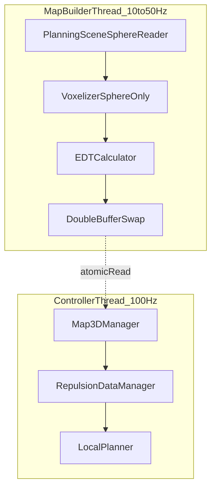

## Obiettivo

Spostare l’architettura da **“distanze per-POI calcolate esternamente”** (`scene_builder/RobotPointsInfo`) a **“query su mappa 3D locale”** (distance grid + gradient, aggiornata asincronamente) mantenendo:

- skeleton multi-POI (TCP + link POIs) e conversione Jacobian già presente in `LocalPlanner`
- loop controller 100 Hz lock-free lato lettura
- supporto ostacoli **solo sfera** (come da vincolo)

## Decisioni fissate (dai tuoi commenti nel doc di analisi)

- **Frame**: per ora `world == base_link`, quindi semplifichiamo TF; l’interfaccia resta comunque “world in / world out” per futuro base mobile.
- **Semantica distanza**: robot puntiforme + **raggio POI variabile**; ostacolo ha **margine fisso globale**.
- **Gradienti**: clamp vicino a 0 + fallback su ultimo gradiente valido per POI; fuori mappa (se capita) gradiente verso centro.
- **Bordi**: la mappa è abbastanza grande, ma implementiamo comunque un comportamento deterministico.
- **Retrocompatibilità**: non richiesta → possiamo rimuovere dipendenze/marker/flow legacy.

## Stato attuale (punti di attacco nel codice)

- `RepulsionDataManager` oggi **subscriba** `scene_builder/RobotPointsInfo` e traduce in `ObstacleInfo`/`LinkPOI`.
  - [`cartesian_velocity_controller/include/cartesian_velocity_controller/components/repulsion_data_manager.hpp`](/home/simone/Test_ws/src/cartesian_velocity_controller/include/cartesian_velocity_controller/components/repulsion_data_manager.hpp)
  - [`cartesian_velocity_controller/src/components/repulsion_data_manager.cpp`](/home/simone/Test_ws/src/cartesian_velocity_controller/src/components/repulsion_data_manager.cpp)
- `LocalPlanner` usa:
  - `ObstacleInfo.distance` + `ObstacleInfo.distance_vector` (direzione repulsiva = `distance_vector.normalized()`).
  - `LinkPOI.position_link` per Jacobian parziale; oggi viene ricostruita in `RepulsionDataManager` con `RobotStateManager`.
  - [`cartesian_velocity_controller/src/components/local_planner.cpp`](/home/simone/Test_ws/src/cartesian_velocity_controller/src/components/local_planner.cpp)
- Il controller chiama `repulsion_manager_->getRepulsionData()` nel loop.
  - [`cartesian_velocity_controller/src/cartesian_velocity_controller.cpp`](/home/simone/Test_ws/src/cartesian_velocity_controller/src/cartesian_velocity_controller.cpp) (zona ~L1734)

## Architettura target (in-process)

## Specifica dati (per evitare ambiguità)

- **Output repulsione** (quello che entra in `LocalPlanner`) resta in **world frame**.
- **`ObstacleInfo` (TCP)**
  - `distance`: distanza effettiva (già “safety”, vedi sotto)
  - `distance_vector`: vettore **ostacolo → TCP** con norma = `distance` (così `getRepulsiveDirection()` è già “away from obstacle”)
  - `position`: opzionale ma utile per marker/debug: **closest_point_on_obstacle** (world)
- **`LinkPOI`**
  - `position_world`: POI in world
  - `position_link`: offset nel frame link (da config), usato per Jacobian
  - `distance_to_closest_obstacle`: distanza effettiva
  - `repulsive_direction`: **away from obstacle** (world)
  - `distance_vector`: se tenuta, deve essere coerente col marker/debug (POI→closestPoint o POI→center: scegliamo POI→closestPoint per coerenza con mappa)

## Strategia margini (coerente con “margine fisso ostacolo”)

- Durante voxelizzazione: occupato se dentro sfera di raggio `(r_sphere + obstacle_margin)`.
- In query: `distance_eff = max(eps, d_edt - poi_radius)`.
  - `poi_radius` per POI (da parametri già esistenti)
  - `obstacle_margin` globale (nuovo parametro map3d)

## Refactoring (prima del cambio paradigma)

### 1) Eliminare dipendenza da `scene_builder/RobotPointsInfo`

- Cambiare `RepulsionDataManager` da “subscriber + cache” a “builder sincrono”:
  - carica definizioni POI (link + offset) da parametri (riusiamo lo stesso schema di `scene_builder` in `scene_builder_params.yaml`, se vuoi):
    - esempio attuale in scene_builder: `robot_points_of_interest.<name>.link` + `offset`
    - [`scene_builder/config/scene_builder_params.yaml`](/home/simone/Test_ws/src/scene_builder/config/scene_builder_params.yaml)
  - calcola `position_world` per ogni POI leggendo lo snapshot `RobotStateManager::getRobotStateCopy()`.
  - mantiene le config già presenti per weight/radius/enabled/is_tcp.

### 2) Interfaccia interna “sorgente repulsione” (semplice, non over-engineered)

- Aggiungere in `RepulsionDataManager` una dipendenza opzionale a `Map3DManager`.
- In `getRepulsionData()`:
  - per ogni POI abilitato: query distanza+gradiente alla mappa
  - costruire `ObstacleInfo` o `LinkPOI` direttamente (senza passare da messaggi ROS)

### 3) Pulizia performance lato `scene_builder`

- Per performance, **non lanciare** `distance_monitor_node` (è quello che calcola distanze a frequenza alta).
- Continuare a usare `scene_builder` per:
  - `object_command_node` (gestione/animazione sfere in PlanningScene)
  - configurazioni oggetti (`scene_builder/config/scene_config.yaml`).

## Implementazione mappa 3D (incrementale)

### 4) Modulo mappa in `cartesian_velocity_controller`

Creare un namespace/cartella nuova (come nella tua proposta doc) dentro:

- `cartesian_velocity_controller/include/cartesian_velocity_controller/map3d/…`
- `cartesian_velocity_controller/src/map3d/…`

Componenti minimi:

- `VoxelGrid3D`: occupancy + distance grid + conversioni coordinate + bounds
- `EDTCalculator`: calcolo EDT (Felzenszwalb-Huttenlocher separabile O(N))
- `Map3DManager`: double buffer + API query (distance + gradient + metadata)
- `PlanningSceneSphereReader`: snapshot PlanningScene e output lista sfere (center, radius, id)

### 5) Gradienti (versione 1 robusta)

- Gradiente da differenze finite sulla `distance_grid_` (central diff) + normalizzazione.
- Clamp:
  - se `distance < d_min` o `|grad| < eps`: usa ultimo gradiente valido per quel POI
  - se non disponibile: usa vettore verso centro mappa

### 6) Threading

- Map builder thread (timer o `std::thread` + sleep) che:
  - legge snapshot PlanningScene (lock breve)
  - voxelizza sfere nel back buffer
  - calcola EDT
  - swap atomico
- Controller thread (100 Hz) fa solo read lock-free dal front buffer.

### 7) Debug/telemetria

- Pubblicare (o loggare throttled) tempi per step: read scene, voxelize, EDT, swap.
- Opzionale: marker del volume mappa + alcuni punti campionati (slice o isosurface) per validare visivamente.
- Puoi mantenere `MarkerPublisher::publishRepulsionMarkers()` ma con semantica aggiornata (closest point) o sostituirlo con marker specifici mappa.

## Test plan (pratico, senza retrocompat)

- **Smoke test**: 1 sfera statica davanti al TCP → repulsione coerente, marker coerenti.
- **Multi-POI**: abilitare elbow/wrist/forearm_mid con offsets presi dal tuo `scene_builder_params.yaml`.
- **Jitter test**: portare POI quasi a contatto → gradiente stabile (clamp + last-valid).
- **Performance**: misurare update rate effettivo mappa e budget (con 144k voxel a 5cm).

## Cosa eliminare / rendere superfluo (per performance)

- In `cartesian_velocity_controller`: rimuovere dipendenza di build e runtime dal topic `/robot_points_info` (niente subscriber, niente include message `scene_builder`).
- In `scene_builder`: non usare `distance_monitor.launch`/`distance_monitor_node` nel setup “mappa”; restano utili solo per debug legacy.

## Output finale atteso

- Il controller gira a 100 Hz usando solo query mappa per repulsione.
- La mappa si aggiorna asincronamente (target 10–50 Hz, “as fast as possible” con telemetria).
- `scene_builder` rimane solo per creare/animare sfere in PlanningScene (per ora).