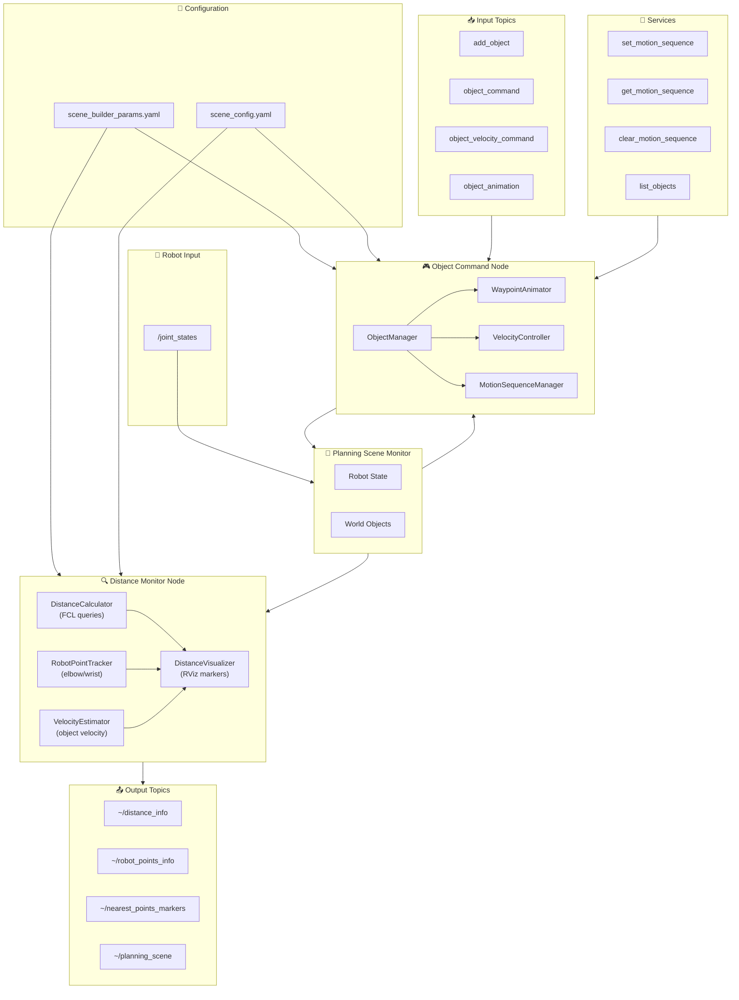
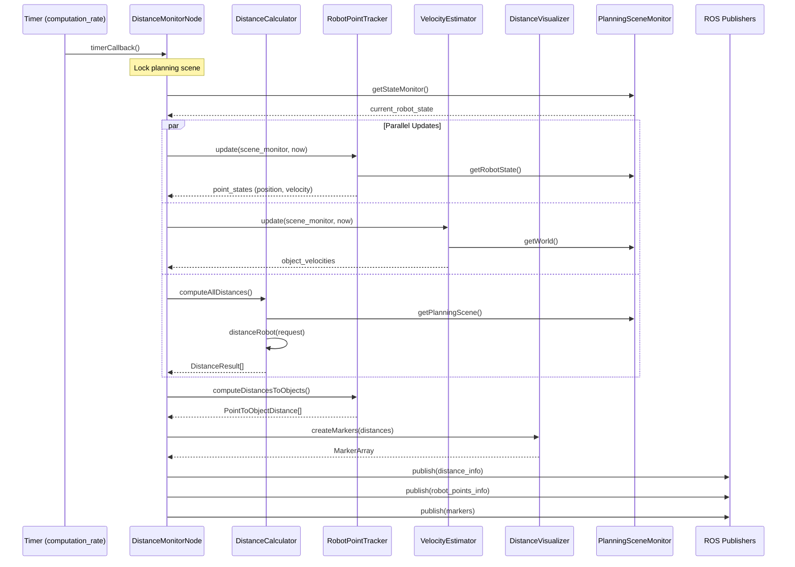
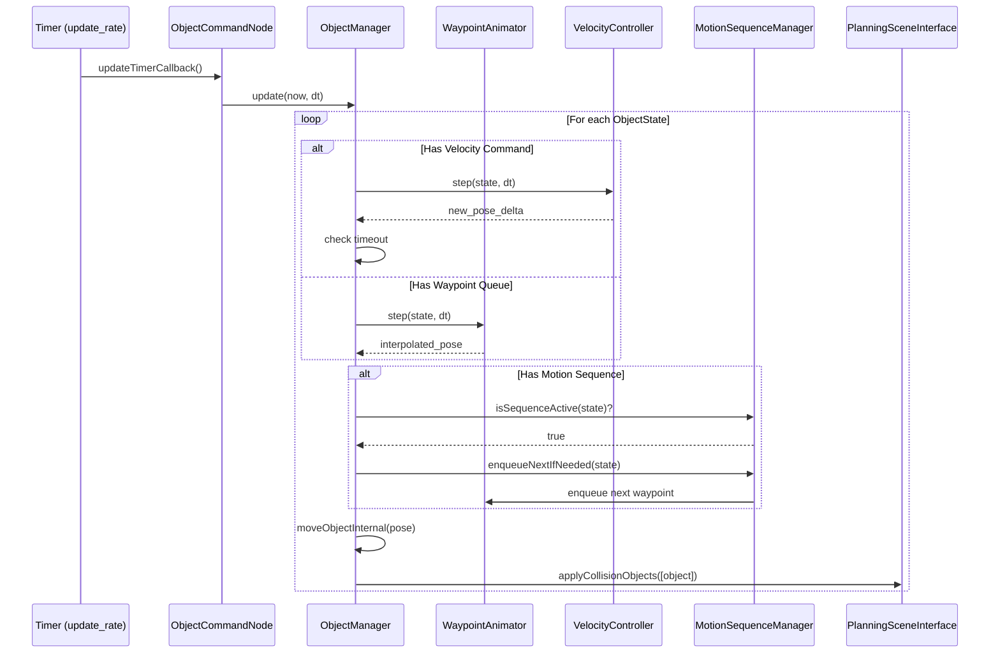

# Scene Builder - Schema Architetturale e Flusso Completo

## Panoramica del Pacchetto

`scene_builder` è un pacchetto ROS che gestisce la planning scene di MoveIt, fornendo:
- Monitoraggio delle distanze robot-ostacoli in tempo reale
- Gestione dinamica degli oggetti di collisione
- Animazioni e sequenze di movimento per ostacoli
- Visualizzazione in RViz

---

## Schema a Blocchi Generale

```
┌─────────────────────────────────────────────────────────────────────────────────────────┐
│                              SCENE_BUILDER PACKAGE                                       │
├─────────────────────────────────────────────────────────────────────────────────────────┤
│                                                                                          │
│  ┌──────────────────────────────────┐    ┌───────────────────────────────────────────┐  │
│  │      DISTANCE MONITOR NODE       │    │         OBJECT COMMAND NODE               │  │
│  │  (scene_distance_monitor)        │    │     (object_command_node)                 │  │
│  │                                  │    │                                           │  │
│  │  ┌────────────────────────────┐  │    │  ┌─────────────────────────────────────┐  │  │
│  │  │   DistanceCalculator      │  │    │  │         ObjectManager               │  │  │
│  │  │   (FCL distance queries)  │  │    │  │   (add/remove/move objects)         │  │  │
│  │  └────────────────────────────┘  │    │  └─────────────────────────────────────┘  │  │
│  │                                  │    │                                           │  │
│  │  ┌────────────────────────────┐  │    │  ┌─────────────────────────────────────┐  │  │
│  │  │   RobotPointTracker       │  │    │  │   Animation Components               │  │  │
│  │  │   (elbow, wrist tracking) │  │    │  │  ┌──────────────────────────────┐    │  │  │
│  │  └────────────────────────────┘  │    │  │  │  WaypointAnimator           │    │  │  │
│  │                                  │    │  │  │  VelocityController         │    │  │  │
│  │  ┌────────────────────────────┐  │    │  │  │  MotionSequenceManager      │    │  │  │
│  │  │   VelocityEstimator       │  │    │  │  └──────────────────────────────┘    │  │  │
│  │  │   (object velocity)       │  │    │  └─────────────────────────────────────┘  │  │
│  │  └────────────────────────────┘  │    │                                           │  │
│  │                                  │    │  ┌─────────────────────────────────────┐  │  │
│  │  ┌────────────────────────────┐  │    │  │   CollisionObjectFactory           │  │  │
│  │  │   DistanceVisualizer      │  │    │  │   (create primitives/meshes)        │  │  │
│  │  │   (RViz markers)          │  │    │  └─────────────────────────────────────┘  │  │
│  │  └────────────────────────────┘  │    │                                           │  │
│  └──────────────────────────────────┘    └───────────────────────────────────────────┘  │
│                                                                                          │
│  ┌──────────────────────────────────────────────────────────────────────────────────┐   │
│  │                              CORE UTILITIES                                       │   │
│  │  ┌────────────────────┐  ┌────────────────────┐  ┌─────────────────────────────┐ │   │
│  │  │ PlanningSceneHolder│  │    PoseUtils       │  │      YamlParser             │ │   │
│  │  │ (scene access)     │  │ (transformations)  │  │  (config loading)           │ │   │
│  │  └────────────────────┘  └────────────────────┘  └─────────────────────────────┘ │   │
│  └──────────────────────────────────────────────────────────────────────────────────┘   │
│                                                                                          │
└─────────────────────────────────────────────────────────────────────────────────────────┘
```

---

## Architettura dei Nodi

### Diagramma Nodi ROS

```
                                    ┌─────────────────────────┐
                                    │     YAML Config         │
                                    │  scene_builder_params   │
                                    │  scene_config           │
                                    └───────────┬─────────────┘
                                                │
                    ┌───────────────────────────┼───────────────────────────┐
                    │                           │                           │
                    ▼                           ▼                           ▼
    ┌───────────────────────────┐   ┌───────────────────────────┐   ┌───────────────┐
    │ distance_monitor_node     │   │ object_command_node       │   │  External     │
    │                           │   │                           │   │  Nodes        │
    │ • Computation Timer       │   │ • Update Timer            │   │  (MoveIt,     │
    │ • Distance Calculation    │   │ • Command Processing      │   │   RViz)       │
    │ • Point Tracking          │   │ • Animation Execution     │   │               │
    │ • Visualization           │   │ • Scene Updates           │   │               │
    └───────────────────────────┘   └───────────────────────────┘   └───────────────┘
              │                               │                             │
              │                               │                             │
              ▼                               ▼                             ▼
    ┌──────────────────────────────────────────────────────────────────────────────┐
    │                           MoveIt Planning Scene                               │
    │                       (PlanningSceneMonitor / Interface)                      │
    └──────────────────────────────────────────────────────────────────────────────┘
```

---

## Flusso del Distance Monitor Node

### Diagramma di Flusso Dettagliato

```
┌─────────────────────────────────────────────────────────────────────────────────────┐
│                          DISTANCE MONITOR NODE FLOW                                  │
└─────────────────────────────────────────────────────────────────────────────────────┘

                                    START
                                      │
                                      ▼
                        ┌─────────────────────────────┐
                        │      1. INITIALIZATION       │
                        │  • Load parameters           │
                        │  • Initialize PSM            │
                        │  • Wait for robot state      │
                        │  • Load initial objects      │
                        │  • Setup publishers          │
                        └─────────────────────────────┘
                                      │
                                      ▼
                        ┌─────────────────────────────┐
                        │      2. START TIMER          │
                        │  computation_rate Hz         │
                        │  (default: 15-50 Hz)         │
                        └─────────────────────────────┘
                                      │
                                      ▼
              ┌───────────────────────────────────────────────────┐
              │                  TIMER CALLBACK                    │
              │                  (timerCallback)                   │
              └───────────────────────────────────────────────────┘
                                      │
                  ┌───────────────────┼───────────────────┐
                  │                   │                   │
                  ▼                   ▼                   ▼
    ┌─────────────────────┐ ┌─────────────────────┐ ┌─────────────────────┐
    │  3a. UPDATE POINT   │ │  3b. UPDATE         │ │  3c. COMPUTE        │
    │     TRACKER         │ │     VELOCITY        │ │     DISTANCES       │
    │                     │ │     ESTIMATOR       │ │                     │
    │ • Get robot state   │ │                     │ │ • FCL queries       │
    │ • Forward kinematics│ │ • Track object      │ │ • All link-object   │
    │ • Compute velocities│ │   positions         │ │   pairs             │
    │                     │ │ • Estimate          │ │ • Nearest points    │
    │                     │ │   velocities        │ │ • Distance vectors  │
    └─────────────────────┘ └─────────────────────┘ └─────────────────────┘
                  │                   │                   │
                  └───────────────────┼───────────────────┘
                                      │
                                      ▼
                        ┌─────────────────────────────┐
                        │  4. CREATE VISUALIZATION     │
                        │  • Point markers (robot)     │
                        │  • Point markers (objects)   │
                        │  • Arrow markers (distance)  │
                        └─────────────────────────────┘
                                      │
                                      ▼
                  ┌───────────────────┬───────────────────┐
                  │                   │                   │
                  ▼                   ▼                   ▼
    ┌─────────────────────┐ ┌─────────────────────┐ ┌─────────────────────┐
    │  5a. PUBLISH        │ │  5b. PUBLISH        │ │  5c. PUBLISH        │
    │  DISTANCE_INFO      │ │  ROBOT_POINTS_INFO  │ │  MARKERS            │
    │                     │ │                     │ │                     │
    │ • DistanceContact[] │ │ • Point positions   │ │ • MarkerArray       │
    │ • Link-object pairs │ │ • Point velocities  │ │   to RViz           │
    │ • Jacobian (opt.)   │ │ • Object distances  │ │                     │
    └─────────────────────┘ └─────────────────────┘ └─────────────────────┘
                                      │
                                      ▼
                              (Loop to Timer)
```

---

## Flusso del Object Command Node

### Diagramma di Flusso Dettagliato

```
┌─────────────────────────────────────────────────────────────────────────────────────┐
│                          OBJECT COMMAND NODE FLOW                                    │
└─────────────────────────────────────────────────────────────────────────────────────┘

                                    START
                                      │
                                      ▼
                        ┌─────────────────────────────┐
                        │      1. INITIALIZATION       │
                        │  • Load parameters           │
                        │  • Create ObjectManager      │
                        │  • Load default objects      │
                        │  • Load motion sequences     │
                        │  • Setup subscribers         │
                        │  • Setup services            │
                        │  • Start update timer        │
                        └─────────────────────────────┘
                                      │
            ┌─────────────────────────┼─────────────────────────┐
            │                         │                         │
            ▼                         ▼                         ▼
 ┌────────────────────┐    ┌────────────────────┐    ┌────────────────────┐
 │   TOPIC CALLBACKS   │    │  SERVICE HANDLERS  │    │   UPDATE TIMER     │
 └────────────────────┘    └────────────────────┘    └────────────────────┘
            │                         │                         │
    ┌───────┼───────┬───────┐         │                         │
    │       │       │       │         │                         │
    ▼       ▼       ▼       ▼         ▼                         ▼
┌──────┐ ┌──────┐ ┌──────┐ ┌──────┐ ┌──────┐           ┌──────────────────┐
│ add  │ │object│ │veloc.│ │anim. │ │set/  │           │  update()        │
│object│ │ cmd  │ │ cmd  │ │ seq  │ │get/  │           │  (60 Hz default) │
│      │ │      │ │      │ │      │ │clear │           │                  │
└──────┘ └──────┘ └──────┘ └──────┘ └──────┘           └──────────────────┘
    │       │       │       │         │                         │
    │       │       │       │         │                         │
    └───────┴───────┴───────┴─────────┘                         │
                    │                                           │
                    ▼                                           ▼
          ┌─────────────────────────────────────────────────────────────┐
          │                      OBJECT MANAGER                         │
          │                                                             │
          │  ┌─────────────────┐  ┌─────────────────┐  ┌─────────────┐  │
          │  │ addObject()     │  │ queueWaypoint() │  │ applyVel()  │  │
          │  │ removeObject()  │  │ setSequence()   │  │             │  │
          │  └─────────────────┘  └─────────────────┘  └─────────────┘  │
          │           │                   │                   │         │
          │           └───────────────────┼───────────────────┘         │
          │                               │                             │
          │                               ▼                             │
          │           ┌─────────────────────────────────────────┐       │
          │           │           update(now, dt)               │       │
          │           │                                         │       │
          │           │  For each object with active commands:  │       │
          │           │  ┌──────────────────────────────────┐   │       │
          │           │  │ 1. Check velocity command timeout│   │       │
          │           │  │ 2. Apply velocity (if active)    │   │       │
          │           │  │ 3. Process waypoint queue        │   │       │
          │           │  │ 4. Advance motion sequence       │   │       │
          │           │  │ 5. Move object to new pose       │   │       │
          │           │  └──────────────────────────────────┘   │       │
          │           └─────────────────────────────────────────┘       │
          │                               │                             │
          └───────────────────────────────┼─────────────────────────────┘
                                          │
                                          ▼
                            ┌───────────────────────────┐
                            │  PlanningSceneInterface   │
                            │  (applyCollisionObjects)  │
                            └───────────────────────────┘
```

---

## Flusso Dati Inter-Componenti

### Diagramma dei Topics e Services

```
┌─────────────────────────────────────────────────────────────────────────────────────────┐
│                              ROS TOPICS & SERVICES FLOW                                  │
└─────────────────────────────────────────────────────────────────────────────────────────┘

    EXTERNAL INPUT                                                    EXTERNAL OUTPUT
    ─────────────                                                    ───────────────
                                                                     
    /joint_states ─────────────┐                    ┌─────────────▶ ~/distance_info
    (sensor_msgs/JointState)   │                    │                (DistanceInfo)
                               │                    │
                               ▼                    │
                   ┌───────────────────────────┐    │
                   │                           │    │               ┌─────────────▶ ~/robot_points_info
                   │   DISTANCE_MONITOR_NODE   │────┼───────────────│               (RobotPointsInfo)
                   │                           │    │               │
                   └───────────────────────────┘    │               │
                               │                    │               │
                               │                    │               └─────────────▶ ~/nearest_points_markers
                               ▼                    │                               (MarkerArray)
                   ┌───────────────────────────┐    │
                   │   PlanningSceneMonitor    │    │               ┌─────────────▶ /planning_scene
                   │   (shared by both nodes)  │◀───┘                               (PlanningScene)
                   └───────────────────────────┘
                               ▲
                               │
                   ┌───────────────────────────┐
                   │                           │
    add_object ───▶│                           │
    (CollisionObj) │   OBJECT_COMMAND_NODE     │────────────────▶ ~objects_list
                   │                           │                    (CollisionObject)
    object_cmd ───▶│                           │
    (ObjectCommand)│                           │
                   │                           │
    object_vel ───▶│                           │◀──── Services:
    (ObjVelocity)  │                           │      • ~/set_motion_sequence
                   │                           │      • ~/get_motion_sequence
    object_anim ──▶│                           │      • ~/clear_motion_sequence
    (PoseArray)    │                           │      • ~/list_objects
                   └───────────────────────────┘
```

---

## Struttura delle Classi

### Class Diagram Semplificato

```
┌─────────────────────────────────────────────────────────────────────────────────────────┐
│                                    CLASS STRUCTURE                                       │
└─────────────────────────────────────────────────────────────────────────────────────────┘

┌─────────────────────────────────────────────┐
│           scene_builder::nodes              │
├─────────────────────────────────────────────┤
│                                             │
│  ┌─────────────────────────────────────┐    │
│  │       DistanceMonitorNode           │    │
│  ├─────────────────────────────────────┤    │
│  │ - distance_calculator_              │    │
│  │ - distance_visualizer_              │    │
│  │ - velocity_estimator_               │    │
│  │ - robot_point_tracker_              │    │
│  │ - planning_scene_monitor_           │    │
│  ├─────────────────────────────────────┤    │
│  │ + start()                           │    │
│  │ - timerCallback()                   │    │
│  │ - loadInitialObjects()              │    │
│  └─────────────────────────────────────┘    │
│                                             │
│  ┌─────────────────────────────────────┐    │
│  │       ObjectCommandNode             │    │
│  ├─────────────────────────────────────┤    │
│  │ - manager_ (ObjectManager)          │    │
│  │ - subscribers (4)                   │    │
│  │ - service_servers (4)               │    │
│  ├─────────────────────────────────────┤    │
│  │ + collisionObjectCallback()         │    │
│  │ + objectCommandCallback()           │    │
│  │ + velocityCommandCallback()         │    │
│  │ + animationSequenceCallback()       │    │
│  │ - updateTimerCallback()             │    │
│  └─────────────────────────────────────┘    │
│                                             │
└─────────────────────────────────────────────┘

┌─────────────────────────────────────────────┐
│          scene_builder::distance            │
├─────────────────────────────────────────────┤
│                                             │
│  ┌─────────────────────────────────────┐    │
│  │       DistanceCalculator            │    │
│  ├─────────────────────────────────────┤    │
│  │ - planning_scene_monitor_           │    │
│  │ - distance_request_                 │    │
│  ├─────────────────────────────────────┤    │
│  │ + computeAllDistances()             │    │
│  │ + computeMinimumDistance()          │    │
│  │ - transformToWorld()                │    │
│  └─────────────────────────────────────┘    │
│                                             │
│  ┌─────────────────────────────────────┐    │
│  │       RobotPointTracker             │    │
│  ├─────────────────────────────────────┤    │
│  │ - points_ (map)                     │    │
│  │ - config_                           │    │
│  ├─────────────────────────────────────┤    │
│  │ + update()                          │    │
│  │ + computeDistancesToObjects()       │    │
│  │ + addPoint() / removePoint()        │    │
│  └─────────────────────────────────────┘    │
│                                             │
│  ┌─────────────────────────────────────┐    │
│  │       VelocityEstimator             │    │
│  ├─────────────────────────────────────┤    │
│  │ - object_states_ (map)              │    │
│  ├─────────────────────────────────────┤    │
│  │ + update()                          │    │
│  │ + getVelocity()                     │    │
│  └─────────────────────────────────────┘    │
│                                             │
│  ┌─────────────────────────────────────┐    │
│  │       DistanceVisualizer            │    │
│  ├─────────────────────────────────────┤    │
│  │ - config_                           │    │
│  ├─────────────────────────────────────┤    │
│  │ + createMarkers()                   │    │
│  │ + createClearMarkers()              │    │
│  └─────────────────────────────────────┘    │
│                                             │
└─────────────────────────────────────────────┘

┌─────────────────────────────────────────────┐
│          scene_builder::objects             │
├─────────────────────────────────────────────┤
│                                             │
│  ┌─────────────────────────────────────┐    │
│  │          ObjectManager              │    │
│  ├─────────────────────────────────────┤    │
│  │ - planning_scene_interface_         │    │
│  │ - move_group_                       │    │
│  │ - object_states_ (map)              │    │
│  │ - waypoint_animator_                │    │
│  │ - velocity_controller_              │    │
│  │ - sequence_manager_                 │    │
│  ├─────────────────────────────────────┤    │
│  │ + addObject()                       │    │
│  │ + removeObject()                    │    │
│  │ + queueWaypoint()                   │    │
│  │ + applyVelocity()                   │    │
│  │ + setWaypointSequence()             │    │
│  │ + update()                          │    │
│  └─────────────────────────────────────┘    │
│                                             │
│  ┌─────────────────────────────────────┐    │
│  │    CollisionObjectFactory           │    │
│  ├─────────────────────────────────────┤    │
│  │ + createBox()                       │    │
│  │ + createSphere()                    │    │
│  │ + createCylinder()                  │    │
│  │ + createMesh()                      │    │
│  └─────────────────────────────────────┘    │
│                                             │
└─────────────────────────────────────────────┘

┌─────────────────────────────────────────────┐
│         scene_builder::animation            │
├─────────────────────────────────────────────┤
│                                             │
│  ┌─────────────────────────────────────┐    │
│  │        WaypointAnimator             │    │
│  ├─────────────────────────────────────┤    │
│  │ + enqueue()                         │    │
│  │ + step()                            │    │
│  │ + isActive()                        │    │
│  └─────────────────────────────────────┘    │
│                                             │
│  ┌─────────────────────────────────────┐    │
│  │       VelocityController            │    │
│  ├─────────────────────────────────────┤    │
│  │ + setVelocity()                     │    │
│  │ + step()                            │    │
│  │ + isActive()                        │    │
│  └─────────────────────────────────────┘    │
│                                             │
│  ┌─────────────────────────────────────┐    │
│  │     MotionSequenceManager           │    │
│  ├─────────────────────────────────────┤    │
│  │ + setSequence()                     │    │
│  │ + enqueueNextIfNeeded()             │    │
│  │ + isSequenceActive()                │    │
│  └─────────────────────────────────────┘    │
│                                             │
└─────────────────────────────────────────────┘
```

---

## Diagramma Mermaid - Flusso Generale



---

## Diagramma Mermaid - Sequenza Calcolo Distanze



---

## Diagramma Mermaid - Animazione Oggetti



---

## Messaggi Custom

### Struttura dei Messaggi

```
┌─────────────────────────────────────────────────────────────────────────────────┐
│                            CUSTOM MESSAGES                                       │
└─────────────────────────────────────────────────────────────────────────────────┘

┌──────────────────────────────────────┐  ┌──────────────────────────────────────┐
│           DistanceInfo               │  │         DistanceContact              │
├──────────────────────────────────────┤  ├──────────────────────────────────────┤
│ std_msgs/Header header               │  │ string link_name                     │
│ DistanceContact[] contacts           │──▶│ string object_id                     │
│                                      │  │ float64 distance                     │
│                                      │  │ geometry_msgs/Point robot_point      │
│                                      │  │ geometry_msgs/Point object_point     │
│                                      │  │ geometry_msgs/Vector3 distance_vector│
│                                      │  │ geometry_msgs/Pose object_pose       │
│                                      │  │ geometry_msgs/Vector3 object_velocity│
└──────────────────────────────────────┘  └──────────────────────────────────────┘

┌──────────────────────────────────────┐  ┌──────────────────────────────────────┐
│         RobotPointsInfo              │  │      RobotPointDistanceInfo          │
├──────────────────────────────────────┤  ├──────────────────────────────────────┤
│ std_msgs/Header header               │  │ string point_name                    │
│ RobotPointDistanceInfo[] points      │──▶│ string link_name                     │
│                                      │  │ geometry_msgs/Point position         │
│                                      │  │ geometry_msgs/Vector3 linear_velocity│
│                                      │  │ string object_id                     │
│                                      │  │ geometry_msgs/Vector3 distance_vector│
│                                      │  │ float64 distance                     │
│                                      │  │ float64 object_characteristic_radius │
│                                      │  │ geometry_msgs/Vector3 object_velocity│
└──────────────────────────────────────┘  └──────────────────────────────────────┘

┌──────────────────────────────────────┐  ┌──────────────────────────────────────┐
│          ObjectCommand               │  │      ObjectVelocityCommand           │
├──────────────────────────────────────┤  ├──────────────────────────────────────┤
│ string object_id                     │  │ string object_id                     │
│ geometry_msgs/Pose target_pose       │  │ string reference_frame               │
│ float64 move_duration                │  │ geometry_msgs/Twist twist            │
│                                      │  │ float64 timeout                      │
└──────────────────────────────────────┘  └──────────────────────────────────────┘
```

---

## Parametri di Configurazione

### Tabella Parametri Principali

| Categoria           | Parametro                  | Default  | Descrizione                         |
| ------------------- | -------------------------- | -------- | ----------------------------------- |
| **Frequenze**       | `computation_rate`         | 15-50 Hz | Frequenza calcolo distanze          |
|                     | `update_rate`              | 60 Hz    | Frequenza aggiornamento animazioni  |
|                     | `state_update_frequency`   | 100 Hz   | Frequenza aggiornamento stato robot |
| **Timeouts**        | `state_wait_timeout`       | 2.0 s    | Attesa stato iniziale robot         |
|                     | `default_velocity_timeout` | 1.0 s    | Timeout comandi velocità            |
| **Limiti**          | `max_velocity_norm`        | 2.0 m/s  | Velocità max oggetti                |
| **Visualizzazione** | `arrow_length`             | 0.15 m   | Lunghezza frecce marker             |
| **Animazioni**      | `default_command_duration` | 0.5 s    | Durata default waypoints            |
|                     | `autostart_loops`          | false    | Avvio automatico sequenze           |

---

## File System del Pacchetto

```
scene_builder/
├── CMakeLists.txt
├── package.xml
├── README.md
│
├── config/
│   ├── scene_builder_params.yaml    # Parametri generali
│   └── scene_config.yaml            # Oggetti e sequenze
│
├── launch/
│   ├── distance_monitor.launch
│   ├── object_command.launch
│   └── ur10e_*.launch               # Launch completi
│
├── msg/
│   ├── DistanceInfo.msg
│   ├── DistanceContact.msg
│   ├── RobotPointsInfo.msg
│   ├── RobotPointDistanceInfo.msg
│   ├── ObjectCommand.msg
│   └── ObjectVelocityCommand.msg
│
├── srv/
│   ├── SetMotionSequence.srv
│   ├── GetMotionSequence.srv
│   ├── ClearMotionSequence.srv
│   └── ListObjects.srv
│
├── include/scene_builder/
│   ├── nodes/
│   │   ├── distance_monitor_node.hpp
│   │   └── object_command_node.hpp
│   ├── distance/
│   │   ├── distance_calculator.hpp
│   │   ├── distance_visualizer.hpp
│   │   ├── robot_point_tracker.hpp
│   │   └── velocity_estimator.hpp
│   ├── objects/
│   │   ├── object_manager.hpp
│   │   ├── object_state.hpp
│   │   └── collision_object_factory.hpp
│   ├── animation/
│   │   ├── waypoint_animator.hpp
│   │   ├── velocity_controller.hpp
│   │   └── motion_sequence.hpp
│   └── core/
│       ├── planning_scene_holder.hpp
│       ├── pose_utils.hpp
│       └── yaml_parser.hpp
│
└── src/
    ├── nodes/
    │   ├── distance_monitor_node.cpp
    │   ├── distance_monitor_main.cpp
    │   ├── object_command_node.cpp
    │   └── object_command_main.cpp
    ├── distance/
    │   ├── distance_calculator.cpp
    │   ├── distance_visualizer.cpp
    │   ├── robot_point_tracker.cpp
    │   └── velocity_estimator.cpp
    ├── objects/
    │   ├── object_manager.cpp
    │   └── collision_object_factory.cpp
    ├── animation/
    │   ├── waypoint_animator.cpp
    │   ├── velocity_controller.cpp
    │   └── motion_sequence.cpp
    └── core/
        ├── planning_scene_holder.cpp
        ├── pose_utils.cpp
        └── yaml_parser.cpp
```

---

## Riepilogo Flusso Completo

```
┌─────────────────────────────────────────────────────────────────────────────────────────┐
│                              COMPLETE SYSTEM FLOW                                        │
└─────────────────────────────────────────────────────────────────────────────────────────┘

1. STARTUP
   │
   ├─▶ Load YAML configuration files
   ├─▶ Initialize PlanningSceneMonitor
   ├─▶ Wait for robot state from /joint_states
   ├─▶ Load default objects into scene
   └─▶ Start timers (computation + update)

2. DISTANCE MONITORING (computation_rate Hz loop)
   │
   ├─▶ Read current robot state (FK)
   ├─▶ Update robot point positions/velocities
   ├─▶ Update object velocity estimates
   ├─▶ Compute FCL distances for all link-object pairs
   ├─▶ Compute point-to-object center distances
   ├─▶ Generate RViz markers
   └─▶ Publish: distance_info, robot_points_info, markers

3. OBJECT MANAGEMENT (update_rate Hz loop + callbacks)
   │
   ├─▶ Receive commands via topics/services
   │   ├─ add_object: Add/update collision object
   │   ├─ object_command: Queue waypoint
   │   ├─ object_velocity_command: Apply velocity
   │   └─ object_animation: Set animation sequence
   │
   ├─▶ Update loop:
   │   ├─ Process velocity commands (apply delta pose)
   │   ├─ Process waypoint queue (interpolate)
   │   ├─ Advance motion sequences (enqueue next)
   │   └─ Apply new poses to planning scene
   │
   └─▶ Services respond with current state/lists

4. OUTPUT
   │
   ├─▶ Distance data → cartesian_velocity_controller (obstacle avoidance)
   ├─▶ Markers → RViz (visualization)
   └─▶ Planning scene → MoveIt (motion planning)
```

---

*Documento generato il 2026-01-19*
*Pacchetto: scene_builder*
*Versione: Current*
