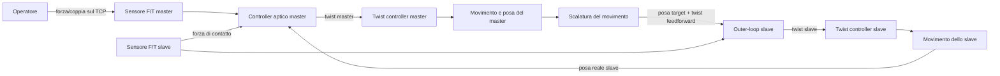
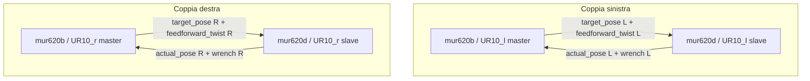
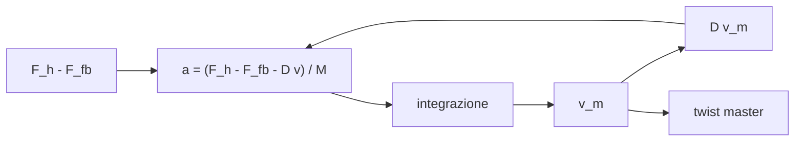
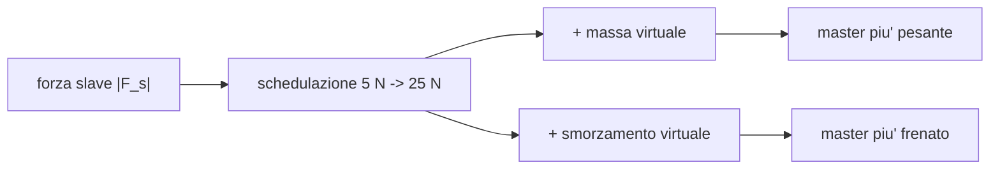
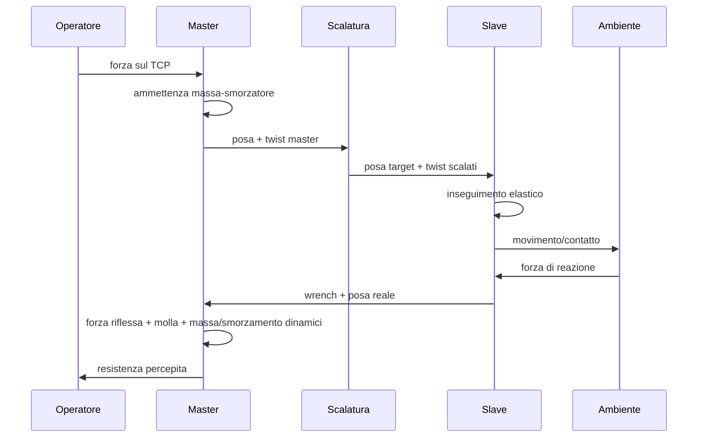

# Teleoperazione master/slave MUR620b -> MUR620d

Questo documento descrive la configurazione avviata da:

```bash
roslaunch teleoperation master_slave_mur620b_mur620d_dual_real.launch
```

L'applicazione realizza una teleoperazione bilaterale tra il robot master `mur620b` e il robot slave `mur620d`.
Sono attive due coppie indipendenti:

- `mur620b/UR10_l` comanda `mur620d/UR10_l`
- `mur620b/UR10_r` comanda `mur620d/UR10_r`

Le due coppie hanno la stessa logica di controllo. Non viene usato nessun accoppiamento tra braccio sinistro e braccio destro: il topic di coupling e' vuoto nel launch file, quindi il comportamento bimanuale accoppiato non fa parte di questa configurazione.

## Idea generale

L'operatore non comanda direttamente una posizione dello slave. L'operatore applica una forza al master. Il master misura questa forza con il sensore forza/coppia e si muove come se fosse una massa virtuale immersa in uno smorzatore. Da questo moto del master vengono generati:

- un comando di velocita' per muovere fisicamente il master;
- una posa target scalata per lo slave;
- un twist di feedforward scalato per lo slave.

Lo slave insegue la posa target usando il twist di feedforward e una correzione elastica sulla posa. Quando lo slave entra in contatto con l'ambiente, la forza misurata dallo slave torna al master e modifica la dinamica percepita dall'operatore: il master diventa piu' pesante, piu' smorzato e riceve una forza riflessa.

Schema concettuale di una coppia:



## Nodi attivi

Per ogni braccio sono attivi due nodi principali.

| Lato | Nodo master | Nodo slave |
| --- | --- | --- |
| Sinistro | `teleop_master_haptic_controller_left` | `teleop_slave_twist_outer_loop_left` |
| Destro | `teleop_master_haptic_controller_right` | `teleop_slave_twist_outer_loop_right` |

Sono inoltre avviati i nodi di azzeramento dei sensori forza/coppia UR10e, per fare la tare iniziale dei quattro sensori:

- master sinistro
- master destro
- slave sinistro
- slave destro

## Flusso dei topic

Per ogni lato, il master pubblica verso lo slave:

- `target_pose`: posa target dello slave;
- `feedforward_twist`: velocita' desiderata derivata dal moto del master.

Lo slave pubblica verso il master:

- `slave_actual_pose`: posa reale dello slave, riportata nel frame del master;
- wrench dello slave: forza/coppia misurata al TCP dello slave.

Schema dei due canali indipendenti:



## Principio fisico lato master: ammettenza massa-smorzatore

Il master e' controllato in ammettenza. Questo significa che l'ingresso e' una forza misurata, mentre l'uscita e' una velocita' comandata.

Il modello fisico virtuale e':

```text
forza applicata -> massa virtuale + smorzatore -> velocita' del master
```

Per la parte lineare:

```math
M_m \dot{v}_m + D_m v_m = F_h - F_{fb}
```

Per la parte angolare:

```math
J_m \dot{\omega}_m + B_m \omega_m = \tau_h - \tau_{fb}
```

dove:

- `F_h`, `tau_h` sono forza e coppia applicate dall'operatore al master;
- `v_m`, `omega_m` sono velocita' lineare e angolare comandate al master;
- `F_fb`, `tau_fb` sono i contributi di feedback provenienti dallo slave;
- `M_m`, `J_m` sono massa e inerzia virtuale;
- `D_m`, `B_m` sono smorzamento lineare e angolare.

I valori base configurati sono:

| Grandezza | Valore |
| --- | ---: |
| Massa lineare base `M_0` | `9.0 kg` |
| Smorzamento lineare base `D_0` | `25.0 N s/m` |
| Inerzia angolare base `J_0` | `0.04 kg m^2` |
| Smorzamento angolare base `B_0` | `0.3 N m s/rad` |

Il controller integra questa dinamica e pubblica un `geometry_msgs/Twist` sul twist controller del master. L'operatore percepisce quindi un master che "cede" quando lo spinge, ma che viene rallentato o contrastato quando lo slave e' in contatto o in ritardo.

Schema massa-smorzatore:



## Feedback dal robot slave al master

Il feedback aptico usato dal master ha tre contributi principali.

### 1. Forza riflessa dal sensore dello slave

La forza misurata sullo slave viene filtrata, saturata e riflessa sul master con un guadagno:

```math
F_{refl} = -k_f F_s
```

con:

```math
k_f = 0.70
```

Il segno meno serve a rendere la forza riflessa oppositiva: se lo slave sente una reazione dell'ambiente, il master tende a opporsi al movimento dell'operatore.

Nella configurazione attuale la riflessione diretta della coppia dello slave e' nulla:

```math
k_\tau = 0
```

quindi il feedback diretto da sensore e' principalmente lineare.

### 2. Molla virtuale tra master e slave

Il master riceve anche la posa reale dello slave. Se il master e lo slave non sono allineati, viene generata una forza elastica:

```math
F_{spring} = K_s (p_m - p_s^{eq}) + B_s (v_m - \hat{v}_s^{eq})
```

dove:

- `p_m` e' la posizione del master;
- `p_s^{eq}` e' la posizione dello slave riportata nello spazio equivalente del master;
- `v_m` e' la velocita' comandata al master;
- `\hat{v}_s^{eq}` e' la velocita' stimata dello slave, calcolata per differenza finita;
- `K_s = 10.0 N/m`;
- `B_s = 10.0 N s/m`;
- la forza elastica e' limitata a `150 N`.

Questa molla virtuale e' importante per dare all'operatore la sensazione che lo slave stia "tirando indietro" quando non riesce a seguire il master, per esempio durante un contatto o un rallentamento.

### 3. Massa e smorzamento dinamici

Quando la forza misurata sullo slave aumenta, il master aumenta automaticamente la massa virtuale e lo smorzamento. Il risultato pratico e' che il master diventa piu' pesante e piu' viscoso quando lo slave e' in contatto.

La variabile usata e' la norma della forza dello slave:

```math
F_{env} = \|F_s\|
```

La schedulazione parte a `5 N` e arriva al massimo a `25 N`:

```math
u = clamp\left(\frac{F_{env} - 5}{25 - 5}, 0, 1\right)
```

```math
s = u^2(3 - 2u)
```

Poi:

```math
M_m = M_0 + s \Delta M_{max}
```

```math
D_m = D_0 + s \Delta D_{max}
```

con:

| Grandezza | Extra massimo | Valore massimo risultante |
| --- | ---: | ---: |
| Massa lineare | `15.0 kg` | `24.0 kg` |
| Smorzamento lineare | `80.0 N s/m` | `105.0 N s/m` |
| Inerzia angolare | `0.01 kg m^2` | `0.05 kg m^2` |
| Smorzamento angolare | `2.4 N m s/rad` | `2.7 N m s/rad` |

Gli extra di massa e smorzamento sono filtrati con un passa-basso a `30 Hz`, per evitare cambi bruschi nella sensazione aptica.

Schema concettuale:



## Scalatura del movimento master -> slave

La scalatura del movimento e' attiva.

| Parametro | Valore |
| --- | ---: |
| Scala traslazionale | `2.0` |
| Scala rotazionale | `1.0` |

Prima della scalatura, le grandezze del master vengono riportate nel sistema numerico dello slave con una rotazione statica attorno all'asse `z`.

| Lato | Rotazione master -> slave | Rotazione slave -> master |
| --- | ---: | ---: |
| Sinistro | `+0.230546998 rad` | `-0.230546998 rad` |
| Destro | `+0.228120324 rad` | `-0.228120324 rad` |

Quindi:

- uno spostamento del master di `50 cm` produce uno spostamento target dello slave di `25 cm`;
- la rotazione non viene ridotta, perche' la scala rotazionale e' `1.0`.

La scalatura e' fatta rispetto a una posa neutra del master. Le pose neutre usate dal launch sono:

| Lato | Posizione neutra master |
| --- | --- |
| Sinistro | `[-0.840, 0.060, -0.117]` |
| Destro | `[0.838, 0.049, -0.126]` |

Le orientazioni neutre del master, in formato `[x, y, z, w]`, sono:

| Lato | Orientazione neutra master |
| --- | --- |
| Sinistro | `[0.714, 0.701, -0.010, -0.001]` |
| Destro | `[-0.698, 0.716, 0.005, -0.008]` |

Il concetto e':

```text
master fermo nella posa neutra  ->  slave fermo nella sua posa neutra
master si sposta di Delta       ->  slave si sposta di Delta / scala
```

Per la posizione:

```math
p_{s,target} = p_{s,0} + \frac{R_{ms}(p_m - p_{m,0})}{s_t}
```

dove:

- `p_m` e' la posizione corrente del master;
- `p_{m,0}` e' la posizione neutra del master;
- `p_{s,0}` e' la posa neutra corrispondente nello spazio dello slave;
- `R_{ms}` e' la rotazione statica master -> slave;
- `s_t = 2.0` e' la scala traslazionale.

Per il twist lineare:

```math
v_{s,ff} = \frac{R_{ms} v_m}{s_t}
```

Per l'orientamento viene scalato il vettore di rotazione relativo alla posa neutra:

```math
q_{s,target} = q_{s,0} \exp\left(\frac{\log(q_{s,0}^{-1} q_m^s)}{s_r}\right)
```

con:

- `q_m^s` orientamento del master riportato nel sistema dello slave;
- `s_r = 1.0` scala rotazionale.

Per il twist angolare:

```math
\omega_{s,ff} = \frac{R_{ms} \omega_m}{s_r}
```

Dato che `s_r = 1.0`, la velocita' angolare non viene scalata.

Schema semplice della scalatura:

```text
Posa neutra
    master: p_m0
    slave:  p_s0

Movimento
    master: p_m0 + Delta
    slave:  p_s0 + Delta / 2
```

## Controllo dello slave

Lo slave riceve:

- posa target scalata;
- twist di feedforward scalato;
- wrench misurato sullo slave.

Il controller dello slave usa un controllo elastico sulla posa, con feedforward dominante:

```math
v_s = k_{ff} v_{ff} + K_p e_p + K_i \int e_p dt
```

dove:

```math
e_p = p_{target} - p_s
```

e:

| Parametro | Valore |
| --- | ---: |
| Guadagno feedforward `k_ff` | `0.95` |
| Guadagno elastico lineare `K_p` | `1.0 1/s` |
| Guadagno integrale lineare `K_i` | `0.2 1/s^2` |
| Limite del termine elastico lineare | `0.3 m/s` |
| Limite finale velocita' lineare | `0.7 m/s` |

L'integrale lineare viene congelato quando la forza sullo slave supera `10 N`, cosi' non accumula errore mentre lo slave e' in contatto.

Per l'orientamento:

```math
\omega_s = k_{ff} \omega_{ff} + K_R e_R
```

dove `e_R` e' l'errore di orientamento espresso come vettore asse-angolo. Il guadagno configurato e':

```math
K_R = 1.0 1/s
```

Il limite del termine elastico angolare e' `0.8 rad/s`, mentre il limite finale della velocita' angolare dello slave e' `1.8 rad/s`.

La compliance diretta dello slave da forza misurata e' configurata con guadagno nullo:

```math
k_{adm,linear} = 0
```

quindi, in questa configurazione, lo slave non arretra in modo continuo per ammettenza locale: segue il master e usa la forza soprattutto per sicurezza, feedback al master e congelamento dell'integrale.

## Come si chiude il ciclo bilaterale

Il ciclo completo di una coppia e':

1. L'operatore spinge il master.
2. Il sensore F/T del master misura `F_h`.
3. Il controller master calcola una velocita' `v_m` con la dinamica massa-smorzatore.
4. Il master si muove e la sua posa viene letta via TF.
5. La posa e il twist del master vengono ruotati e scalati.
6. Lo slave riceve posa target e twist feedforward.
7. Lo slave insegue il target con feedforward + correzione elastica.
8. Lo slave pubblica la sua posa reale e la sua forza misurata.
9. Il master usa questi segnali per generare feedback aptico.

Schema del ciclo:



## Trattamento dei segnali di forza

Le wrench dei sensori vengono:

1. ruotate dal frame del tool al frame `base_link_inertia`;
2. filtrate con un passa-basso;
3. passate in una deadband con isteresi;
4. saturate in norma per sicurezza.

Il filtro e':

```math
x_f[k] = \alpha x[k] + (1-\alpha)x_f[k-1]
```

con:

```math
\alpha = \frac{\Delta t}{\tau + \Delta t}
```

```math
\tau = \frac{1}{2 \pi f_c}
```

Nel master:

- wrench master filtrata a `25 Hz`;
- wrench slave di feedback filtrata a `25 Hz`.

Nello slave:

- wrench slave filtrata a `25 Hz`.

## Sicurezze principali attive

Il master limita:

- velocita' lineare massima: `0.7 m/s`;
- velocita' angolare massima: `3.0 rad/s`;
- accelerazione e jerk per rendere il comando piu' regolare;
- wrench stale: se i dati diventano vecchi, pubblica twist nullo e resetta lo stato.

Lo slave limita:

- velocita' lineare massima: `0.7 m/s`;
- velocita' angolare massima: `1.8 rad/s`;
- termine elastico lineare massimo: `0.3 m/s`;
- termine elastico angolare massimo: `0.8 rad/s`;
- hard guard: se la forza supera `150 N` per `0.05 s`, esegue una ritirata a `0.2 m/s`.

## Ritorno automatico alla home

Il ritorno alla home e' attivo sul master. Dopo `5 s` senza attivita' dell'operatore, viene aggiunto un contributo elastico verso una posa home configurata per ogni braccio. Questo contributo e' applicato gradualmente con un tempo di blend di `3 s`.

Concettualmente:

```math
F_{home} = K_h (p_m - p_{home}) + D_h v_m + K_{I,h}\int(p_m - p_{home})dt
```

Il contributo e' limitato a `15 N`. Serve a riportare il sistema verso una configurazione nota quando l'operatore smette di interagire.

## Riassunto operativo

La teleoperazione funziona perche':

- il master trasforma la forza dell'operatore in moto tramite un modello massa-smorzatore;
- il moto del master viene mandato allo slave come posa target e twist feedforward;
- la scalatura riduce lo spostamento traslazionale dello slave di un fattore `2`;
- lo slave insegue il target con un controllo elastico stabile;
- lo slave rimanda forza e posa reale al master;
- il master usa forza riflessa, molla virtuale e massa/smorzamento dinamici per far percepire all'operatore il contatto e il ritardo dello slave.

La parte importante e' che non viene comandata una forza fisica esplicita al master: il feedback aptico nasce dal modo in cui il controller modifica la velocita' del master in risposta alle forze e alla posa dello slave.
