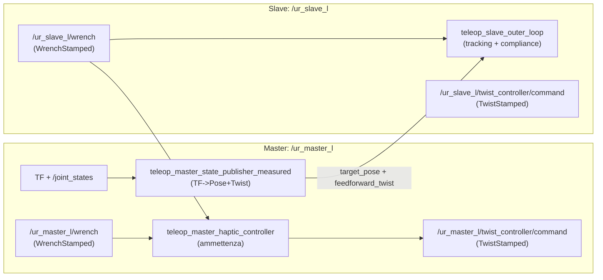

# Teleoperazione bilaterale UR10e (2 Master + 2 Slave) — guida pratica

Obiettivo: realizzare una teleoperazione **bilaterale** dove:

- l’operatore muove **manualmente** 2 UR10e “master”;
- 2 UR10e “slave” ricevono dal master **feedforward di velocità cartesiana** + **posa cartesiana** (come già fate);
- le **forze misurate sullo slave** (sensore F/T integrato UR e-series) vengono “riflesse” sul master con un **loop chiuso** (force reflection), così l’operatore percepisce il contatto remoto.

Questo documento è scritto per il contesto del tuo workspace:

- pacchetto `teleoperation` con:
  - publisher di stato master già presente (`scripts/teleop_master_state_publisher.py`) ma basato su `PipelineDebug` del `cartesian_velocity_controller`;
  - controller slave C++ che comanda `joint_group_vel_controller_*/unsafe` e consuma `target_pose` + `feedforward_twist`.
- driver UR ROS presente: `ur_robot_driver` (ROS-control) con:
  - topic F/T TCP: `force_torque_sensor_controller` pubblica `geometry_msgs/WrenchStamped` su **`/wrench`**;
  - servizio di tare: **`zero_ftsensor`** (`std_srvs/Trigger`);
  - controllori utili per teleop: **`joint_group_vel_controller`** e **`twist_controller`** (cartesiano).

---

## Controllo bilaterale: cosa significa “chiudere il loop” sul master

Se lo slave tocca l’ambiente e misura una forza $F_{ext}$, vuoi che sul master compaia un “effetto resistivo” (o guida) proporzionale a $F_{ext}$.

Ci sono due modi concettuali:

- **(A) Solo misura → nessuna aptica reale**: muovi il master in freedrive, leggi la posa e comandala allo slave. Usi $F_{ext}$ solo per logging/UI. È “unilaterale” dal punto di vista aptico.
- **(B) Aptica con robot master**: il master *non è semplicemente libero*, ma gira un controllore che genera comandi (tipicamente velocità cartesiana) tali da creare, tramite i servo interni del robot, un comportamento “massa-smorzatore” e una reazione alla forza remota. Questo è ciò che, in pratica, permette all’operatore di “sentire” $F_{ext}$.

Nel tuo caso, con UR10e + ROS-control, l’approccio **più pragmatico** è (B) usando un controllore **in velocità cartesiana** (meglio `twist_controller`) oppure in velocità giunti (`joint_group_vel_controller`) con IK via Jacobiano.

---

## Sensore di forza UR10e: come si usa in ROS (lettura + zero)

### Topic pubblicato

Con `ur_robot_driver`, il controller read-only:

- **`force_torque_sensor_controller`** pubblica la wrench TCP come:
  - **tipo**: `geometry_msgs/WrenchStamped`
  - **topic**: **`/wrench`**

In multi-robot, tipicamente questo diventa namespaced, ad esempio:

- master sinistro: `/<master_l_ns>/wrench`
- slave sinistro: `/<slave_l_ns>/wrench`

Nota importante: la wrench è associata a un frame id configurabile tramite parametro driver **`wrench_frame_id`** (utile con più robot per evitare collisioni di frame id).

### Tare / azzeramento

È disponibile:

- servizio: **`zero_ftsensor`** (`std_srvs/Trigger`)

Operativamente:

- chiamalo **a robot fermo**, senza contatti, con payload/tool già configurato;
- ripetilo quando cambi tool/payload o noti drift.

### Cosa contiene davvero la misura

- Per UR ROS driver la wrench è “misurata al TCP” e pubblicata già come `WrenchStamped`.
- Rimane comunque fondamentale applicare:
  - **filtro passa-basso** (rumore e spike in collisione);
  - **clamp/saturazione** (per stabilità del loop bilaterale);
  - **trasformazione di frame coerente** (vedi sezione “Frame”).

---

## Architettura consigliata (per ogni coppia Master↔Slave)

Per ogni lato (L e R) considera 4 stream:

- **Master → Slave**
  - `target_pose` (`geometry_msgs/PoseStamped`): posa TCP master misurata (o filtrata) in un frame “comune”.
  - `feedforward_twist` (`geometry_msgs/TwistStamped`): twist TCP master misurato/stimato.
- **Slave → Master**
  - `wrench_slave` (`geometry_msgs/WrenchStamped`): wrench TCP dello slave (contatto ambiente).
- **Master interno**
  - `wrench_master` (`geometry_msgs/WrenchStamped`) *opzionale ma raccomandato*: wrench TCP master (forza mano + contatti local).

### Esempio di grafo ROS (un lato)

Esempio per una singola coppia (sinistra). Adatta i namespace a come li hai configurati (in questo doc uso `/ur_master_l` e `/ur_slave_l`).



### Nota su quello che hai già

Il tuo `teleop_master_state_publisher.py` attuale prende i dati da `PipelineDebug` di `cartesian_velocity_controller`, quindi funziona bene quando il master è “pilotato” da quel controller.

Se invece vuoi **muovere il master manualmente** (hand-guiding), ti serve un publisher che pubblichi **stato misurato** (TF/joint_states) e non un debug di un controller.

---

## Quali controller ROS sono più adatti (UR10e + ur_robot_driver)

Qui il punto chiave: **per “renderizzare” una forza sul master serve che il master sia comandato**, non solo lasciato in freedrive.

### Scelta pragmaticamente migliore: `twist_controller` (cartesiano)

Dal doc `ur_robot_driver/doc/controllers.md`:

- **`twist_controller`** accetta un **twist TCP** (lin+ang) ed è pensato proprio per “Cartesian servoing” (teleop/visual servoing).

Vantaggi:

- comandi in 6D cartesiano senza implementare tu Jacobiano/IK;
- interfaccia pulita (Twist) e più vicina al tuo schema master→slave.

Svantaggi / cautele:

- il controller non “capisce” da solo limiti/ambiente: devi mettere **limiti, filtri, watchdog**;
- un twist sbagliato può portare a protective stop (workspace/config change).

#### Nota importante (vale soprattutto per lo slave)

Usare `twist_controller` **non** elimina automaticamente il problema “spinge all’infinito”: se continui a comandare un twist verso un ostacolo, lo slave continuerà a provarci.

Quindi la scelta “migliore” è:

- usare `twist_controller` per avere una **porta cartesiana** pulita verso l’hardware;
- implementare sopra (outer loop) una legge `force-aware` che **modula** il twist in base a `/<slave_ns>/wrench`.

#### Come attivarlo (controller_manager)

Con `ur_robot_driver` i controller si switchano via `controller_manager/switch_controller`. Esempio tipico (ferma la traiettoria in posizione e avvia twist):

```bash
rosservice call /ur_master_l/controller_manager/switch_controller "start_controllers: ['twist_controller']
stop_controllers: ['scaled_pos_joint_traj_controller']
strictness: 2
start_asap: false
timeout: 0.0"
```

### Alternativa già allineata a quello che fai: `joint_group_vel_controller` (giunti)

Vantaggi:

- semplice “pass-through” di $\dot{q}$, prevedibile;
- si integra con il tuo codice Jacobiano già nel repo (`teleoperation/components/jacobian_solver.*`).

Svantaggi:

- devi gestire tu $J^+$, damping, frame, limiti, ecc. (ma lo state già facendo sullo slave).

#### Come attivarlo (controller_manager)

```bash
rosservice call /ur_master_l/controller_manager/switch_controller "start_controllers: ['joint_group_vel_controller']
stop_controllers: ['scaled_pos_joint_traj_controller']
strictness: 2
start_asap: false
timeout: 0.0"
```

### Perché NON cito “effort controller” come prima scelta

Un vero rendering aptico “ideale” sarebbe con un controllore a **coppia** (impedance/torque). Ma con UR + `ur_robot_driver` standard il percorso più usato in ROS1 resta: controllo in posizione/velocità + modalità force/servo interne. Quindi, per restare sullo stack che avete già, twist/velocity è la via pratica.

---

## Scelta consigliata “best practice” per lo slave

Per “fare bene” una teleoperazione cartesiana, la soluzione che consiglio è:

- **SLAVE comandato in cartesiano** con **`twist_controller`**
- un **outer-loop teleop** che calcola un twist sicuro:
  - tracking pose (errore posa)
  - feedforward twist dal master
  - **compliance/guard basati su `/<slave_ns>/wrench`**

In altre parole: lo slave non riceve direttamente un passthrough di $\dot q$ o di $v_{ff}$, ma un twist già “filtrato dalla forza”.

Vantaggi principali:

- architettura più semplice e coerente (Twist ovunque)
- niente IK/jacobiano nello strato teleop (meno failure mode)
- più facile garantire che “in contatto rallenta/si ferma”

Quando scegliere invece $\dot q$ (`joint_group_vel_controller`):

- se vuoi controllare tu in modo fine SDLS/limiti joint-level e gestire esplicitamente singolarità/configurazioni
- se devi usare vincoli joint-specific non esprimibili bene in twist

---

## Master “manuale” con force reflection: due modalità implementabili

### Modalità 1 (solo tracking): Freedrive + publisher stato (NO force reflection)

È la soluzione più veloce se vuoi solo muovere lo slave “come un duplicatore”.

- Metti il master in freedrive / hand-guiding (teach).
- Leggi la posa TCP dal TF (`base_link -> tool0`) e pubblica:
  - `target_pose`
  - `feedforward_twist` (stimato con differenza finita, filtrato).
- Lo slave segue come già fate.

Limite: lo slave può misurare forze, ma **non le sentirai** sul master (il master è passivo).

### Modalità 2 (bilaterale vera): Master in servo (twist/vel) + loop di ammettenza

**Risposta:** Voglio questa modalità

Qui il master *viene comandato* per risultare “leggero” e muovibile a mano, ma anche per opporsi quando lo slave sente contatto.

#### Idea fisica: “admittance” sul master

Usi una dinamica virtuale tipo massa-smorzatore nello spazio cartesiano:

$$
M_m \ddot{x}_m + D_m \dot{x}_m = F_{hand} - K_f \, F_{ext}
$$

- $F_{hand}$: wrench misurata al TCP del **master** (forza mano sull’EE).
- $F_{ext}$: wrench al TCP dello **slave** (forza ambiente).
- $K_f$: scala della forza riflessa (e.g. 0.2–1.0).
- $M_m, D_m$: parametri aptici (inerzia e smorzamento “percepiti”).

Poi integri in discreto e generi un comando di velocità cartesiana:

- $a = M^{-1}(F_{hand} - K_fF_{ext} - D v)$
- $v \leftarrow v + a \Delta t$
- clamp $v$ (limiti sicurezza)
- pubblica $v$ al controller del master (`twist_controller`) **oppure** converti in $\dot{q}$ e pubblica a `joint_group_vel_controller`.

#### Pseudocodice (loop discreto)

Esempio minimale per la parte lineare XYZ (estendibile a 6D):

```text
state:
  v_cmd (3x1)  # velocità cartesiana master che invii al controller

params:
  M = diag([m, m, m])           # kg (virtual)
  D = diag([d, d, d])           # N*s/m
  Kf = diag([kf, kf, kf])       # scala force reflection
  vmax = 0.25 m/s               # clamp sicurezza
  fc_wrench = 30 Hz             # low-pass su wrench

loop every dt:
  F_hand = LPF(master_wrench.force)
  F_ext  = LPF(slave_wrench.force)

  # opzionale: deadband su F_ext per evitare rumore a vuoto
  F_ext = deadband(F_ext, 1.0 N)

  a = inv(M) * (F_hand - Kf*F_ext - D*v_cmd)
  v_cmd = v_cmd + a*dt
  v_cmd = clamp_norm(v_cmd, vmax)

  publish master_twist_cmd.linear = v_cmd
```

#### Scelta iniziale di parametri (ordine di grandezza)

Valori “safe” per partire (poi si tarano sul feeling):

- $K_f$: 0.2 → 0.5 (inizia basso, aumenta finché senti ma non vibra)
- $M_m$ (lineare): 2–8 kg (più grande = più “pesante”)
- $D_m$ (lineare): 20–80 N·s/m (più grande = più smorzato/stabile)
- clamp velocità master: 0.1–0.3 m/s
- filtro wrench: 20–50 Hz

Se hai ritardo rete non trascurabile, aumenta $D_m$ e riduci $K_f$.

In questa modalità:

- se lo slave “spinge” contro un ostacolo, $F_{ext}$ cresce;
- il termine $-K_fF_{ext}$ riduce/inverte $v$: il master “tira indietro” o si irrigidisce;
- l’operatore deve applicare più forza per continuare → percezione aptica.

#### Variante utile se non vuoi usare $F_{hand}$ (sconsigliata, ma possibile)

Puoi rendere il master “quasi libero” e applicare solo una velocità opposta al moto quando $F_{ext}$ cresce, ad esempio:

$$
v_{cmd} = v_{free} - K_v F_{ext}
$$

ma:

- non misura la forza mano reale → sensazione meno naturale;
- più rischio di instabilità se $F_{ext}$ è rumorosa.

---

## Dettagli critici per un loop bilaterale stabile

### Frame: dove esprimere pose/twist/wrench

Per evitare TF tra robot diversi, la pratica più semplice è:

- **pubblicare i comandi master→slave già nel frame base dello slave** (come suggerito dal tuo `master_publisher_params.yaml` con `frame_id_override`).

Per la forza:

- leggi `/<slave_ns>/wrench` (wrench al TCP slave) e trasformala nello **stesso frame** in cui fai i conti sul master controller (tipicamente base master o base slave, ma sii consistente).

Regola pratica: scegli un “teleop frame” per coppia (es. `/<slave_ns>/base_link`) e:

- trasformi **pose** e **twist** del master in quel frame prima di inviarle allo slave;
- trasformi anche la **wrench** dello slave in quel frame prima di rifletterla sul master.

### Filtri e saturazioni minime (non opzionali)

- **Filtro su wrench**: passa-basso (es. 20–50 Hz) + clamp su forza/torque massimi.
- **Filtro su twist comandato al master**: clamp su norme lineare/angolare; opzionale jerk-limit.
- **Watchdog**: se i topic `wrench` o input master/slave sono “stale” (timestamp vecchio), manda **velocità zero**.

### Zero del sensore: quando farlo

Sequenza pratica (per ogni robot):

```bash
rosservice call /ur_slave_l/zero_ftsensor
rosservice call /ur_master_l/zero_ftsensor
```

Fallo:

- subito prima di iniziare la teleop;
- dopo un cambio tool/payload;
- dopo un contatto forte o se vedi offset statici.

### Frequenze

Indicativamente:

- loop master aptico: 250–500 Hz (se riesci); sotto ~100 Hz tende a “sentirsi” gommoso/instabile.
- loop slave tracking: 100 Hz (come già config in `slave_controller_params.yaml`) ok.

Se non puoi salire di rate, aumenta smorzamento $D_m$ e riduci $K_f$.

### Passività / energia (nota pratica)

I loop bilaterali possono diventare instabili con ritardi rete e filtri. Se noti vibrazioni:

- abbassa $K_f$
- aumenta $D_m$
- limita la banda del filtro su $F_{ext}$
- limita la banda su $v$
- aggiungi “leaky integrator” o reset di $v$ quando il master è fermo.

---

## Implementazione ROS suggerita nel tuo package `teleoperation`

### 1) Nuovo publisher di stato master “misurato” (TF/joint_states)

Crea un nodo che pubblichi:

- `~target_pose_topic` (`PoseStamped`)
- `~feedforward_twist_topic` (`TwistStamped`)

**Sorgente posa**:

- lookup TF `(<master_base>, <master_tcp>)` (es. `base_link -> tool0`).

**Sorgente twist**:

- opzione semplice: differenza finita di posa (pos + rot) con filtro.
- opzione migliore: usa Jacobiano + `joint_states.velocity` (richiede modello/jacobiano).

Nota: questo sostituisce concettualmente `scripts/teleop_master_state_publisher.py` quando il master è mosso “a mano” e non da `cartesian_velocity_controller`.

#### Integrazione con lo slave controller già esistente

Il tuo `teleop_slave_controller.launch` prende due argomenti:

- `target_pose_topic` (default: `"/mur620/target_pose"`)
- `feedforward_twist_topic` (default: `"/mur620/feedforward_twist"`)

Quindi per la teleop UR↔UR puoi scegliere la stessa convenzione:

- pubblichi dal master (es. sotto `/ur_master_l`):
  - `/<master_ns>/target_pose`
  - `/<master_ns>/feedforward_twist`
- lanci lo slave passando gli assoluti corretti, ad esempio:
  - `target_pose_topic:=/ur_master_l/target_pose`
  - `feedforward_twist_topic:=/ur_master_l/feedforward_twist`

### 2) Nodo “master haptic controller” (loop di ammettenza)

Nodo ROS (C++ o Python) che:

- sottoscrive:
  - `/<master_ns>/wrench` (opzionale ma raccomandato)
  - `/<slave_ns>/wrench` (forza ambiente)
  - (opzionale) `/<master_ns>/joint_states` o TF per stimare $v$ misurata
- pubblica comando al master:
  - **se usi `twist_controller`**: `/<master_ns>/<twist_controller_name>/command` (`TwistStamped` o `Twist` a seconda della config)
  - **se usi `joint_group_vel_controller`**: `/<master_ns>/joint_group_vel_controller/command` (`Float64MultiArray`)

Logica:

- filtra $F_{hand}$ e $F_{ext}$
- calcola $a$, integra $v$
- clamp $v$
- pubblica $v$

#### Nota pratica sul topic di comando

Il nome del topic di comando dipende da come chiami il controller nel tuo YAML UR.
Quindi:

- verifica con `rostopic list` quali sono i topic `.../command` del master (`twist_controller` o `joint_group_vel_controller`);
- imposta il nodo “master haptic controller” per pubblicare lì.

### 3) Slave controller (consigliato): `twist_controller` + outer-loop teleop force-aware

Scelta consigliata: usa `twist_controller` anche sullo **slave** e realizza un nodo/controller “outer-loop” che calcola un twist cartesiano sicuro.

Concettualmente lo slave diventa:

- **inner loop (hardware)**: `twist_controller` esegue il twist al TCP
- **outer loop (teleop)**: tracking + feedforward + compliance/guard da forza

Legge di controllo consigliata:

$$
v_{cmd} =
\alpha(F_{ext}) \, k_{ff} v_{ff}
\;+\;
K_p \, e_{pose}
\;-\;
K_{adm} \, F_{ext}
$$

dove:

- $v_{ff}$: feedforward twist dal master
- $e_{pose}$: errore posa (posizione + orientamento) tra target e posa corrente dello slave
- $F_{ext}$: wrench dello slave (`/<slave_ns>/wrench`) filtrata e clampata
- $\alpha(\cdot)\in[0,1]$: scala che riduce l’avanzamento quando aumenta la forza (vedi Strategia 1)

Output:

- pubblichi `v_{cmd}` su `/<slave_ns>/twist_controller/command`.

#### Problema: “lo slave spinge all’infinito” (vale anche con `twist_controller`)

È reale: se lo slave è in **velocity control puro** e tu continui a mandare $v_{ff}$ verso un ostacolo, lui proverà a mantenere quella velocità finché:

- va in protective stop / limite di forza interno,
- oppure satura per limiti di velocità/accelerazione,
- oppure “struscia” generando forze alte.

La soluzione pratica è rendere lo slave **force-aware**, cioè modulare $v_{cmd}$ in funzione della wrench che lo slave misura.

Qui sotto ti elenco 3 strategie (compatibili con il tuo controller attuale). In pratica, io partirei da **(1)+(2)** insieme: scaling + ammettenza.

---

#### Strategia 1 — Scaling del feedforward in funzione della forza (la più semplice e robusta)

Molto efficace: quando cresce la forza di contatto, **riduci** la componente “dominante” $k_{ff} v_{ff}$.

Definisci una scala $\alpha \in [0,1]$ che dipende dalla norma della forza (o dalla forza lungo la direzione di moto):

$$
\alpha(F) =
\begin{cases}
1 & \|F\| \le F_{start}\\
\text{smoothstep}(F_{start}, F_{stop}, \|F\|) & F_{start} < \|F\| < F_{stop}\\
0 & \|F\| \ge F_{stop}
\end{cases}
$$

e poi:

$$
v_{cmd} = \alpha(F_{ext}) \, k_{ff} v_{ff} + PID(e)
$$

Note pratiche:

- usa $F_{start}$ per non reagire al rumore (es. 5–10 N);
- usa $F_{stop}$ per “fermarsi” prima di arrivare a forze pericolose (es. 20–50 N, dipende dall’applicazione);
- preferisci un filtro passa-basso su $F_{ext}$ (20–50 Hz) e un clamp su valori massimi.

**Variante migliore**: scala solo lungo la direzione di moto (così non “congeli” movimenti laterali utili).

Sia $\hat{d}$ la direzione del moto comandato (ad es. $\hat{d} = v_{ff,lin}/\|v_{ff,lin}\|$). Allora:

- $F_\parallel = \hat{d}^\top F_{ext,lin}$
- usa $\alpha(|F_\parallel|)$ invece di $\alpha(\|F\|)$.

---

#### Strategia 2 — Termine di ammettenza sullo slave (lo rende “cedevole” al contatto)

Aggiungi un termine che “spinge indietro” o devia il comando quando cresce la forza:

$$
v_{cmd} = \alpha(F_{ext}) \, k_{ff} v_{ff} + PID(e) - K_{adm} \, F_{ext}
$$

Dove:

- $F_{ext}$ è la wrench dello **slave** (tipicamente inizi con solo forza lineare XYZ),
- $K_{adm}$ è una matrice/guadagno (dimensione $ \frac{m}{N\cdot s} $ se lo interpreti come ammettenza istantanea in velocità).

Due consigli importanti per non destabilizzare:

- **proiezione**: applica $-K_{adm}F$ solo sugli assi che vuoi “compliant” (es. solo Z o solo lungo la normale del contatto);
- **saturazione**: limita la velocità generata dal termine di compliance, ad es. $\|K_{adm}F\| \le v_{comp,max}$.

Regola “da campo”:

- in aria libera vuoi: $\alpha\approx 1$ e $K_{adm}F \approx 0$;
- in contatto vuoi: $\alpha \downarrow$ e $K_{adm}F$ che ti “smorza”/allontana dal contatto.

---

#### Strategia 3 — Contact guard: stop o retreat oltre soglia

Oltre a scaling/ammettenza, metti un guardrail duro:

- se $\|F_{ext}\| > F_{hard}$ per più di $T_{hard}$ ms → **override** del comando:
  - opzione A: $v_{cmd}=0$ (stop morbido)
  - opzione B: “retreat” lungo la direzione opposta al contatto per un tempo breve:
    - $v_{cmd,lin} = -v_{ret} \, \hat{n}$ (se stimi una normale $\hat{n}$)
    - oppure $v_{cmd,lin} = -v_{ret} \, \hat{d}$ (opposto alla direzione di avanzamento)

Questo evita la situazione “spinge e accumula forza” se qualcosa va storto (latenza, errore pose, ecc.).

---

#### Dove implementarla (best practice)

Nel nodo/controller outer-loop dello slave:

- sottoscrivi:
  - `target_pose` (`PoseStamped`)
  - `feedforward_twist` (`TwistStamped`)
  - `/<slave_ns>/wrench` (`WrenchStamped`)
  - (opzionale ma utile) posa/twist misurati dello slave (TF o FK) per calcolare $e_{pose}$
- applica:
  - filtro + clamp su $F_{ext}$
  - Strategia 1 + 2 + 3 (scaling + ammettenza + guard)
- pubblica:
  - `/<slave_ns>/twist_controller/command`

In questo modo la “porta” verso l’hardware è sempre twist, e tutta la logica di contatto è nel tuo outer-loop.

#### Alternativa (se vuoi tenere l’uscita in $\dot{q}$)

Se per motivi tuoi preferisci mantenere `joint_group_vel_controller` sullo slave, puoi applicare le stesse Strategie 1–3 **in cartesiano** (calcoli $v_{cmd}$ force-aware) e poi convertire \(v_{cmd}\rightarrow \dot q\) con Jacobiano smorzato come già fate.

---

## Esempio di mapping “minimo” per force reflection (intuizione)

Se vuoi un comportamento tipo “contatto duro → mano si ferma”, senza complicarti troppo:

- usa solo la componente di forza lungo la direzione di moto:
  - proietta $F_{ext}$ lungo $v$ e crea un termine dissipativo.

Oppure, più semplice e spesso efficace:

- riflettere solo le forze lineari XYZ (ignorare torques RX/RY/RZ) finché il sistema è stabile;
- introdurre torques dopo.

---

## Checklist di setup (multi-robot: 4 UR10e)

- **Namespaces** coerenti (esempio):
  - `/ur_master_l`, `/ur_master_r`, `/ur_slave_l`, `/ur_slave_r`
- Ogni UR bringup:
  - `force_torque_sensor_controller` attivo (così hai `/<ns>/wrench`)
  - un controller di comando attivo:
    - **master**: preferito `twist_controller` (alternativa `joint_group_vel_controller`)
    - **slave**: preferito `twist_controller` (alternativa `joint_group_vel_controller`)
- Prima di teleop:
  - chiamare `/<ns>/zero_ftsensor` su master e slave (a bracci fermi)
- Lati L/R:
  - 1 loop master_haptic per lato
  - 1 slave_outer_loop force-aware per lato (pubblica twist allo slave)
  - 1 master_state_publisher “misurato” per lato

---

## Nota finale: cosa cambierei rispetto al “pass-through” attuale

Se oggi usi `joint_group_vel_controller` come passthrough, va bene per lo **slave**.
Per il **master bilaterale**, però, il “pezzo mancante” è: un controllore che **non** sia passthrough, ma che implementi una dinamica virtuale e usi `/<slave_ns>/wrench` per modificare (o frenare) il moto del master.

Nello stack UR ROS che hai già, la combinazione più pulita è:

- master command: **`twist_controller`**
- master sensing: `/<master_ns>/wrench` + TF/joint_states
- slave sensing: `/<slave_ns>/wrench`
- teleop coupling: ammettenza sul master + slave force-aware (scaling + ammettenza + guard) che pubblica twist allo slave

